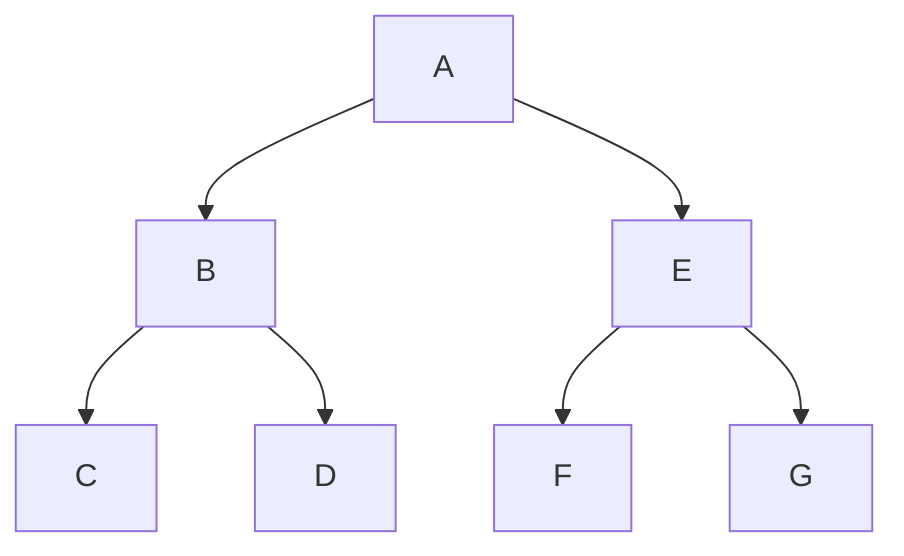
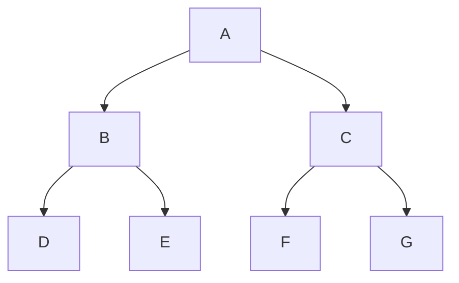
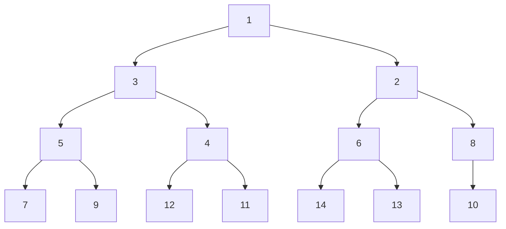

# 爬虫的抓取策略

- [爬虫的抓取策略](#爬虫的抓取策略)
  - [深度优先算法](#深度优先算法)
  - [广度优先算法](#广度优先算法)
  - [使用二叉树模拟广度/深度优先算法](#使用二叉树模拟广度深度优先算法)
  - [注意事项](#注意事项)
  - [实践中组合抓取策略](#实践中组合抓取策略)

一般在抓取爬虫数据时，我们不会只抓取一个入口的URL数据就停止了。

当有多个URL链接需要抓取时，就不得不提到深度优先算法和广度优先算法。

## 深度优先算法

深度优先是指搜索引擎先从网站页面上的某个链接进行抓取，进入到这个链接的页面后抓取页面上的内容。

然后继续顺着当前页面上的这个链接继续抓取下去，直到顺着这个页面上的链接全部抓取完。

最深的页面上没有链接了，爬虫会再回过头来顺着第一个网站页面上的另外一个链接进行抓取。

如下图所示，按照`ABCDEFG`的顺序进行抓取：



## 广度优先算法

广度优先则是另一个过程，它先把该层次的链接都遍历完，再继续下一层次的遍历。

如下图按照`ABCDEFG`的顺序进行抓取：



## 使用二叉树模拟广度/深度优先算法

构造一个完全二叉树，实现其深度优先和广度优先遍历算法。

完全二叉树如下：



深度优先遍历的结果：`[1, 3, 5, 7, 9, 4, 12, 11, 2, 6, 14, 13, 8, 10]`。
广度优先遍历的结果：`[1, 3, 2, 5, 4, 6, 8, 7, 9, 12, 11, 14, 13, 10]`。

``` python
# 定义树节点
class TreeNode:
    def __init__(self, data, left, right):
        self._data = data  # 节点数据
        self._left = left  # 左子树
        self._right = right  # 右子树


# 定义二叉树
class BinaryTree:
    def __init__(self):  # 初始化二叉树
        self._root = None

    def make_tree(self, treeNode):  # 初始化根节点
        self._root = treeNode

    def insert(self, treeNode):  # 构造完全二叉树
        tList = []  # tList列表作为队列使用
        def insert_node(tree_node, p, treeNode):
            if tree_node._left is None:  # 左子树为空则插入节点并返回
                tree_node._left = treeNode
                tList.append(tree_node._left)
                return
            elif tree_node._right is None:  # 右子树为空则插入节点并返回
                tree_node._right = treeNode
                tList.append(tree_node._right)
                return
            else:  # 左右子树均不为空时将左右子树加入队列，递归调用直到找到合适的插入点
                tList.append(tree_node._left)
                tList.append(tree_node._right)
                insert_node(tList[p+1], p+1, treeNode)

        tList.append(self._root)
        insert_node(self._root, 0, treeNode)


# 广度优先遍历
def BFS(tree):
    tLst = []  # 列表作为队列使用
    def traverse(node, p):
        if node._left is not None:  # 左子树不为空则入队
            tLst.append(node._left)
        if node._right is not None:  # 右子树不为空则入队
            tLst.append(node._right)
        if p > (len(tLst)-2):
            return
        else:
            traverse(tLst[p+1], p+1)  #递归遍历
    tLst.append(tree._root)  # 根节点入队
    traverse(tree._root, 0)

    # 输出遍历结果
    for node in tLst:
        print(node._data)


# 深度优先遍历
def DFS(tree):
    tLst = []  # 列表作为栈使用
    tLst.append(tree._root)  # 根节点入栈
    while len(tLst) > 0:  # 循环直到栈为空
        node = tLst.pop()
        print(node._data)  # 输出节点数据
        if node._right is not None:  # 右子树不为空则入栈
            tLst.append(node._right)
        if node._left is not None:  # 左子树不为空则入栈
            tLst.append(node._left)

if __name__ == '__main__':
    TList = [1, 3, 2, 5, 4, 6, 8, 7, 9, 12, 11, 14, 13,10]

    tree = BinaryTree()
    for (i, j) in enumerate(TList):
        node = TreeNode(j, None, None)
        if i == 0:
           tree.make_tree(node)
        else:
           tree.insert(node)
           
    print("BFS results:")
    BFS(tree)      

    print("DFS results:")
    DFS(tree)
```

## 注意事项

以上为了便于理解只是简单的使用二叉树模拟了遍历过程。

大多数情况下网站的结构在数据结构上表现为图，这种情况下不要重复爬取，即需要去重。

## 实践中组合抓取策略

1. 一般来说，重要的网页距离入口站点的距离很近
2. 宽度优先有利于多爬虫并行进行
3. 可以考虑将深度与广度相结合的方式来实现抓取的策略
    - 优先考虑广度优先，对深度进行限制最大深度
