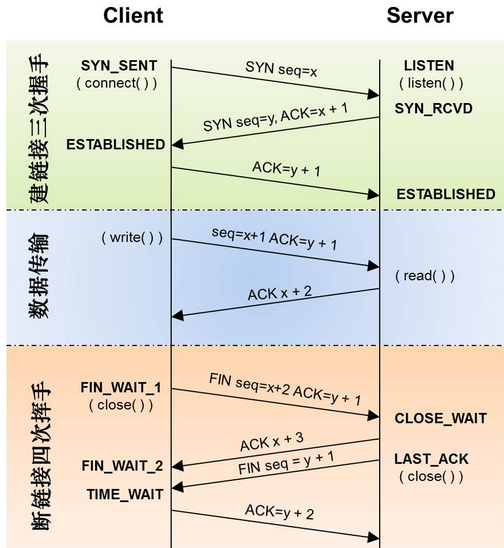

# python

- [python](#python)
  - [列表](#列表)
  - [元组](#元组)
  - [字符串](#字符串)
  - [bytes 和 bytearray](#bytes-和-bytearray)
  - [字典](#字典)
  - [集合](#集合)
  - [汉字编码](#汉字编码)
  - [匿名函数(lambda)](#匿名函数lambda)
  - [函数传参](#函数传参)
  - [不定长参数](#不定长参数)
  - [部分函数说明](#部分函数说明)
  - [高阶函数](#高阶函数)
  - [装饰器](#装饰器)
  - [类](#类)
  - [继承](#继承)
  - [覆盖(override)](#覆盖override)
  - [多态(polymorphic)](#多态polymorphic)
  - [私有变量和私有方法](#私有变量和私有方法)
  - [重载](#重载)
    - [对象转字符串函数重载](#对象转字符串函数重载)
    - [算数运算符的重载](#算数运算符的重载)
    - [反向算数运算符重载](#反向算数运算符重载)
    - [复合赋值算术运算符](#复合赋值算术运算符)
    - [一元运算符的重载](#一元运算符的重载)
    - [比较运算符的重载](#比较运算符的重载)
    - [位运算符重载](#位运算符重载)
    - [内建函数重载](#内建函数重载)
    - [数值转换函数重载](#数值转换函数重载)
    - [bool测试运算符重载](#bool测试运算符重载)
    - [in/not in 运算符重载](#innot-in-运算符重载)
    - [索引和切片运算符的重载](#索引和切片运算符的重载)
    - [函数调用(模拟)重载](#函数调用模拟重载)
    - [属性管理重载](#属性管理重载)
  - [迭代器和生成器](#迭代器和生成器)
    - [迭代器](#迭代器)
    - [生成器](#生成器)
  - [文件](#文件)
  - [异常](#异常)
    - [语法](#语法)
    - [Python中的异常类型](#python中的异常类型)
    - [`try/finally`语句](#tryfinally语句)
    - [`raise`语句](#raise语句)
    - [`assert`语句(断言语句)](#assert语句断言语句)
    - [`with`语句](#with语句)
    - [上下文管理协议](#上下文管理协议)
  - [模块](#模块)
    - [时间模块(time)](#时间模块time)
    - [数学模块(math)](#数学模块math)
    - [系统模块(sys)](#系统模块sys)
    - [随机模块(random)](#随机模块random)
    - [os 模块](#os-模块)
    - [threading 模块](#threading-模块)
  - [属性](#属性)
  - [环境变量](#环境变量)
  - [python 调试器](#python-调试器)
  - [pip 与 VirtualEnv](#pip-与-virtualenv)
  - [pymongo](#pymongo)
  - [pymysql](#pymysql)
  - [多进程和多线程](#多进程和多线程)
    - [基本概念](#基本概念)
    - [全局解释锁](#全局解释锁)
    - [多线程](#多线程)
    - [Python中的多进程和多线程](#python中的多进程和多线程)
    - [进程间通信](#进程间通信)
    - [进程池](#进程池)
    - [优先级队列](#优先级队列)
    - [避免死锁](#避免死锁)
    - [协程](#协程)
    - [多进程和多线程以及协程的对比](#多进程和多线程以及协程的对比)
  - [网络通信](#网络通信)
    - [TCP](#tcp)
      - [三次握手和四次挥手](#三次握手和四次挥手)
      - [编程服务器端流程](#编程服务器端流程)
      - [编程客户端流程](#编程客户端流程)
    - [UDP](#udp)
    - [长链接和短链接](#长链接和短链接)
    - [同步与异步和阻塞与非阻塞](#同步与异步和阻塞与非阻塞)
    - [python中的select模型](#python中的select模型)
    - [Python中网络通信多进程模型](#python中网络通信多进程模型)
    - [Python中网络通信单进程轮询模型](#python中网络通信单进程轮询模型)
    - [UDP广播自发自收](#udp广播自发自收)
    - [UDP编程](#udp编程)
    - [TCP编程](#tcp编程)
    - [bind](#bind)
    - [connect](#connect)

## 列表

`list()` 生成一个空列表，等同于`[]`。

`list(iterable)`用可迭代对象初始化一个列表。

**列表的运算**：

- `+`、`+=`、`*`、`*=`
- `>`、`>=`、`<`、`<=`、`==`、`!=`
- `in`、`not in`

**索引和切片**：

- 通过索引访问列表 x ：`x[idx]`
- 正向 idx：`0 ~ len[x]-1`
- 反向 idx：`-len[x] ~ -1`

列表可变，可以通过索引赋值修改元素的值。

切片slice：`lst[start :end :step]`

切片赋值时改变的是原列表，不会生成新列表。

**常用函数**：

- `len(x)`：返回序列长度
- `max(x)`：返回序列最大值
- `min(x)`：返回序列最小值
- `sum(x)`：返回序列所有元素的和
- `any(x)`：列表中有一个值为真值则返回 True
- `all(x)`：列表中所有值为真值则返回 True
- `L.index(v[, begin[, end]])`：返回对应元素的索引下标
- `L.insert(index, obj)`：在索引位置之前插入一个元素
- `L.count(x)`：返回元素个数
- `L.remove(x)`：删除第一次出现的值
- `L.copy()`：复制此列表(只复制一层，不进行深层复制)
- `L.append(x)`：在列表尾部添加单个元素
- `L.extend(list)`：向列表追加一个列表
- `L.clear()`：清空列表，等同于`L[:] = []`
- `L.sort(reverse=False)`：从小到大排序
- `L.sort(reverse=True)`：从大到小排序
- `L.reverse()`：反转列表
- `L.pop([index])`：删除索引对应的元素并返回该元素，不加索引删除最后元素
- `del L[index]`：删除列表元素

**复制列表**：

浅拷贝(shallow copy) --> `L.copy()` 和 `L[:]`。

```python
L = [1,2,3]
L2 = [10, L, 20]
L3 = L2.copy()
L3[1] is L  # 输出：True
```

深拷贝(deep copy) --> 将对象逐层复制(复制后的对象完全独立)。

```python
import copy
L = [1,2,3]
L2 = [10, L, 20]
L3 = copy.deepcopy(L2)
L3[1] is L  # 输出：False
```

**列表推导式**：

列表推导式是用可迭代对象一次生成列表内元素的方式。

语法：

- `[表达式 for 变量 in 可迭代对象]`
- `[表达式 for 变量 in 可迭代对象 if 条件表达式]`
- `[表达式 for 变量1 in 可迭代对象1 (if 条件表达式1) for 变量2 in 可迭代对象2 (if 条件表达式2)]`

```python
L = [x**2 for x in range(1, 11) if x%2==1]
L = [x*y for x in [2, 3, 5] for y in [7, 11, 13]]
```

## 元组

元组是不可改变的序列，同list一样，元组可以存放任意的值。

元组是可迭代对象。

表示方法：

- 用`()`括起来
- 单个元素括起来后加逗号`(,)`用于区分单个对象还是元组
- 元组的构造(生成)函数`tuple`
  - `tuple()`生成一个空元组，等同于`()`
  - `tuple(iterable)`：用可迭代对象生成一个元组

**元组的运算**：

- `+`、`+=`、`*`、`*=`
- `<`、`<=`、`>`、`>=`、`==`、`!=`
- `in`、`not in`

**索引和切片**：

等同于列表索引，但元组不能索引赋值。

等同于列表切片规则，但元组不能切片赋值。

元组的**方法**：

- `T.index(v[, begin[, end]])`：返回对应元素的索引下标
- `T.count(x)`：返回元组中元素个数

## 字符串

python3 中使用 unicode 作为内部编码。

Unicde16：

- 用2个字节表示
- 编码范围：`0` ~ `2**16-1`
- 如字符`A`编码为`0x0041`

Unicde32：

- 用4个字节表示
- 编码范围：`0` ~ `2**32-1`
- 如字符`A`编码为`0x00000041`

**字符编码转换**：

- `ord(s)`返回一个字符的编码值(`ascii`/`unicode`值)
- `chr(i)`返回i值所对应的字符

**字符串常用方法**：

- `S.isdight()`：判断字符串是否全为数字
- `S.isalpha()`：判断字符串是否全为字符
- `S.islower()`：判断字符串是否全为小写
- `S.isupper()`：判断字符串是否全为大写
- `S.isspace()`：判断字符串是否全为空白
- `S.isnumeric()`：判断字符串是否为数字
- `S.center(width[, fill])`：字符串居中，左右默认填充fill
- `S.title()`：每个单词首字符大写
- `S.upper()`：英文转化为大写
- `S.lower()`：英文转化为小写
- `S.replace(old,new[, count])`：字符串old用new代替，生成新字符串
- `S.split(sep=None)`：将字符串按照seq分割为字符串列表
- `"str".join(iterable)`：将可迭代对象进行拼接，中间用str进行分隔
- `help(str)`

注：空白字符是指水平制表符、换行符、空格等不可见字符。

**格式化表达式**：

- `格式字符串 % 参数值`
- `格式字符串 % (参数值1，参数值2，...)`
- `"%(key1)s %(key0)d" % {"key0": 123, "key1": "string"}`：基于字典的字符串格式化

**格式化字符串**：

- `%s`：字符串
- `%r`：字符串(repr转义)
- `%c`：单个字符
- `%d`：十进制整数
- `%o`：八进制整数
- `%x`：十六进制整数(a-f小写)
- `%X`：十六进制整数(A-F大写)
- `%e`：指数型浮点数(e小写)
- `%E`：指数型浮点数(E大写)
- `%f`或`%F`：十进制浮点数形式
- `%g`或`%G`：十进制形式浮点或指数浮点自动转换
- `%%`：等同于一个字符`%`

**占位符和类型码之间的格式语法**：

- `-`号左对齐
- `+`号右对齐
- `0`补零
- `width`宽度
- `pricision`精度
- `.b`代表小数点后的位数

S.intersection(s2)：

- 字符串`str`
- 列表`list`
- 元组`tuple`
- 字典`dict`
- 集合`set`
- 固定集合`frozenset`
- 迭代器

**列表和字符串的比较**：

1. 均是序列，有先后顺序
2. 列表可变，字符串不可变
3. 列表可以存储任意类型的数据，字符串只能存储字符

**可变和不可变类型的区别**：

1. 不可变类型的数据作为函数参数传入时，函数内部不会改变原数值，是安全的
2. 可变类型的数据作为参数传入时，函数内部可以改变原数据，可用来返回数据

## bytes 和 bytearray

bytes 以字节为单位存储数据的类型，每一个字节的值为0-255。

bytes 常量的**表示方式**：

- `b''`：空字节串
- `b'ABCD'`：有四个字节的字节串
- `b'\x41\42'`：有两个字节的字节串

bytes 支持以下**运算**：

- `+` `+=` `*` `*=`
- `<` `<=` `>` `>=` `==` `!=`
- `in` `not in`

bytes **相关的函数**：

- `len(bytes_obj)`：获取字节串字节个数
- `max(bytes_obj)`：比较字节串每个字节的 ascii 码，返回最大的 ascii 码
- `min(bytes_obj)`：比较字节串每个字节的 ascii 码，返回最小的 ascii 码
- `sum(bytes_obj)`：将字节串每个字节的 ascii 码相加，返回 ascii 码之和
- `any(bytes_obj)`：有一个字节 ascii 码不为0，则结果为真
- `all(bytes_obj)`：所有字节 ascii 码不为0，则结果为真

使用函数`bytes()`**创建字节串**：

- `bytes(整型可迭代对象)`
- `bytes(字符串，encoding='utf-8')`
- `bytes(整数)`
- `bytes()`

**字节串可以看做是序列，支持索引操作，但字节串是不可变的**。

- `help(bytes)` 查看帮助
- str 转换为 bytes
  - `str.encode(encoding = "utf-8")`
- bytes 转换为 str
  - `B.decode(encoding = "utf-8")`

**bytes 为数据不可变类型，bytearray 为数据可变的类型**。

bytearray **运算**：

- `+` `+=` `*` `*=`
- `<` `<=` `>` `>=` `==` `!=`
- `in` `not in`

bytearray 操作：

- `obj.clear()`：清空
- `obj.append(n)`：追加一个字节(n为0~255的整数)
- `obj.remove(value)`：删除第一次出现value，未出现则产生ValueError错误
- `obj.reverse()`：字节的顺序进行反转
- `obj.decode(encoding = 'utf-8')`：将编码转换为字符串
- `obj.find(sub[,start[,end]])`：查到返回下标，没查到返回-1创建

使用函数`bytearray()`创建 bytearray：

- `bytearray(整型可迭代对象)`
- `bytearray(字符串，encoding='utf-8')`
- `bytearray(整数)`
- `bytearray()`

## 字典

字典是一种可变容器，可以存储任意类型的数据。

字典中的数据要用`键(key)`进行索引。

字典中的数据是无序的。

字典中的数据是以键值对的形式进行存储的。

字典数据要用`{}`括起来，以冒号`:`分割各键值对，各键值对之间用逗号`,`分隔。

字典的键不能重复，可迭代。

**创建空字典的方法**：

- `{}`
- `dict()`

**创建非空的字典方法**：`{"name":None, "age":1}`。

**字典的值可以是任何类型**，包括但不限于以下类型：

- `字符串`
- `None`
- `布尔值` `数值`
- `列表` `元组` `字典` `集合`
- `函数` `类对象`

**字典的键(key)必须为不可变类型**，不可变的类型包括：

- `bool` `int` `float`
- `complex`
- `str`
- `tuple`
- `frozenset`

列表、字典、集合都是可变类型，不能作为字典的键。

字典的**基本操作**：

- 访问字典：`dict_name[key]`
- 添加/修改字典的元素：`dict_name[key] = value`
- 删除字典点元素：`del dict_name[key]`
- 元素个数：`len(dict_name)`
- 判断一个键是否存在于字典：`in` `not in`

字典的**生成函数**：

- `dict()`
- `dict(iterable)`
- `dict(**kwargs)`

字典的**方法**：

dict_name.clear()  清空字典
dict_name.pop(key)  移除键，同时返回此键所对应的值
dict_name.copy()  反回字典D的副本，只复制一层（浅拷贝）
dict_name.update(dict_name2)  合并字典，键相同，则取参数字典的值
dict_name.get(key,default)  返回键对应的值，没有此键则返回default

**字典推导式**(可以嵌套)：

```python
{键表达式:值表达式 for 变量 in 可迭代对象 [if条件表达式]}

numbers = [1001, 1002, 1003, 1004]
names = ["Tom", "Jerry", "Spike", "Tyke"]
result = {numbers[i]:names[i] for i in range(4)}
```

字典的**基本函数操作**：

- `len(x)`：字典长度
- `max(x)`：字典键最大值
- `min(x)`：字典键最小值
- `sum(x)`：字典所有键的和
- `any(x)`：真值测试，任意键为真，返回True
- `all(x)`：真值测试，所有键为真，返回True

## 集合

集合内的元素是不可变、无序、无重复的。

集合是可变的容器，是可迭代的。

**生成空集合**：`set()`。

**生成非空集合**：`set(iterable)`。

集合的**运算**：

- 并集 `|`
- 交集 `&`
- 补集 `-`
- 对称补集 `^`
- 判断子集 `<`
- 判断超集 `>`
- 集和相等 `==`
- 集和不等 `!=`
- 判断值是否在集合中 `in` `not in`
- 判断子集/超集 `<=` `>=`

集合的常用方法：

- 添加一个新元素，元素存在则不添加
  - `S.add(e)`
- 清空所有的元素
  - `S.clear()`
- 复制(浅拷贝)
  - `S.copy()`
- 求补集
  - `S.difference(s2)`
    - 等同于`S-s2`
  - `S.difference_update(s2)`
    - 等同于`S=S-s2`
- 移除一个数字
  - `S.discard(digit)`
  - 如 digit 不是数字则无操作
- 求交集
  - `S.intersection(s2)`
    - 等同于`S & s2`
  - `S.intersection_update(s2)`
    - 等同于`S = S & s2`
- 判断子集
  - `S.issubset(s2)`
  - 等同于`S < s2`
- 删除一个元素
  - `S.pop()`
- 删除一个元素
  - `S.remove(e)`
    - 元素不存在会产生 **KeyError** 错误
- 求并集
  - `S.union(s2)`
    - 等同于`S | s2`
  - `S.update(s2)`
    - 等同于`S = S | s2`

集合的**基本函数**操作：

- `len(x)`：返回长度
- `max(x)`：返回最大值
- `min(x)`：返回最小值
- `sum(x)`：返回所有的和
- `any(x)`：任意键为真，则返回 True
- `all(x)`：所有键为真，则返回 True

**集合推导式**：

```python
{表达式 for 变量 in 可迭代对象 [if表达式]}
```

固定集合是一个不可变、无序、无重复元素的集合。

固定集合可以作为字典的键，还可以作为集合得值。

**创建固定集合**：

- `frozenset()`：创建空的固定集合
- `frozenset(iterable)`：创建非空的固定集合

固定集合的**运算**：

- 并集 `|`
- 交集 `&`
- 补集 `-`
- 对称补集 `^`
- 判断子集 `<`
- 判断超集 `>`
- 集和相等 `==`
- 集和不等 `!=`
- 判断值是否在集合中 `in` `not in`
- 判断子集/超集 `<=` `>=`

固定集合的**方法**：

- 清空所有元素：`S.clear()`
- 复制(浅拷贝)：`S.copy()`
- 求补集
  - `S.difference(s2)`
    - 等同于 `S - s2`
  - `S.difference_update(s2)`
    - 等同于 `S = S - s2`
- 求交集
  - `S.intersection(s2)`
  - 等同于 `S & s2`
  - `S.intersection_update(s2)`
  - 等同于 `S = S & s2`
- 判断子集
  - `S.issubset(s2)`
  - 等同于 `S < s2`
- 求并集
  - `S.union(s2)`
    - 等同于 `S | s2`
  - `S.update(s2)`
    - 等同于 `S = S | s2`

## 汉字编码

- `GBK`
- `UNICODE16/32` <-> `UTF-8`

GBK是两字节编码`(8140~FEFE，剔除xx7F)`，共65535个字符位，收录汉字21003个。

第一个字节取值范围是`81~FE`，第二个字节取值范围是`40~7E`和`80~FE`。

- `UNICODE-16`
  - 两字节编码
  - 取值范围：`0x0000~0xFFFF`
  - `ASCII(0~0x7F)`字符对应取值范围`(0x0000~0x007F)`
    - 这样写英文会有一半内存无用
- `UNICODE-32`
  - 四字节编码
  - 取值范围：`0x00000000~OxFFFFFFFF`
  - `ASCII(0~0x7F)`字符对应取值范围`(0x00000000~0x0000007F)`
- `UTF-8`
  - Unicode Transformation Font/Format

**Unicode <<--->> UTF-8 互转**：

- 0x0000 ~ 0x007F 一字节
- 0x0080 ~ 0x07FF 二字节
- 0x0800 ~ 0xFFFF 三字节 (汉字在此区域)

在windows上用记事本编辑写一段中文，在linux读出来中文内容：

```python
fd = open("GB2312.txt","rb")

s = fd.read()
s = s.decode("GBK") 
print(s)

f.close()
```

## 匿名函数(lambda)

`lambda`表达式又称匿名函数对象。

作用：用于创建一个匿名(无名)的函数对象，同`def`类似，但不提供函数名。

```python
# 语法
lambda [参数1, 参数2, ...]:表达式(返回值)
# lambda只是一个表达式，用来创建一个函数对象
# lambda表达式执行时，返回的是冒号后表达式的值
# lambda表达式创建的函数只能包含一条语句
# lambda比函数简单且可以随时创建和销毁(用完就销毁，不用del)
# lambda有利于减少程序的耦合度

# 示例
def myadd(x, y):
    return x+y
# 等价于
myadd = lambda x,y : x+y
```

## 函数传参

参数传递方式：

- 位置传参
- `*`序列传参
- `**`关键字传参

**位置传参**：

1. 实际参数的对应关系与形式参数的对应关系是以位置来依次对应的
2. 实参和形参能同过位置进行对应和传递
3. 实参和形参的个数必须完全相同

```python
def func(a,b,c):  # 形参
    pass

func(1,2,3)  # 实参
```

**序列传参**：

序列的元素个数必须与形参个数相同。

```python
def func(a,b,c):  # 形参
    pass

func(*[1,2,3])  # 实参
func(*(1,2,3))  # 实参
```

**关键字传参**：

关键字传参是指传参时，按着形参的名称给形参赋值。

实参参数和形参按名称进行匹配。

关键字传参不建议等号两边加空格：

```python
def func(a, b, c):
    pass

func(a=1, c=2, b=3)
```

**字典的关键字传参**：

实参和形参通过字典进行传递和匹配，字典的值传递给键对应的形参。

字典传参的键名和形参名必须一致。

键名必须为字符串。

键名要在形参中存在。

```python
def func(a, b, c):
    pass

func(**{"a":1, "c":2, "b":3})
```

**综合传参**：

位置传参、序列传参在前，关键字传参方式在后。

```python
# func(位置传参, 序列传参, 关键字传参)

def func(a, b, c):
    pass

func(1, *(2,), c=3)
func(1, *(2,), {'c':3})
```

## 不定长参数

不定长参数有两种：

1. 星号元组形参
2. 双星号字典形参

**星号元组形参**：

```python
# 语法
def 函数名(*元组形参名):
    pass

# 示例
def func(*args):
    print("实参个数:", len(args))
    print(args)

func(1,2)

# 语法
def 函数名(*, 命名关键字形参名)
    pass
def 函数名(*args, 命名关键字参数名)
    pass

# 示例
def func(a, b, *, c):
    pass

func(1,3,c=3) 
```

**双星号字典形参**：

```python
# 语法
def 函数名(**字典形参名):
    pass

def func(**kwargs):
    print("参数个数", len(kwargs))
    for k,v in kwargs.items():
        print(k, "->>", v)

func(name="shiyucun", age=15)
func(a=1, b="BBB", c=[1,2,3], d=True)
```

**函数的参数列表顺序**：

位置形参、缺省参数、星号元组形参、双星号字典形参、命名关键字参数可以混合使用。

函数参数自左至右的顺序为：

1. 位置形参
2. 星号元组形参
3. 双星号字典形参

```python
def func(a, b, *args, c, **kwargs):
    print(a, b, args, c, kwargs)
func(100, 200, 300, 400, c = "4", d = "a", e = "4")
```

## 部分函数说明

`globals()/locals()`：

- `globals()`返回当前全局变量作用域内变量的字典
- `locals()`返回当前局部作用域内变量的字典

```python
a = 1
b = 2

def fn(c, d):
    e = 300
    print("locals:", locals())  # locals: {'e': 300, 'c': 100, 'd': 200}

print("globals:", globals())  # globals: {'a': 1, 'b': 2, 'fn': fn函数的地址, ...等内置变量}

d = globals()
d["b"] = 500

fn(100, 200)
print(b)  # 500
```

`eval()/exec()`：

`eval()`用于将一个字符串当成一个表达式执行，返回表达式的执行结果。

```python
# 原型
eval(source, globals=None, locals=None)

# 示例
x = 100
y = 200

a = eval("x+y")
print(a)  # 300

s = input("请输入一个字符串:")  # x + y

a = eval(s)
print(a)  # 300


local_scope = {"x": 5, "y": 10}

a = eval("x+y", None, local_scope)
print(a)  # 15

z = 300
a = eval("x*y+z", {"z":3333}, local_scope)
print(a)  # 3383 
```

`exec()`用于把一个字符串当做程序来执行。

```python
# 原型
exec(source,globals=None,locals=None)
# 注: globals 和 locals 作用同 eval 函数

x = 100
y = 200

s = "print('sum:', x+y)"
exec(s)  # sum: 300

gs = {"x":10, "y":20}
ls = {"x":1, "y":2}

exec("z=x+y", gs, ls) # 有局部先用局部变量，执行"z=x+y"会生成新的局部变量ｚ加入ls
print(ls)  # {"x": 1, "y": 2, "z": 3}
```

`issubclass()`：

`issubclass(arg1, arg2)`用于判断 arg1 是否为 arg2(类名或类名元组) 的子类，返回 True/False。

`help(__builtins__)`可以查看所有內建类的包含关系以及帮助信息。

**可用于序列的函数总结**：

- `len(seq)`：返回序列的长度
- `max(seq)`：返回序列的最大值的元素
- `min(seq)`：返回序列的最小值的元素
- `sum(seq)`：返回序列中所有元素的和
- `any(seq)`：真值测试，如果列表其中一个值为真值，则返回 True
- `all(seq)`：真值测试，如果列表中所有值都为真值则返回 True
- `reversed(seq)`：返回反向序列顺序的迭代器

## 高阶函数

满足下列条件中的一个则函数为高阶函数：

1. 函数接受一个或多个函数作为参数传入
2. 函数返回一个函数

python 中内置的高价函数有：map、filter、sorted。

**map 函数**：

```python
# 原型
map(func, *iterable)
# 可迭代对象中每个元素作为func参数计算出新的可迭代对象
# 当最短的一个可迭代对象完成迭代后，此迭代生成结束

def power2(x):
    return x ** 2

mit = map(power2, range(1,10))

for x in mit:
    print(x,end=" ")  # 1 4 9 16 25 36 49 64 81

def mymul(x, y):
    return x*y

mit = map(mymul, [1, 2, 3, 4], [4, 3, 2])

for x in mit:
    print(x, end=" ")  # 4 6 6
```

**filter 函数**：

```python
# 原型
filter(func or None,iterable)
# 筛选iterable中的数据，返回一个可迭代对象
# func将对可迭代对象中的每个元素进行求值，返回False将此数据丢弃
# func为None时，只返回值为真的元素

L = [x for x in range(10)]
print(L)  # [0, 1, 2, 3, 4, 5, 6, 7, 8, 9]

L1 = [x for x in filter(None, L)]
print(L1)  # [1, 2, 3, 4, 5, 6, 7, 8, 9]

def isodd(x):  # 如果为奇数返回True
    return x % 2 == 1

L2 = [x for x in filter(isodd, L)]
print(L2)  # [1, 3, 5, 7, 9]
```

**sorted 函数**：

```python
# 原型
sorted(iterable, key=None, reverse=False)
# 对可迭代对象的数据进行排序，生成排序后的列表
# key函数作用于iterable的每个元素并提供一个值作为排序依据

L = [5, -2, -4, 0, 3, 1]
L2 = sorted(L)
print(L2)  # [-4, -2, 0, 1, 3, 5]
L3 = sorted(L, reverse=True)
print(L3)  # [5, 3, 1, 0, -2, -4]
L4 = sorted(L, key=abs)
print(L4)  # [0, 1, -2, 3, -4, 5]

names = ['Tom', 'Jerry', 'Spike', 'Tyke']
sorted(names)  # ['Jerry', 'Spike', 'Tom', 'Tyke']
sorted(names, key=len)  # ['Tom', 'Tyke', 'Jerry', 'Spike']

def fz(x):
    return x[::-1]  # 反转字符串

sorted(names, key=fz)  # ['Spike', 'Tyke', 'Tom', 'Jerry']
sorted(names, key=lambda x : x[::-1])  # ['Spike', 'Tyke', 'Tom', 'Jerry']
```

## 装饰器

装饰器(decorator)是一个函数，主要作用是用来包装另一个函数或类。

包装的目的是在不改变原函数名的情况下，改变被包装函数(对象)的行为。

使用装饰器前，我们有以下方法可以改变函数的行为：

```python
def 装饰器函数名(参数)
    函数块
    return 函数

def deco(fn):
    print("装饰器函数被调用，并返回原函数")
    return fn
```

使用装饰器函数语法：

```python
@ 装饰器函数名[(装饰器函数参数)]  # 参数可省略
def 函数名(参数列表):
    语句块
# 只有首次装饰时候会执行装饰函数

# 示例1
def deco(fn):
    print("装饰器函数被调用，并返回原函数")
    return fn

@deco  # 等价于 myfunc = deco(myfunc)
def myfunc():
    print("函数myfunc被调用")

myfunc()
myfunc()
myfunc()

# 装饰器函数被调用，并返回原函数
# 函数myfunc被调用
# 函数myfunc被调用
# 函数myfunc被调用

# 示例2
def deco(fn):
    print("装饰器函数被调用，并返回新函数")
    return lambda: print("hello world!")

@deco
def myfunc():
    print("函数myfunc被调用")

myfunc()
myfunc()
myfunc()

# 装饰器函数被调用，并返回新函数
# hello world!
# hello world!
# hello world!

# 示例3：被装饰函数带有参数的装饰器
def msg_savemoney(fn):
    def savemoney2(name, x):
        print("欢迎" + name + "来北京银行，请取号")
        fn(name, x)
        print(name + "办理了存" + str(x) + "元钱的业务，短信发送中")
    return savemoney2

@msg_savemoney  # 等价于 savemoney = msg_savemoney(savemoney)
def savemoney(name, x):
    print(name + "存钱" + str(x) + "元")

savemoney("小赵", 200)
savemoney("小赵", 500)

# 欢迎小赵来北京银行，请取号
# 小赵存钱200元
# 小赵办理了存200元钱的业务，短信发送中
# 欢迎小赵来北京银行，请取号
# 小赵存钱500元
# 小赵办理了存500元钱的业务，短信发送中
```

## 类

**定义类**：

```python
class 类名(继承列表):    #一般类名首字母大写
    '''文档字符串'''
    实例方法(类的函数method)定义
    类方法(@classmethod)   定义
    静态方法(@staticmethod)定义
# 注：除了类名都能省略
```

**对象(实例)**：

- 对象有自己的作用域和名字空间，可以为实例添加变量(属性)
- 对象可以调用类中的方法
- 对象可以访问类中的类变量
  - `对象名.变量名`
  - `模块名.对象名.变量名`

**方法(对象方法、实例方法)**：

```python
# 定义
class 类名(继承列表)：
    def 类方法名(self,形式参数1，形式参数2，....):
        '''文档字符串'''
        语句 ...

# 类方法的实质是函数，是定义在类内的函数
# 类方法属于类的属性
# 类方法第一个参数代表调用这个类方法的对象，一般命名为"self" 绑定对象
# 类方法如果没有return语句，则返回None

# 调用
对象.类方法名(调用参数)
类名.类方法名(对象, 调用参数)
```

**构造方法**：用于创建对象时初始化对象变量。

```python
def __init__(self[, 形式参数列表]):
    pass
# 构造方法名必须为__init__不可改变
# 在一个类中只能有一个__init__构造方法，有多个时，最后一个起作用
# 构造方法会在实例创建时自动调用，且将实例自身通过第一个参数self传入
# 构造方法如果没有return语句，则返回self
```

**析构方法**：

```python
def __del__(self):
    pass
# 析构方法会在对象销毁前被自动调用
# python语言不建议在对象销毁时做操作，因为此方法的调用时间难以确定
```

**类变量**：

- 在类内定义的变量属于类，不属于类的对象
- 类变量，可以通过该类直接使用
- 类变量，可以通过该类对象的__class__属性间接访问

**对象的属性管理函数**：

```python
getattr(obj, name[, default])
# 从一个对象得到对象属性
# getattr(x, 'y')等同于 x.y
# 属性不存在时
#     如给出default参数，则返回default
#     如未给出default参数，则产生一个AttributeError错误

hasattr(obj, name)
# 返回对象obj是否有name属性
# 此做法可以避免调用getattr()引发错误

setattr(obj, name, value)
# 给对象obj的name属性设置相应的值
# set(x, 'y', v)等同于 x.y = v

delattr(obj, name)
# 删除对象obj的name属性
# delattr(x, 'y')等同于 del x.y

isinstance(obj, 类和类的元组)
# 返回对象obj是否为某个类或某些类的对象
# 如果是返回True，否则返回False

type(obj)  # 返回对象的类型
```

**@classmethod 类方法**：

- 类方法是只能访问类变量的方法
- 类方法需要使用`@classmethod`装饰器定义
- 类方法的第一个参数是类，约定写为cls

类方法和对象方法对比：

1. 类方法能够访问类变量，不能访问对象变量；对象方法能够访问类变量，也能访问对象变量
2. 类方法可以用对象来调用，也可以用类来调用；对象方法在调用时必须传入对象

**@staticmethod 静态方法**：

- 静态方法是普通的函数，定义在类的内部，只能凭借该类和对象调用
- 静态方法需要使用`@staticmethod`装饰器定义
- 静态方法与普通函数定义相同，不需要传入self实例参数和cls类参数
- 类和对象都可以调用静态方法，静态方法不能访问类变量和对象变量

**综上**：

- 不想访问类变量和对象变量(属性)用静态方法
- 只访问类内变量，不访问对象属性用类方法
- 既访问类内变量，又访问对象变量用对象方法

**@property 特性属性**：

用`@property`来模拟一个属性，通过该装饰器可以对属性赋值和取值加以控制，实现其他语言所拥有的getter和setter功能

```python
import math

class Circle:
    def __init__(self, r):
        self.radius = r
    @property
    def area(self):
        return math.pi * self.radius ** 2
    @area.setter
    def area(self, a):
        self.radius = math.sqrt(a/math.pi)

c1 = Circle(10)
print(c1.area)  # 314.1592653589793

c1.area = 31415.926
print(c1.radius)  # 99.99999914709194

print(c1.area)  # 31415.925999999996
```

## 继承

继承的目的是延续旧的功能，派生的目的是在旧类的基础上添加新的功能。

作用：

- 继承派生机制，可以将一些共有功能封装在基类中，实现代码共享
- 在不改变父类代码的情况下可以改变原有功能

名词：

- 基类(base class)
- 超类(super class)
- 父类(father class)
- 派生类(derived class)
- 子类(child class)

任何类都直接或间接的继承自object类，object类是一切类的超类。

**单继承**：

```python
# 语法
class 类名(父类名)：
    ......
```

**多继承**：

多继承是指一个子类继承自两个或两个以上的基类。

```python
# 语法
class 类名(父类1, 父类2, ...):
    ...
# 多继承标识符产生冲突时会保留最先继承类的标识符
# 如上语法，父类1和父类2标识符产生冲突时会保留父类1的标识符
```

## 覆盖(override)

继承关系中，子类实现了与基类同名的方法时，子类对象调用该方法实际调用的是子类中的方法。

子类对象显示调用基类方法：

```python
# 语法
基类名.方法名(子类对象, 参数)

# 获取基类名
self.__class__.__base__
类名.__base__
# 通过super()函数获取基类
super(type, obj)  # 要求参数obj类型必须为type
super()  # 类内方法可直接调用

# 示例：
class A(object):
    def hello(self):
        print("A - hello")

class B(A):
    def hello(self):
        print("B - hello")

    def super_hello(self):
        super(B, self).hello()
        super().hello()  # 与上一行等价

b = B()
b.hello()
b.__class__.__base__.hello(b)
B.__base__.hello(b)
super(B, b).hello()
b.super_hello()
```

```python
# 显式调用基类的构造方法
class Human:
    def __init__(self, name, age):
        self.name = name
        self.age = age
    def infos(self):
        print("name:", self.name, "age:", self.age)

class Student(Human):
    def __init__(self, name, age, score):
        super(Student, self).__init__(name, age)
        self.score = score
    def infos(self):
        print("name:", self.name, "age:", self.age, "score:", self.score)

class Doctor(Student):
    def __init__(self, name, age, score, grad): 
        super().__init__(name, age, score)
        self.grad = grad
```

## 多态(polymorphic)

在有继承/派生关系的类中，调用基类对象的方法，实际调用子类覆盖方法的现象叫做多态。

多态调用的方法与对象相关，不与类相关。

```python
class Shape:
    def draw(self):
        self.drawSelf()

class Point(Shape):
    def drawSelf(self):
        print("draw point.")

class Circle(Point):
    def drawSelf(self):
        print("draw circle.")

shape = Point()
shape.draw()

shape = Circle()
shape.draw()
```

## 私有变量和私有方法

在python类中，以双下滑线开头的标识符为私有成员。

**注**：

1. 以双下划线开头、双下划线结尾的标识符是python中特殊方法专用的标识
2. 以单下划线开头的成员变量是保护变量，只有类实例和子类实例能访问到这些变量

私有成员分为：私有属性和私有方法。

通常情况下私有成员在子类和类外部无法访问。

类内部定义中，以双下划线开始的名字都被翻译成**下划线**、**类名**、**私有成员名**相连的形式。

```python
class ClassName(object):
    def __infos(self):
        print("This is private method for ClassName.")

a = ClassName()
a._ClassName__infos()
```

## 重载

用自定义规则实现对象之间的运算符操作或函数操作称为运算符重载。

作用：

1. 让对象像数学表达式一样的进行运算操作
2. 让对象像內建函数对象一样进行內建函数操作
3. 让程序简单易读

重载说明：

1. 重载方法的参数已经有固定的含义，不可改变原有意义
2. 除`__call__`方法外，其他重载方法的参数个数不可改变

### 对象转字符串函数重载

```python
# 函数
repr(obj)
str(obj)  # 如果对象没有__str__方法，则用repr(obj)函数的结果代替

# 对应方法
def __repr__(self):
    ...
def __str__(self):
    ...
```

### 算数运算符的重载

```python
+     __add__(self, other)
-     __sub__(self, other)
*     __mul__(self, other)
/     __truediv__(self, other)
//    __floordiv__(self, other)
%     __mod__(self, other)
**    __pow__(self, other)

# 以上均为二元运算符
# 重载格式：(二元运算符的冲载方法的参数列表只能有两个参数)

def __xxx__(self, other):
    ...
```

### 反向算数运算符重载

```python
__radd__(self, lhs)         # 加法 lhs + self
__rsub__(self, lhs)         # 减法 lhs + self
__rmul__(self, lhs)         # 乘法 lhs + self
__rtruediv__(self, lhs)     # 除法 lhs + self
__rfloordiv__(self, lhs)    # floor除 lhs + self
__rmod__(self, lhs)         # 求余 lhs + self
__rpow__(self, lhs)         # 幂运算 lhs + self
```

### 复合赋值算术运算符

```python
__iadd__(self, rhs)         # 加法 self += rhs
__isub__(self, rhs)         # 减法 self -= rhs
__imul__(self, rhs)         # 乘法 self *= rhs
__itruediv__(self, rhs)     # 除法 self /= rhs
__ifloordiv__(self, rhs)    # 地板除 self //= rhs
__imod__(self, rhs)         # 取模（求余） self %= rhs
__ipow__(self, rhs)         # 幂 self **= rhs
```

### 一元运算符的重载

```python
__neg__(self)       # 负号
__pos__(self)       # 正号
__invert__(self)    # 取反

# 重载格式：(有且只有一个参数)

def __xxx__(self):
    ...
```

### 比较运算符的重载

```python
__lt__(self, rhs)    # 小于
__le__(self, rhs)    # 小于等于
__gt__(self, rhs)    # 大于
__ge__(self, rhs)    # 大于等于
__eq__(self, rhs)    # 等于
__ne__(self, rhs)    # 不等于
```

### 位运算符重载

```python
__invert__    # 取反
__and__       # 位与
__or__        # 位或
__xor__       # 异位或
__lshift__    # 左移
__rshift__    # 右移
```

### 内建函数重载

```python
__abs__         # abs(obj)
__len__         # len(obj)
__reversed__    # reversed(obj)
__round__       # round(obj)
...
```

### 数值转换函数重载

```python
__str__        # str(obj)
__complex__    # complex(x)
 __int__       # int(obj)
 __float__     # float(obj)
__bool__       # bool
```

### bool测试运算符重载

```python
# 语法
def __bool__(self):
    ...
```

1. 可用于`if`语句的真值表达式中
2. 可用于`while`语句的真值表达中
3. 可用于`bool(obj)`函数取值

注意：没有方法`__bool__(self)`时，真值测试将取`__len__(self)`的返回值。

### in/not in 运算符重载

```python
# 语法
def __contains__(self, e):
    pass
```

### 索引和切片运算符的重载

```python
__getitem__(self, i)           # 用索引/切片获取值
__setitem__(self, i, value)    # 设计索引或切片的值  
__delitem__(self, i)           # 进行删除索引操作
```

索引和切片运算符的重载可以让自定义的对象进行索引和切片操作。

```python
class Mylist:
    def __init__(self, count=0, value=0):
        self.data = []
        for x in range(count):
            self.data.append(value)

    def __repr__(self):
        return "MyList(%r)" % self.data

    def setValueAt(self, index, value):
        self.data[index] = value

    def __setitem__(self, index, value):
        self.data[index] = value

    def __getitem__(self, index):
        return self.data[index]

    def __delitem__(self, index):
        if index >= len(self.data):
            raise IndexError("%d在不允许的范围内" % index)
        if index <= -len(self.data):
            raise IndexError("%d在不允许的范围内" % index)
        del self.data[index]
```

### 函数调用(模拟)重载

```python
# __call__ 可以让一个对象像函数一样被调用
# 语法
def __call__(self, 参数列表)：
    ...

class MySum:
    def __init__(self):
        self.data = 0
    def __call__(self, *args):
        print("__call__被调用")
        s = sum(args)
        self.data += s
        return s

ms = MySum()
r = ms(100, 200)  # __call__被调用
print("r=", r)    # r=300
```

### 属性管理重载

```python
hasattr(obj, name[, default])
getattr(obj, name)
setattr(obj, name, value)
delattr(obj, name)
```

回顾以上四个属性管理的函数，作用：

1. 实现对特殊属性的管理
2. 模拟一些特殊属性

```python
# 重载语法
def __setattr__(self, n, v):             # 设置属性
    ...
def __getattribute__(self, n):           # 获取属性
    ...
def __getattr__(self, n):                # 获取属性
    ...
def __delattr__(self, n):                # 删除属性
    ...

# 当属性不存在时，以上四个方法需产生 AttributeError 异常
# __getattr__在找不到对应属性时才调用
# __getattribute_无论是否找到对应属性该函数都会被调用，当没有属性产生异常时，执行__getattr__继续寻找

class Square:
    def __init__(self, l):
        print("call __init__")
        self.length = l  # 边长

    def __getattribute__(self, name):
        print("call __getattribute__")
        if name in object.__getattribute__(self, "__dict__"):
            return object.__getattribute__(self, name)
        raise AttributeError("attr error.")

    def __getattr__(self, name):
        print("call __getattr__")
        if name == "perimeter":
            return object.__getattribute__(self, "length") * 4

    def __setattr__(self, name, value):
        print("call __setattr__", name, value)
        if name == "length":
            object.__setattr__(self, name, value)
        elif name == "perimeter":
            object.__setattr__(self, name, value / 4)

    def __delattr__(self, name):
        print("call __delattr__", name)
        if name == "length":
            object.__delattr__(self, name)
        else:
            print("can not del attr");

print("-------")
sq = Square(10)
print("-------")
print(sq.length)
print("-------")
print(sq.perimeter)
print("-------")
sq.length = 100
print("-------")
print(sq.length)
print("-------")
print(sq.perimeter)
print("-------")
sq.perimeter = 800
print("-------")
print(sq.length)
print("-------")
print(sq.perimeter)
print("-------")
del sq.length
print("-------")
del sq.perimeter
print("-------")

# -------
# call __init__
# call __setattr__ length 10
# -------
# call __getattribute__
# 10
# -------
# call __getattribute__
# call __getattr__
# 40
# -------
# call __setattr__ length 100
# -------
# call __getattribute__
# 100
# -------
# call __getattribute__
# call __getattr__
# 400
# -------
# call __setattr__ perimeter 800
# -------
# call __getattribute__
# 100
# -------
# call __getattribute__
# 200.0
# -------
# call __delattr__ length
# -------
# call __delattr__ perimeter
# can not del attr
# -------
```

## 迭代器和生成器

### 迭代器

**迭代器**是指能用`next(it)`函数取值的对象(实例)。

1. 用`iter()`可返回一个可迭代对象的迭代器
2. 迭代器是访问可迭代对象的一种方式
3. 迭代器只能向前，不能向后

`iter(x)`从一个对象x中返回一个迭代器，x必须是能提供一个迭代器的对象。

`next(it)`从迭代器获取下一个记录，无法获取记录会触发`StopIteration`异常。

```python
it = iter(range(1, 10, 2))
try:
    while True:
        print(next(it))
except StopIteration:
    print("打印结束")
```

`next(it)`对应`__next__(self)`方法
`iter(obj)`对应`__iter__(self)`方法，通常返回一个可迭代对象。

```python
class Fibonacci:
    @staticmethod
    def fib_genrator(n):  # 生成器函数
        a, b = 0, 1
        count = 0
        while count < n:
            count += 1
            yield b  # 带有yield的函数不再是一个普通函数，而是一个生成器generator
                     # 每当此函数运行到该位置时返回b
                     # 再次调用该函数时将从下一行继续执行
            a, b = b, a+b

    def __init__(self, n):
        self.lst = list(x for x in self.fib_genrator(n))  # 生成器表达式

    def __repr__(self):
        return "Fibonacci(%r)" % self.lst

    def __iter__(self):
        class Fib_iter:
            def __init__(self, lst):
                self.cur = 0
                self.lst = lst

            def __next__(self):
                if self.cur >= len(self.lst):
                    raise StopIteration
                r = self.cur
                self.cur += 1
                return self.lst[r]

        return Fib_iter(self.lst)

L = [x for x in Fibonacci(10)]  # for推导式会先调用iter(obj)拿出迭代器
print(L)

G = (x for x in Fibonacci(5))
print(sum(G))
```

### 生成器

**生成器**能够提供迭代器的对象(实例)。

含有`yield`语句的函数是生成器函数，`yield`翻译为产生或生成。

`yield`用于`def`函数中，目的是将此函数作为生成器函数使用。

`yield`用来生成数据，供迭代器`next(it)`函数使用。

生成器函数的调用将返回一个生成器对象，生成器对象是可迭代对象。

在生成器函数内调用`return`会产生一个`StopIteration`异常。

```python
def myyield():
    for i in range(5):
        yield i

it = iter(myyield())

try:
    while True:
        print(next(it))
except StopIteration as err:
    print("Err Info(%r)" % err)
```

**生成器表达式**：用推导式形式生成一个新的生成器(可迭代对象)。

```python
(表达式 for 变量 in 可迭代对象 [if 真值表达式])  # if子句可以省略
```

```python
>>> (x for x in range(10) if x % 2==1)
<generator object <genexpr> at 0x7f2a5eb6b468>
>>> g=(x for x in range(10) if x % 2==1)
>>> next(g)
1
...
>>> next(g)
9
>>> next(g)
Traceback (most recent call last):
  File "<stdin>", line 1, in <module>
StopIteration
>>> g =  (x for x in range(10) if x % 2==1)
>>> type(g)
<class 'generator'>
>>> list(g)
[1, 3, 5, 7, 9]
>>>
```

**迭代工具函数**：用于生成个性化的可迭代对象。

`zip(iter1[, iter2[, ...]])`：

- 返回一个zip对象，此对象用于生成一个元组
- 元组的个数由最小的可迭代对象决定

`enumerate(iterable[, start])`：

- 生成带索引的迭代器，返回的迭代类型为`(key, value)`对
- 默认索引从零开始，也可以通过`start`参数指定

```python
numbers = [10086, 10000, 10010, 95588]
names = ["中国移动", "中国电信", "中国联通"]

d = dict(zip(numbers,names))
print(d)
# {10086: '中国移动', 10000: '中国电信', 10010: '中国联通'}

names = ["abc", "bcd", "cde"] 
for i in enumerate(names):
    print(i)

# (0, 'abc')
# (1, 'bcd')
# (2, 'cde')
```

## 文件

文件是用于数据存储的单位，通常是用于长期存储数据。

liunx下文件可分为普通文件和设备文件。

普通文件是由文件名和文件中的数据两部分组成的。

**文件的打开和关闭**：

- 文件在使用前打开才能读写
- 不需要读写文件时，应及时关闭文件以释放系统资源
- 任何操作系统，打开的文件数有最大限制

```python
fd = open(file, mod)
# 作用：用于打开一个文件，返回此文件的操作对象，如果打开失败则会触发错误，抛出异常
# 参数：
#     file 为相对路径或绝对路径字符串
#     mod  为文件操作模式字符串
# 返回值：
#     fd 文件操作描述符
#        为可迭代对象，(for x in fd: print(x)) x为文件内容

fd.close()
# 作用：用于关闭文件并释放系统资源
#      fd为open打开文件返回的文件操作描述符

# 文件操作模式字符串：
#     'r' 已只读方式打开文件(默认)
#     'w' 以只写方式打开文件，删除原有文件内容(文件不存在时创建该文件并以只读方式打开)
#     'x' 创建一个新文件，并以写模式打开文件，如果文件存在则会产生FileExisError错误
#     'a' 以追加写方式打开一个文件，如果有原文件则追加到原文件末尾
#     'b' 用二进制模式打开
#     't' 用文本文件模式打开(默认）
#     '+' 为更新内容打开一个磁盘文件(可读可写)
#     'w+b' 可以实现二进制的随机读写
#     'r+b' 以二进制只读形式打开文件，打开文件时不会清空文件内容
#     'r+' 以文本模式打开文件，打开文件不会清空文件内容，可对文件进行操作
```

`文本文件的读写`：

```python
fd.readline()
# 读取一行数据，达到文件尾返回空行

fd.readlines([n])
# 读取n行数据，并将读取的数据存储在列表中

fd.writelines(lines)
# 参数可以为字符串或列表等，参数为列表时列表的每个元素需要为字符串，函数将会把每个元素写入文件

fd.write(s)
# 参数必须为字符串，可写入多个字节

fd.flush()
# 把缓存内容写入到磁盘文件中
```

**二进制文件读写**：

二进制文件中以字节(byte)为单位存储，是不以换行符(\n)为单位分隔内容的文件。

```python
fd.read(n = -1)
# 文本文件，返回字符串
# 二进制文件，返回字节串(字节序列)
# n为读取字符数，未提供则读取文件全部内容

fd.write(字符串/字节串)
# 写一些数据到文件流中，返回写入的字节数(字符数)

fd.tell()
# 返回当前文件流的绝对位置

fd.seek(偏移量，whence = 相对位置)
# 改变数据流的位置，返回新的绝对位置
# 偏移量：
#     大于0的数代表向文件尾方向移动
#     小于0代表向文件头方向移动
# 相对位置：
#     0 代表从文件头开始偏移
#     1 代表从当前位置开始偏移
#     2 代表从文件尾开始偏移

fd.readable()
# 判断这个文件是否可读，可读返回True

fd.writable()
# 判断这个文件是否可写，可写返回True
```

**标准输入输出文件**：

- `sys.stdin`：标准输入input
- `sys.stdout`：标准输出print
- `sys.stderr`：标准错误输出

linux 下`Ctrl+D`为输入文件结束符。

## 异常

异常是程序出错时标识的一种状态。

当异常发生时，程序不会再向下执行，而转去调用此函数的地方，待处理相应的错误后恢复为正常状态。

### 语法

```python
try:
    可能触发异常的语句
except 错误类型1[as 变量1]:
    异常处理语句1
except 错误类型2[as 变量2]:
    异常处理语句2
except(错误类型3, 错误类型3, ...)[as 变量3]:
    异常处理语句3
...
except:
    异常处理语句other
else:
    未发生异常语句
finally:
    最终语句

# 语法说明：
#     except 子句可以有一个或者多个，但至少要有一个
#     as 子句是用于绑定错误对象的变量，可以省略
#     else 子句最多只能有一个，也可以省略，程序没有异常状态下执行
#     finally 子句最多只能有一个，也可以省略不写，无论什么状态下都会被执行

# 处理说明：
#     except子句用来捕获和处理当某种类型的错误发生时，处理异常
#     except子句会根据错误的类型进行匹配，如匹配成功则调用异常处理语句进行处理，然后程序转为正常状态
#     如果except子句没有匹配到任何类型的异常则转到(except:)子句
#     如果没有任何except子句进行处理，则程序的异常状态会继续下去，并向上层传递
#     如果没有异常，则执行else子句中的语句
#     最后执行finally子句中的语句
```

### Python中的异常类型

```python
ZeroDivisionError     除(或取模)零
StopIteration         迭代器没有更多的值
OverflowError         数值运算超出最大限制
IOError               输入/输出操作失败
ImportError           导入模块错误
GeneratorExit         生成器发生异常来通知退出
IndexError            序列中没有此索引
FloatingPointError    浮点计算错误
IndentationError      缩进错误
TypeError             对类型无效的操作
ValueError            传入无效的参数
AssertionError        断言语句失败
NameError             未声明/初始化对象
AttributeError        对象没有这个属性
KeyboardInterrupt     用户中断执行(通常是输入Ctrl+C)
# 更多见：>>>help(__builtins__)
```

### `try/finally`语句

通常用try/finally语句来做触发异常时必须要处理的事情。

无论异常是否发生finally子句都会被执行。

```python
try:
    可能触发异常的语句
finally:
    最终语句

# 说明：
#     finally子句不可以省略
#     一定不存在except子句
# 注：try/finally语句不会改变程序的(正常/异常)状态
```

### `raise`语句

`raise`用于生成一个错误，让程序进入异常状态。

```python
rasie 异常类型/异常对象

def div(x,y):
    if y == 0:
        raise ZeroDivisionError("y的零值错误！")
    return x/y
```

### `assert`语句(断言语句)

`assert`真值表达式为`False`时，使用错误数据抛出`AssertionError`异常。

```python
assert 真值表达式, 错误数据(通常是字符串)

# 等价于
if 真值表达式 == False：
    raise AssertionError(错误数据)

def get_score():
    s = int(input("请输入学生成绩"))
    assert s<=100, "错误, 成绩小于等于100"
```

### `with`语句

```python
with 表达式 [as 变量名]:
    语句块

with 表达式1 [as 变量名1][, 表达式2 [as 变量名2] ...]:
    语句块

# 说明：
#     with 语句块内是一个相对独立的运行环境，执行完毕离开该环境时执行相应的操作
#     as 子句中的变量绑定生成的对象

# 作用：在对资源进行访问的场合，使用过程中无论是否发生异常，都会执行"清理"工作，释放资源
# 注：遵循上下文管理协议的类才能使用with语句进行管理

with open("filename.txt") as fd:
    while True:
        line = fd.readline()
        if len(line) == 0:
            break
        print(line)
```

### 上下文管理协议

类内有`__enter__`和`__exit__`方法的类遵循了上下文管理协议。

遵循上下文管理协议的类能够用`with`语句进行管理：

- `__enter__`
  - 进入`with`语句时被调用并返回
  - `as`变量管理对象
- `__exit__`
  - 离开with时被调用
  - 可以用参数判断离开`with`语句时是否有异常发生，并作出相应处理
- `with`语句不能捕捉和处理错误，错误会向with语句外层传递

```python
def __enter__(self):
    pass

def __exit__(self, exc_type, exc_value, exc_tb):
    pass

class TestContext:
    def Open(self):
        print("open.")

    def Close(self):
        print("close.")

    def doSomething(self):
        print("do something.")

    def __enter__(self):
        print("__enter__.")
        self.Open()
        return self

    def __exit__(self, exc_type, exc_value, exc_tb):
        self.Close()
        if exc_type is None:
            print("__exit__.")
        else:
            print("__exit__ error.")

with TestContext() as c:  # 定义TestContext对象时会调用__enter__做一些必要的操作
    c.doSomething()
    # 3/0  # 出现异常时会调用__exit__做必要的清理操作
    c.doSomething()
```

## 模块

### 时间模块(time)

**导入方式**：

```python
impot time
from time import *
from time import xxx
```

**时间简介**：

公元纪年是公元0年1月1日开始。

对于`Unix/Linux`系统，计算机元年是从`1970-1-1`零时开始的，此时间为0。

**UTC**(Coordinated Universal Time)是 Greenwich 时间，不会因时区问题产生错误。

**DST**(Daylight Saving Time)是阳光节约时间(夏令时)，是经过日照时间修正后的时间。

**时间元组**是由9个整数组成的，这9个元素自前至后依次为：

- 四位的年(如:1993)
- 月(1-12)
- 日(1-31)
- 时(0-23)
- 分(0-59)
- 秒(0-59)
- 星期几(0-6,周一是0)
- 元旦开始日(1-366)
- 夏令时修正时间 (-1、0、1)

**模块中的变量**：

- `time.timezone`
  - 本地区时间与UTC时间时间差 (秒为单位)
- `time.altzone`
  - 夏令时时间与UTC时间差 (秒为单位)
- `time.daylight`
  - 夏令时校正时间
- `time.tzname`
  - 时区名称元组

**模块中的函数**：

- `time.time()`
  - 返回从计算机元年至当前时间的秒数的浮点数 (UTC时间为准)
- `time.sleep(secs)`
  - 让程序按给定的秒数睡眠一段时间
- `time.gmtime([secs])`
  - 将给定的秒数转换为UTC表达的时间元组
- `time.mktime(tuple)`
  - 将时间元组转换为新纪元秒数时间 (UTC为准)
- `time.asctime([tuple])`
  - 将时间元组转换为字符串
- `time.localtime([secs])`
  - 将UTC秒数转换为时间元组 (以本地时间为准)
- `time.clock()`
  - 返回自CPU开始运行到现在的时间秒数的浮点数

**注**：`[]`里内容代表可省略。

### 数学模块(math)

math 模块在 Linux 下为内建模块，在 Mac 下为标准库模块。

**模块中的变量**：

- `math.e`
  - 自然对数e
- `math.pi`
  - 圆周率

**模块中的函数**：

- `math.ceil(x)`
  - 向上取整
- `math.floor(x)`
  - 向下取整
- `math.sqrt(x)`
  - 返回平方根
- `math.factocial(x)`
  - 求阶乘
- `math.log(x[, base])`
  - 返回以base为底x的对数，默认以自然对数e为底
- `math.log10(x)`
  - 求以10为底x的对数
- `math.pow(x,y)`
  - 返回x的y次方
- `math.fabs(x)`
  - 返回绝对值
- `math.degrees(x)`
  - 将弧度转换为角度
- `math.radians(x)`
  - 将角度转换为弧度
- `math.sin(x)`
  - 返回正弦(x为弧度)
- `math.cos(x)`
  - 返回余弦
- `math.tan(x)`
  - 返回正切
- `math.asin(x)`
  - 返回反正弦(x为弧度)
- `math.acos(x)`
  - 返回反余弦
- `math.atan(x)`
  - 返回反正切
- ...

### 系统模块(sys)

**数据**：

- `sys.path`
  - 模块搜索路径，列表里为字符串，`path[0]`为当前脚本路径或者为`''`
- `sys.modules`
  - 已加载模块的字典
- `sys.version`
  - 版本信息
- `sys.version_info`
  - 版本信息的命名元组
- `sys.paltfrom`
  - 平台信息
- `sys.argv`
  - 命令行参数，`argv[0]`为当前脚本路径
- `sys.copyright`
  - 获取`python`版权相关信息
- `sys.builtin_module_names`
  - 获得`python`內建模块名称

**函数**：

- `sys.exit([code])`
  - 退出程序，正常退出时`sys.exit(0)`
- `sys.getrecursionlimit()`
  - 获取递归的层次限制值
- `sys.setrecursionlimit(n)`
  - 设置递归的最大层次限制值

### 随机模块(random)

**导入模块**：

```python
import random as R
```

**函数**：

- `R.random()`
  - 返回一个`[0, 1)`之间的随机数
- `R.getrandbits(nbit)`
  - 以长整型的形式返回
  - 用nbit位来表示随机数
  - 取值范围`[0, 2**nbit)`
- `R.unifrom(a, b)`
  - 返回`[a, b)`区间内的随机数
- `R.randrange([start, ]stop[, step])`
  - 返回`range(start, stop, step)`中的随机数
- `R.choice(seq)`
  - 从序列中返回随意元素
- `R.shuffle(seq)`
  - 随机指定序列的顺序(乱序序列)
- `R.sample(seq, n)`
  - 从序列中选择n个随机且不重复的元素
- `R.randint(a, b)`
  - 从`range(a,b)`中随机选择一个数返回

### os 模块

- `os.getcwd()`
  - 获取当前工作目录 (脚本工作路径)
- `os.chdir("dirname")`
  - 改变当前脚本工作目录 (相当于`cd`命令)
- `os.curdir`
  - 返回当前目录 ('.')
- `os.pardir`
  - 返回父目录 ('..')
- `os.makedirs('dirname1/dirname2')`
  - 生成多层递归目录
- `os.removedirs('dirname1')`
  - 若目录为空，则删除目录
  - 递归到上一级目录，若也为空，则删除，依此类推
- `os.mkdir('dirname')`
  - 生成单级目录
- `os.rmdir('dirname')`
  - 删除单级空目录
  - 若目录不为空则无法删除，报错
- `os.listdir('dirname')`
  - 列出指定目录下的所有文件和子目录，包括隐藏文件，并以列表方式打印
- `os.remove()`
  - 删除一个文件
- `os.rename("oldname", "newname")`
  - 重命名文件/目录
- `os.stat('path/filename')`
  - 获取文件/目录信息
- `os.symlink('path/filename', 'ln_filename')`
  - 创建符号链接，源需要是绝对路径
- `os.utime()`
  - 修改时间属性
- `os.walk()`
  - 生成一个目录树下的所有文件名
- `os.walk(top[, topdown=True[, onerror=None[, followlinks=False]]])`
  - top 表示需要遍历的目录树的路径
  - topdown
    - 默认值是 True，首先返回目录树下的文件，然后在遍历目录树的子目录
    - 值为 False 时，则表示先遍历目录树的子目录
  - onerror
    - 默认值是 None，忽略文件遍历时产生的错误
    - 如果不为 None，则提供一个自定义函数提示错误信息
      - 函数执行后可以继续遍历或抛出异常中止遍历
      - 函数返回三元素的元组(每次遍历的路径名、目录列表、文件列表)
- `os.tmpfile()`
  - 创建并打开权限为`w+b`的一个新的临时文件
- `os.sep`
  - 输出操作系统特定的路径分隔符，win下为`\\`，Linux下为`/`
- `os.linesep`
  - 输出当前平台使用的行终止符，win下为`\t\n`，Linux下为`\n`
- `os.pathsep`
  - 输出用于分割文件路径的字符串
- `os.name`
  - 输出字符串指示当前使用平台，win下为`nt`，Linux下为`posix`
- `os.system("bash command")`
  - 运行 shell 命令，直接显示
- `os.popen("bash command")`
  - 运行 shell 命令，生成对象，可赋给变量，再用 read 读取
- `os.environ`
  - 获取系统环境变量
- `os.access('pathfile', os.W_OK)`
  - 检验文件权限模式，输出 True 或 False
- `os.chmod('pathfile', os.W_OK)`
  - 改变文件权限模式
- `os.path.abspath(path)`
  - 返回 path 规范化的绝对路径
- `os.path.split(path)`
  - 将 path 分割成目录和文件名二元组返回
- `os.path.basename(path)`
  - 返回 path 最后的文件名
- `os.path.commonprefix(list)`
  - 返回 list 中，所有 path 共有的最长的路径，从左向右，相同字符
- `os.path.exists(path)`
  - 如果 path 存在，返回 True
  - 如果 path 不存在，返回 False
- `os.path.isabs(path)`
  - 如果 path 是绝对路径，返回 True
- `os.path.isfile(path)`
  - 如果 path 是一个存在的文件，返回 True，否则返回 False
- `os.path.isdir(path)`
  - 如果 path 是一个存在的目录，返回 True，否则返回 False
- `os.path.join(path1[, path2[, ...]])`
  - 将多个路径组合后返回，第一个绝对路径之前的参数将被忽略
- `os.path.normcase(path)`
  - 在 Linux 平台，该函数会原样返回 path
  - 在 windows 平台，会将路径中所有字符转换为小写，并将所有斜杠转换为反斜杠
- `os.path.getsize(path)`
  - 返回 path 的大小(字节数)
- `os.path.getatime(path)`
  - 返回 path 所指向的文件或者目录的最后存取时间
- `os.path.getmtime(path)`
  - 返回 path 所指向的文件或者目录的最后修改时间
- `os.path.walk(top, func, arg)`
  - top 表示需要遍历的目录树的路径
  - func 表示回调函数，回调函数对遍历路径进行处理
    - 回调函数就是函数的参数
    - 当触发调用回调函数时，程序将调用回调函数处理其它任务
    - 回调函数必须提供3个参数：
      - 第1个参数为 `walk()` 的参数 arg
      - 第2个参数表示目录列表
      - 第3个参数表示文件列表
  - arg 是传递给回调参数 func 的元组，为回调函数提供处理参数
    - 回调函数的一个参数必须是 arg
    - 参数 arg 可以为空
  - `os.path.walk()`与`os.walk()`产生的文件名列表并不相同
    - `os.path.walk()`产生目录树下的目录路径和文件路径
    - `os.walk()`只产生文件路径

### threading 模块

```python
Thread(group=None, target=None, name=None, args=(), kwargs={})

# 用于创建一个新的线程实例
# 参数：
#   group   为以后的扩展而保留
#   target  可调用对象，线程启动时 run() 方法将调用此对象
#   name    线程名称，默认创建一个 Thread-N 格式的唯一名称
#   args    传递给 target 对象的参数元组
#   kwargs  传递给 target 对象的参数字典
```

`Thread`实例支持以下方法和属性：

- `start()`
- `run()`
- `join([timeout])`
  - 等待直到线程终止或出现超时为止
  - timeout 是一个浮点数，用于指定以秒为单位的超时时间
  - 线程不能 join 自身，而且在线程启动之前就 join 将出现错误
- `is_alive`
- `name`
- `ident`整数线程标识符
- `daemon`线程的布尔型后台标志

```python
Timer(interval, func[, args[, kwargs]])

# Timer 对象用于在某个时间执行一个函数
# 在过去 interval 秒之后运行函数 func

from threading import Timer

def info():
    print('Hello,Alice.')

t = Timer(5, info)
t.start()

# 如上：在调用 start() 方法之后才会启动定时器

t.start()    # 启动定时器
t.cancel()   # 取消定时器
```

threading 模块**多线程锁**机制：

Lock 对象，**互斥锁**，是一个同步原语，状态是“已锁定”或“未锁定”：

```python
import threading

lock = threading.Lock()
lock.acquire()
lock.release()
```

Rlock 对象，**可重入锁**，类似 Lock 对象的同步原语，同一线程可多次获取：

```python
import threading

rlock = threading.RLock()
rlock.acquire()
rlock.release()
```

信号量与有边界的信号量：

```python
Semaphore([value])

# 创建一个新的信号量
# value 是计数器的初始值
# 省略 value时，计数器的值将被置1

a.acquire([blocking])
a.release()

BoundedSemaphore([value])

# 创建一个新的信号量
# value 是计数器的初始值
# 省略 value 时，计数器的值将被置1
# 与 Semaphore 工作方式相同，但 release 次数不能超过 acquire 次数
```

## 属性

以双下划线开头，以双下划线结尾的标识符通常代表 python 的特殊属性。

`help(obj)`可以查看模块相关的文档字符串。
`dir(obj)`返回模块所有属性的字符串列表。
`dir([对象])`返回一个字符串列表。

**函数的属性**：

`__name__`用于记录函数名：

```python
def func():
    pass

a = func
print(a.__name__)     # func
print(func.__name__)  # func
```

`__doc__`用于记录文档字符串：

```python
def func():
    "我是文档字符串"
    pass

print(func.__doc__)  # '我是文档字符串'
```

**模块的属性**：

`__name__`用于记录模块自身的名字，可以用来判断是否为主模块：

1. 对于被导入模块，模块名为去掉路径前缀和".py"后缀的文件名
2. 对于被执行的主模块，模块名为`__main__`

`__doc__`用于绑定文档字符串(模块中第一行出现且未赋值给变量的字符串)。

`__all__`用于存放可导入的属性，导入模块时只导入该列表内的属性(变量)。

`__file__`用于记录模块对应的文件路径名。

模块中以`_`或`__`开头，不以`__`结尾的属性是模块的**隐藏属性**。

在导入模块时，隐藏属性不会被导入其他模块。

**类的属性**：

`__dict__`每一个对象(实例)都有该属性，该属性绑定了存储此实例自身属性的字典。

`__doc__`用于保存类的文档字符串，调用`help()`时将显示该内容。

`__class__`用于绑定创建此对象的类对象：

1. 借助于此属性创建同类的实例
2. 借助此属性访问类变量

`__module__`对象所属模块，主模块值为`__main__`，否则值为`__slots__`属性：

1. 限定类创建的对象只能有固定的属性，不允许对象添加列表以外的属性
2. 防止用户因错写属性名称而发生程序错误

`__slots__`属性是一个列表，列表的值是字符串：

1. 含有`__slots__`属性的类创建的实例没有`__dict__`属性
2. 含有`__slots__`属性的实例不用字典来存储自身属性

`__base__`用于记录基类：

```python
int.__base__
# <type 'object'>
```

## 环境变量

**模块的查找顺序**：

1. 搜索内置模块：`sys.builtin_module_names`
2. `sys.path`提供的路径
3. 当前路径

**添加自定义文件路径**：

```python
import sys
sys.path.append("自定义模块文件所在路径")

import 模块文件名    # 之后就可以跨文件夹调用模块了
```

**修改`PYTHONPATH`**：

此环境变量的值在 python3 解析器启动时自动加载到`sys.path`列表中。

```shell
export PYTHONPATH=$PATHONPATH:/home/shiyucun
# 以上在当前终端执行只有在当前终端生效，只生效一次
# 以上在 ~/.bashrc 文件最后面加入，则可以一直使用，永久有效
```

`Linux/Unix`环境下使用命令`printenv`查看所有的变量。

**模块加载注意事项**：

1. 模块导入时，模块内的所有语句会执行
2. 如果一个模块已经导入，则再次导入时不会重新执行所有语句

**导入模块**：

```python
import 模块名1 [as 模块新名1], 模块名2 [as 模块新名2] ...
# 将某模块整体导入到当前模块，使用时需要指定模块名

from 模块名 import *
# 将某模块整体导入到当前模块，使用时不需要指定模块名

from 模块名 import xxx
# 将某模块内的 xxx 符号导入当前模块，使用时不需要指定模块名

from PackageName import *
# 在 python2 中表示相对查找
# 在 python3 中表示绝对查找

from .PackageName import *
# '.'表示在包内查找，即当前路径查找
```

## python 调试器

pdb 是个模块，主要用于调试 python 程序。

作用：

1. 让程序单步执行，并跟踪程序的执行流程
2. 在运行中查看变量的值
3. 让程序控制程序的执行流程

相关方法：

```python
pdb.set_trace()  # 在此代码段进入调试器
```

相关命令：

```bash
q/quit  # 退出pdb调试器
l/list  # 列出源码
h/help  # 查看pdb帮助
p/pp 表达式  # 运行表达式并返回结果
n/next  # 执行下一条语句
c/cont/continue  # 继续执行，直到下一个断点
b/break 断点  # 设置断点
cl/clear 断点号  # 清除断点
s/step  # 进入到函数内部执行
r/return  # 持续运行，直到此函数返回
w/where  # 打印函数调用栈
run [命令行参数]  # 重新开始运行程序

# 设置断点
# 方法1：b 文件名:行号
b test.py:19
# 方法2：b 当前文件行号 (省略文件名)
b 20
# 方法3：b 函数名
b func
# 方法4：b 模块.函数名
b test.play

# 控制台下运行pdb调试
python3 -m pdb xxxx.py
# 注：xxxx.py内不需要导入pdb模块和调用set_trace
```

## pip 与 VirtualEnv

**pip** 是 python 的软件包管理器。

一些 python 包被集成到了 pip 中，被集成的包可以通过 pip 进行安装。

ubuntu 安装 pip：

```bash
sudo apt install python-pip   # python2
sudo apt install python3-pip  # python3
```

使用 pip：

```bash
sudo pip3 install PackageName    # 安装python包
sudo pip3 download PackageName   # 下载python包
sudo pip3 uninstall PackageName  # 删除python包
sudo pip3 upgrade PackageName    # 更新python包

pip3 list                # 列出当前环境已安装的包
pip3 search PackageName  # 搜索
pip3 show PackageName    # 展示

pip3 freeze > requirements.txt  # 记录现有环境的python包
cat requirements.txt
pip3 install -r requirements.txt  # 逐一安装依赖包
```

**VirtualEnv** 是 python 中的虚拟环境。

进行 python 应用开发时，可以虚拟出 python 环境，专为某一应用而存在。

VirtualEnv 允许在虚拟环境中安装各种各样的包，且不影响实际的 python 环境。

安装 VirtualEnv：

```bash
sudo pip3 install virtualenv
```

创建和使用虚拟环境：

```bash
# 准备工作
mkdir my_env && cd my_env

# 创建虚拟环境

# virtualenv 虚拟环境名称
virtualenv Env

# 指定虚拟环境python版本
virtualenv -p /usr/bin/python2.7 Env
virtualenv -p /usr/bin/python3.5 Env

# 查看
ls  # Env
cd Env && ls  # bin  include  lib  pip-selfcheck.json
cd bin && ls
# activate  activate.csh  activate.fish  activate_this.py
# easy_install  easy_install-3.5  pip  pip3  pip3.5  python  python3
# python3.5  python-config  wheel

# 相关操作
source bin/activate  # 启动虚拟环境
deactivate           # 退出虚拟环境
rm Env -rf           # 删除虚拟环境
```

**virtualenvwrapper** 是虚拟环境的第三方管理工具，能够快速、高效、方便的管理虚拟环境。

ubuntu 安装 virtualenvwrapper：

```bash
sudo pip3 install virtualenvwrapper
```

使用 virtualenvwrapper：

```bash
# 配置 virtualenvwrapper
vim ~/.bashrc

# 文件底部增加以下三行
# export WORKON_HOME=~/my_env
# source /usr/local/bin/virtualenvwrapper.sh
# export VIRTUALENVWRAPPER_PYTHON=/usr/bin/python3

# 使以上配置生效
source .bashrc

mkvirtualenv 环境名称  # 创建并进入虚拟环境
mkvirtualenv --python=/usr/bin/python3.5 环境名称  # 创建指定python版本的虚拟环境
workon  # 查看当前所维护的所有的虚拟环境
workon 环境名称  # 切换虚拟环境
deactivate  # 退出虚拟环境
rmvirtualenv 环境名称  # 删除虚拟环境
```

## pymongo

```python
import pymongo  # 导入pymongo模块，用于mongo数据库
from pymongo import MongoClient  # 导入MongoClient类

# 创建client
client = MongoClient()  # 无参
client = MongoClient('localhost', 27017)  # 主机+端口号

# 使用数据库
db = client.数据库名
db = client['数据库名']  # 数据库名要加上引号

# 使用集合
collection = db.集合名
collection = db['集合名']  # 集合名要加上引号

# 在python中mongo数据库的文档使用字典保存

# 插入文档
db.集合名.insert_one(文档字典)
db.posts.insert_many(文档字典列表)

# 查询文档
# 条件和格式须使用字典
# 格式部分可用于设置显示或隐藏字段
# 不存在满足查询条件的文档则返回None
db.集合名.find_one(条件, 格式)  # 查询单个文档
for 变量 in db.集合名.find(条件, 格式):  # 查询多个文档
    pprint.pprint(变量)

# 输出查询结果
import pprint
pprint.pprint(文档)

# mongodb按BSON格式存储数据
# BSON字符串为UTF-8编码，因此pymongo也要保证字符串为utf-8编码
# 默认情况下，属性为0隐藏，属性为1显示
# pymongo中，字典的键一定要加上引号

# 修改文档
db.集合名.update_one(条件, 修改器)  # 修改单个文档
db.集合名.update_many(条件, 修改器)  # 修改多个文档

# 其它操作
db.集合名.count()  # 查看集合中文档个数
db.集合名.find(条件).count()  # 查看集合中文档个数
db.集合名.delete_one(条件)  # 删除单个文档
db.集合名.delete_many(条件)  # 删除多个文档
db.集合名.find().sort(key[,1(-1)])  #排序，从小到大(1)、从大到小(-1)排序
```

## pymysql

执行`pymysql.connect()`得到`Connection`实例，而不是执行构造函数`Connection()`。

`pymysql.connect()`的参数即为构造函数`Connection()`的参数。

```python
pymysql.connections.Connection(self,
    host=None,                 # 连接的主机地址
    user=None,                 # 登录数据库的用户
    password='',               # 密码
    database=None,             # 连接的数据库
    port=0,                    # 端口号，一般为3306
    unix_socket=None,          # 选择是否要用unix_socket而不是TCP/IP
    charset='',                # 字符编码
    sql_mode=None,             # Default SQL_MODE to use.
    read_default_file=None,    # 从默认配置文件(my.ini或my.cnf)读取参数
    conv=None,                 # 转换字典
    use_unicode=None,          # 是否使用unicode编码
    client_flag=0,             # Custom flags to send to MySQL.
    cursorclass=<class 'pymysql.cursors.Cursor'>,    # 选择Cursor类型
    init_command=None,         # 连接建立时运行的初始语句
    connect_timeout=10,        # 连接超时时间，(default: 10, min: 1)
    ssl=None,                  # A dict of arguments similar to mysql_ssl_set()'s parameters.
    read_default_group=None,   # Group to read from in the configuration file.
    compress=None,             # 不支持
    named_pipe=None,           # 不支持
    no_delay=None,
    autocommit=False,          # 是否自动提交事务
    db=None,                   # 同 database，为了兼容 MySQLdb
    passwd=None,               # 同 password，为了兼容 MySQLdb
    local_infile=False,        # 是否允许载入本地文件
    max_allowed_packet=16777216,    # 限制 `LOCAL DATA INFILE` 大小
    defer_connect=False,       # wait for connect call.
    auth_plugin_map={},
    read_timeout=None,
    write_timeout=None,
    bind_address=None          # 当客户有多个网络接口，指定一个连接到主机
)
```

重要函数
| 函数 | 说明 |
|---|---|
| cursor(cursor = None) | 创建一个游标 |
| commit() | 事务提交，如果没有设为自动提交，则每次操作后必须提交事务，否则操作无效 |
| rollback() | 操作出错时，可以用这个函数回滚到执行事务之前 |
| close() | 关闭连接 |

执行`connections.Connection.cursor()`可以得到`Cursor`实例。

`connections.Connection.cursor()`的参数是`Cursor`构造函数的参数。

| 函数 | 说明 |
|---|---|
| callproc(procname, args=()) | 执行一个过程 |
| execute(query,args=None) | 执行一条SQL语句，返回受影响的行数。<br>若args是列表，用%s做占位符，若是字典，用%(name)s |
| executemany(query,args) | 对一个操作运行多个数据，如一次插入多条数据 |
| fetchall() | 取出操作返回的所有的行 |
| fetchone() | 取出一行 |
| fetchmany(size=None) | 取出size行 |
| close() | 关闭游标对象 |

| 游标类型 | 说明 |
|---|---|
| Cursor | 默认类型，查询返回list |
| DictCursor | 与Cursor不同的地方是，查询返回dict，包括属性名 |
| SSCursor | 查询不会返回所有的行，而是按需求返回 |
| SSDictCursor | 差别同前两个 |

```python
# 导入pymysql
import pymysql

# 连接数据库
config = {
  'host':'127.0.0.1',
  'port':3306,
  'user':'root',
  'password':'123456',
  'database':'testDB',
  'charset':'utf8mb4', 
  'cursorclass':pymysql.cursors.Cursor,
}
db = pymysql.connect(**config)
db = pymysql.connect("localhost", "root", "123456", "testDB")

# 创建游标对象cursor
cursor ＝ db.cursor()

# 使用execute()方法执行sql语句
SQL = "select * from customers;"
num = cursor.execute(SQL)  # 返回记录条数

# 使用fetchone()方法获取单条数据
data = cursor.fetchone()  # 返回的数据保存在元组中

# 使用fetchall()方法获取所有数据
data = cursor.fetchall()  # 返回的数据保存在元组中

# 使用fetchmany(n)获取n条数据记录
data ＝ cursor.fetchmany(3)

# 使用scroll(n, mode)移动游标
cursor.scroll(6, mode='absolute')  # 绝对位置
cursor.scroll(6, mode='relative')  # 相对位置

# 使用executemany()执行多行SQL语句
cursor.executemany(
  "insert into customers values (%s, %s, %s, %s, %s, %s,)",
  [('13', 'min', 35, 'suzhou', 8888, 'M'),
   ('13', 'min', 35, 'suzhou', 8888, 'M')])

# rowcount为只读属性，返回执行execute()所影响的行数
cursor.rowcount

# 提交修改
db.commit();

# 回滚
db.rollback()

# 关闭数据库连接
db.close()
```

## 多进程和多线程

### 基本概念

进程Process包含数据段、代码段、进程控制块(PCB)、优先级等多种信息。

**进程优先级**：

- 在linux下取值为`-20~19`，数值越小优先级越高
- 在windows下取值为`0~31`，数值越大优先级越高

**进程状态**：

- 新建
- 就绪
- 执行
- 等待/阻塞
- 终止

**并发与并行**：

并发的实质是一个物理CPU(也可以多个物理CPU)在若干道程序之间多路复用。

并发性是对有限物理资源强制行使多用户共享以提高效率。

并行性指两个或两个以上事件或活动在同一时刻发生。

在多道程序环境下，并行性使多个程序同一时刻可在不同CPU上同时执行。

**同步与异步**：

同步是发出一个功能调用时，在没有得到结果前调用不返回。

异步的概念和同步相对。

当一个异步过程调用发出后，调用者不能立刻得到结果。

实际处理这个调用的部件在完成后，可以通过状态、通知或者回调来通知调用者。

- 通过状态通知调用者，调用者就需要定时检查，效率低
- 通过通知通知调用者，效率高
- 通过回调函数通知调用者，本质和通知没有太大区别

实际上：

- 同步是调用模块发起调用之后，等待被调用体返回后再继续下一步
- 异步是调用模块发起调用之后，不等待被调用体返回直接继续下一步

**父子进程之间的关系**：

- 父进程启动子进程，父子进程各自独立运行
  - 如果子进程先结束，会给父进程发送信号
    - 由父进程帮助回收子进程的相关资源
- 父进程启动子进程，父子进程各自独立运行
  - 如果父进程先结束，子进程会变成孤儿进程
    - 子进程会变更父进程(一般重新设定init进程作为新的父进程)
  - 如果子进程先结束，但父进程由于各种原因没有收到子进程发来的信号
    - 子进程资源无法及时回收，则子进程变成僵尸进程。

进程是程序被加载运行的一次抽象：

- 进程是操作系统分配资源的单位
- 线程是操作系统执行流程的分配单位(分配CPU时间片的单位)

在linux系统中，可以认为线程是一个轻量级的进程。

一个进程至少有一个线程；进程所具有的动态性是通过线程来体现的。

### 全局解释锁

全局解释锁(GIL)，`Global Interperter Lock`。

threading模块产生时多核还不流行，因此多核情况下多线程并未充分使用CPU。

从技术的层面讲，threading模块中的多线程由于考虑数据安全等因素仍是单线程。

以上就是因为threading模块中全局解释锁的限制导致的。

multiprocessing模块产生时考虑了多核情况，因此多核情况下多进程可以充分使用CPU。

```python
# 示例1
import threading

def f():
    while True:
        pass

if __name__ == '__main__':
    t = threading.Thread(target=f)
    t.start()
    while True:
        pass

# 使用top查看CPU使用率，只有一个进程达到了100%


# 示例2
import multiprocessing

def f():
    while True:
        pass

if __name__ == '__main__':
    p = multiprocessing.Process(target=f)
    p.start()
    while True:
        pass

# 使用top查看CPU使用率，两个进程都达到了100%

# 示例3
# 使用C语言编写死循环，并将该代码编写为动态库导入python中
# 创建系统级别的线程时可以突破全局解释锁的限制
from threading import Thread
from ctypes import *   # 导入C语言函数，创建系统级别线程

if __name__ == '__main__':
    lib = cdll.LoadLibrary("./dloop.so")
    t = Thread(target=lib.Deadloop)
    t.start()
    while True:
        pass
```

### 多线程

多线程适合于I/O密集型的场景，如：下载文件，网络爬虫，数据库操作等。

多进程适合于CPU计算密集型的场景。在CPU密集型(计算型资源消耗大)的情况下：

**由于线程来回切换，反而会有性能损耗，有可能导致比单进程单线程还要慢。**

### Python中的多进程和多线程

**os模块**：

```python
import os
import time

pid = os.fork()  # fork会返回两个值，子进程返回0，父进程返回子进程的pid
if pid < 0:
    print("fork error")
elif pid == 0:  # 子进程逻辑
    time.sleep(1)  # os.wait被注释，父进程先执行完，子进程成为孤儿进程
    print("child id is %d, parent id is %d" % (os.getpid(), os.getppid()))
else:  # 父进程逻辑
    print("parenet id is %d, child id is %d" % (os.getpid(), pid))
    # os.wait()

# parenet id is 59296, child id is 59297
# child id is 59297, parent id is 1
```

**multiprocessing包**：

```python
# 示例1
from multiprocessing import Process
import time
import os
import random

def getTime(interval):  # 计时函数，通过interval确定间隔多久输出一次
    while True:
        time.sleep(interval)
        print(time.ctime())
        print("Child Process id %d" % os.getpid())

if __name__ == '__main__':
    p = Process(target=getTime, args=(1,))  # 用Process类创建进程
    #p.daemon = True  # daemon设置守护进程
    p.start()  # 进程就绪
    time.sleep(3)
    #p.terminate()  # 不要轻易调用这个方法，否则可能回产生僵尸进程
    print("Parent Process id %d" % os.getpid())
    p.join()  # 未设置timeout时，主进程会进入阻塞状态
    print("Parent end")

# Sun Sep  4 16:29:21 2022
# Child Process id 59390
# Sun Sep  4 16:29:22 2022
# Child Process id 59390
# ...
# 注意：父进程退出时，将尝试终止其所有的守护进程；守护进程不允许创建子进程

# 示例2
import time
from multiprocessing import Process

class Timer(Process):
    def __init__(self, interval):
        Process.__init__(self)
        self.interval = interval

    def run(self):
        print("run")
        #pass

if __name__ == '__main__':
    t = Timer(2)
    t.start()

# run
# 注意：进程start时会调用到run方法
```

**threading模块**：

```python
from threading import Thread
import time

def getTime(interval):
    while True:
        time.sleep(interval)
        print("Current time is %s" % time.ctime())

if __name__ == '__main__':
    # 线程与进程在代码实现上很相似
    t = Thread(target=getTime, args=(2,))
    t.start()
    t.join()

# Current time is Sun Sep  4 16:34:26 2022
# Current time is Sun Sep  4 16:34:28 2022
# Current time is Sun Sep  4 16:34:30 2022
```

### 进程间通信

文件、管道(匿名管道和命名管道)、队列、共享内存、互斥量、信号量、事件、socket通信。

**队列**：

```python
from multiprocessing import Process
from multiprocessing import Queue
import time

def consumer(input_q):  # 消费者进程target函数，队列元素出队
    while True:
        item = input_q.get()
        if item == None:  # 收到None消费者退出
            break
        print(item)

def producer(sequence, output_q):  # 生产者调用，序列元素入队
    for i in sequence:
        output_q.put(i)

if __name__ == '__main__':
    q = Queue()
    con_p = Process(target=consumer, args=(q,))  # 消费者进程
    con_p.start()  # 消费者进程就绪

    con_p2 = Process(target=consumer, args=(q,))
    con_p2.start() 

    # 主进程作为生产者进程
    sequence = [1, 2, 3, 4, 5, 6, 7, 8, 9, 10]
    producer(sequence, q)  # 调用producer函数，序列元素入队
    q.put(None)  # 通过None告诉消费者结束
    q.put(None)

    con_p.join()
    con_p2.join()

# 1
# 2
# 4
# 5
# 3
# 6
# 7
# 8
# 9
# 10
```

**管道**：

```python
import multiprocessing

def consumer(pipe):  # 消费者进程target函数，从管道读取数据
    output_p, input_p = pipe
    input_p.close()  # 关闭管道的输入端
    while True:
        try:
            item = output_p.recv()  # 从管道的输出端读取信息
        except EOFError:
            break
        print(item)
    output_p.close()
    print("Consumer Done")

def producer(sequence, input_p):  # 生产者调用函数，将序列元素入队
    for i in sequence:
        input_p.send(i)

if __name__ == '__main__':
    (output_p, input_p) = multiprocessing.Pipe()  # 创建管道

    con_p = multiprocessing.Process(target=consumer, args=((output_p, input_p),))
    con_p.start()  
    output_p.close()  # 关闭管道输出端

    sequence = [1, 2, 3, 4, 5, 6, 7, 8, 9, 10]
    producer(sequence, input_p)  # 主进程生产者

    input_p.close()
    con_p.join()
    print("生产者结束")

# 1
# 2
# 3
# 4
# 5
# 6
# 7
# 8
# 9
# 10
# Consumer Done
# 生产者结束
```

**事件**：

```python
import multiprocessing
import time

def wait_for_event(e):
    print("wait_for_event: starting")
    e.wait()
    print("wait_for_event is_set is " + str(e.is_set()))

def wait_for_event_timeout(e, t):
    print("wait_for_event_timeout: starting")
    e.wait(t)
    print("wait_for_event_timeout is_set is " + str(e.is_set()))

if __name__ == '__main__':
    e = multiprocessing.Event()  # 创建event对象
    # 创建两个进程，一个等待阻塞的event，另一个等待超时的event
    w1 = multiprocessing.Process(target=wait_for_event,
        name="wait_for_event", args=(e,))
    w2 = multiprocessing.Process(target=wait_for_event_timeout,
        name="wait_for_event_timeout", args=(e,2))
    w1.start()
    w2.start()

    # 主进程休眠３s，保证w2子进程被执行完，
    # 从而造成w2等待Event超时
    time.sleep(3)
    e.set()  # w1会一直等待这个event事件通知
    print("main event is set")

# wait_for_event: starting
# wait_for_event_timeout: starting
# wait_for_event_timeout is_set is False
# wait_for_event is_set is True
# main event is set
```

**信号量**：

```python
import multiprocessing
import time

def worker(s, i):
    s.acquire()  # 获取使用权限
    print(multiprocessing.current_process().name + 'get')
    time.sleep(i)
    s.release()  # 释放用权限
    print(multiprocessing.current_process().name + 'release')

if __name__ == '__main__':
    s = multiprocessing.Semaphore(2)
    for i in range(5):
        p = multiprocessing.Process(target=worker, args=(s, i))
        p.start()
        p.join()
    print("Main End")

# Process-1get
# Process-1release
# Process-2get
# Process-2release
# Process-3get
# Process-3release
# Process-4get
# Process-4release
# Process-5get
# Process-5release
# Main End
```

**共享内存和锁**：

```python
import multiprocessing
import time
import random

def deposit(n,lock):
    for i in range(10):
        time.sleep(random.randint(0, 2))
        lock.acquire()  # 获取锁使用权限，尽量让加锁的粒度最小
        n.value += i
        lock.release()  # 释放使用权限

def withdraw(n,lock):
    for i in range(10):
        time.sleep(random.randint(0, 2))
        lock.acquire()
        n.value -= i
        lock.release()

if __name__ == '__main__':
    money = multiprocessing.Value('i', 2000)  # 创建共享变量，初值为2000
    lock = multiprocessing.Lock()
    d = multiprocessing.Process(target=deposit, args=(money, lock))
    w = multiprocessing.Process(target=withdraw, args=(money, lock))
    d.start()
    w.start()
    time.sleep(3)
    print(money.value)
    d.join()
    w.join()
    print(money.value)

# 1999
# 2000
```

### 进程池

```python
# 示例1
from multiprocessing import Pool
import time
import os

def func(str):
    print("Pool:", str, " Pid:", os.getpid())
    time.sleep(3)
    print("Pool:", str, "end", " Pid:", os.getpid())

if __name__ == '__main__':
    p = Pool(3)

    t1 = time.time()
    for i in range(4):
        msg = "apply %d" % (i)
        # 这里类似一个单进程过程
        p.apply(func, (msg,))

    p.close()
    p.join()

    print("Main End")
    print(time.time() - t1)

# Pool: apply 0  Pid: 60631
# Pool: apply 0 end  Pid: 60631
# Pool: apply 1  Pid: 60632
# Pool: apply 1 end  Pid: 60632
# Pool: apply 2  Pid: 60633
# Pool: apply 2 end  Pid: 60633
# Pool: apply 3  Pid: 60631
# Pool: apply 3 end  Pid: 60631
# Main End
# 12.075236082077026

# 示例2
from multiprocessing import Pool
import time
import os

def func(str):
    print("Pool:", str," Pid:", os.getpid())
    time.sleep(2)
    print("Pool:", str, "end", " Pid:", os.getpid()) 
    return str+"Callback"

def cbFun(args):
    print("callback ", os.getpid(), args)

if __name__ == '__main__':
    # 创建一个进程池
    p = Pool(3)

    # 四个任务 apply_async
    for i in range(4):
        msg = "apply %d"%(i)
        p.apply_async(func, (msg,), callback=cbFun)

    p.close()
    p.join()

# Pool: apply 0  Pid: 60722
# Pool: apply 1  Pid: 60723
# Pool: apply 2  Pid: 60724
# Pool: apply 0 end  Pid: 60722
# Pool: apply 1 end  Pid: 60723
# Pool: apply 3  Pid: 60723
# callback  60720 apply 1Callback
# callback  60720 apply 0Callback
# Pool: apply 2 end  Pid: 60724
# callback  60720 apply 2Callback
# Pool: apply 3 end  Pid: 60723
# callback  60720 apply 3Callback

# 示例3
from multiprocessing import Pool
import os
import time

def f(n):
    sum = 0
    for i in range(n):
        sum += i*i
    return sum

if __name__ == '__main__':
    # Don't use magic number
    calcCount = 20000
    checkNum = 1000

    p = Pool()
    t1 = time.time()
    result = p.map(f, range(calcCount))
    print(result[checkNum])
    print(time.time() - t1)

    t2 = time.time()
    L = []
    for i in range(calcCount):
        L.append(f(i))
    print(L[checkNum])
    print(time.time()-t2)

# 332833500
# 1.5919759273529053
# 332833500
# 7.415056943893433

# 示例4
from multiprocessing import Manager, Pool

def read(q):
    for i in range(q.qsize()):
        print("read from manager queue:%s" % q.get_nowait())

def write(q):
    for i in "shiyucun":
        q.put_nowait(i)

if __name__ == '__main__':
        # Manager管理Pool中队列
        q = Manager().Queue()

        # 通过进程池创建两个进程,一个写，一个读
        p = Pool(2)
        p.apply(write,(q,))
        p.apply(read,(q,))

        p.close()
        p.join()
        print("main end")

# read from manager queue:s
# read from manager queue:h
# read from manager queue:i
# read from manager queue:y
# read from manager queue:u
# read from manager queue:c
# read from manager queue:u
# read from manager queue:n
# main end

# 注意：
#     Manager().Queue()与Pool一起用
#     multiprocessing.Queue()与Procssess一起用

# 示例5
from multiprocessing import Pool  # import进程池类
from multiprocessing import Manager  # 在进程池中传递数据使用Manager类中的队列
import os
import hashlib

def innerCopyFile(fileName, srcPath, desPath, q):  # 实现拷贝文件的操作
    # 拼出源文件的绝对路径名，和目标文件的绝对路径名
    srcFileName = srcPath + '/' + fileName
    desFileName = desPath + '/' + fileName

    with open(srcFileName, 'rb') as fs:
        with open(desFileName, 'wb') as fw:
            for i in fs:
                fw.write(i)
    q.put(desFileName)  # 更新队列内容，向队列里面添加一条数据

def CopyFile(fileName, srcPath, desPath, q):
    # 源路径不存在直接就放弃
    if not os.path.exists(srcPath):
        print("srcPath is not exist")
        return None

    # 如果目标路径文件夹不存在则尝试创建目标路径
    if not os.path.exists(desPath):
        try:
            os.mkdir(desPath)
        except NotImplementError:
            # 创建失败则放弃
            print("mkdir %s error"%desPath)
            return None

    # 调用innerCopyFile
    innerCopyFile(fileName,srcPath, desPath, q)

def hashFile(fileName):  # 对文件进行哈希
    hashM = hashlib.md5()
    with open(fileName, 'rb') as f:
        for i in f:
            hashM.update(i)
    return hashM.hexdigest()

if __name__ == "__main__":
    srcPath = input("请输入需要拷贝的文件:")
    desPath = srcPath+"- 副本"  # 假设不存在其它副本

    # 进程池和进程队列的初始化
    p = Pool()
    q = Manager().Queue()  # 进程池中使用Manager队列传递数据
    allFiles = os.listdir(srcPath)  # 返回原路径下文件列表
    allNum = len(allFiles)  # 原路径下文件个数
    print(allNum)
    num = 0  # 当前已拷贝文件的个数

    # 通过进程池的调度来完成文件拷贝操作
    for i in allFiles:
        p.apply_async(func=CopyFile, args=(i, srcPath, desPath, q))
    p.close()

    #记录当前拷贝文件的进度
    while num < allNum:
        fileName = q.get() # 从队列中取拷贝完成的文件

        # 通过哈希算法来判断当前文件是否拷贝成功
        srcFileName = srcPath+'/'+fileName.split('/')[-1]
        desFileName = fileName
        print(srcFileName)
        print(desFileName)

        if hashFile(srcFileName) == hashFile(desFileName):
            print("%s 拷贝成功"%fileName)
        else:
            print("%s 拷贝失败"%fileName)
            break

        num += 1
        rate = num/allNum*100
        print("当前拷贝的进度是 %.1f%%"%rate)

    p.join()
    print("100% Done")
```

### 优先级队列

```python
from multiprocessing import Process
from queue import PriorityQueue
import random

class Item(object):
    def __init__(self, name, level, size):
        self.name, self.level, self.size = name, level, size

    def __lt__(self, other):
        # 优先级不相等时按照优先级排序
        # 优先级相等时按照入队顺序排序
        if self.level != other.level:
            return self.level < other.level
        else:
            return self.size < other.size

    def __repr__(self):
        return self.name + ":" + str(self.level)

if __name__ == "__main__":
    q = PriorityQueue()

    q.put(Item("Listen to Music", random.randint(1, 20), q.qsize()))
    q.put(Item("Watch_TV", random.randint(1, 20), q.qsize()))
    q.put(Item("Print_Doc", random.randint(1, 20), q.qsize()))
    q.put(Item("Write_Doc", random.randint(1, 20), q.qsize()))

    while not q.empty():
        print(q.get())

# Print_Doc:4
# Listen to Music:5
# Watch_TV:6
# Write_Doc:6
```

### 避免死锁

- 避免互斥：
  - 提供多份资源
  - 缺陷：和资源的特性有关，毕竟资源也是有限的
- 请求与保持条件：
  - 当一个进程因为请求资源而发生阻塞时，该释放就释放(超时可以简单的解决)
  - 缺点：获取资源的效率不高
- 请求资源保持原子性
  - 缺点：效率低下，有时会取到不需要的资源
- 资源获取保持有序：
  - 保证一定的顺序，减少资源获取的竞争
  - 缺点：效率低下，有时会取到不需要的资源

### 协程

协程是一种程序组件，是由子例程（过程、函数、例程、方法、子程序）的概念泛化而来的。

子例程只有一个入口点且只返回一次，而协程允许多个入口点，可以在指定位置挂起和恢复执行。

协程本质是一种控制抽象，它的价值在于可以简洁优雅地实现一些控制行为。

在协程中：

- 控制可以从当前执行上下文跳转到程序的其它位置
- 可以在之后的任意时刻恢复当前执行上下文，控制从跳出点处继续执行

这种行为与Continuation类似，但协程相比之下更容易理解，某些情况下还更加高效。

### 多进程和多线程以及协程的对比

进程相比线程更加笨重、切换耗时更长。

python语言中进程数量不推荐超过CPU核心数(一个进程占用一个CPU能充分利用机器性能)。

特殊情况(**IO密集型任务**)下，**多线程是比多进程好用的**。

协程是一种用户级的轻量级线程。

协程拥有自己的寄存器上下文和栈。

协程调度切换时，寄存器上下文和栈会保存到其他地方，在切回来时，恢复先前保存的数据。

**协程能保留上一次调用时的状态**(即所有局部状态的一个特定组合)。

协程每次过程重入相当于进入上一次的调用状态。

协程与线程类似，**每个协程表示一个执行单元**，有自己的本地数据，与其它协程共享全局数据和其它资源。

目前主流语言基本都选择多线程作为并发设施。

与线程相关的概念是抢占式多任务(Preemptive multitasking)，而与协程相关的是协作式多任务。

无论进程还是线程，每次阻塞、切换都需要陷入系统调用(system call)**先执行CPU调度程序**。

由于抢占式调度执行顺序无法确定的特点，使用线程时需要非常小心地处理同步问题。

**协程完全不存在同步问题**(事件驱动和异步程序也有同样的优点)。

因为**协程是由用户编写调度逻辑的**，对CPU来说，协程就是单线程，因此不需要考虑调度和切换上下文。

因此**协程省去了CPU的切换开销**，在一定程度上又好于多线程。

多进程+协程可看作每个进程里都是单线程，而这个单线程是协程化的。

多进程+协程下，避开了CPU切换的开销，又能把多个CPU充分利用起来。

## 网络通信

`IP`+`端口号`可以唯一标识数据属于某台机器的某个应用。

常用的端口号：

- http：80(8080备用)
- https：443
- ftp：21
- smtp：25
- pop3：110
- telnet：23

**端口号是有范围的**：`0~65535`(两个字节，2^16=65536)。

- `0~1023`：公认端口，被常用的知名应用占用
- `1024~49151`：注册端口，可以用于其他目的
- `49152~65535`：私有端口，动态生成，大多数TCP/IP实现的临时端口

网络上的两个程序**通过一个双向通信的连接实现数据交换**，这个连接的两端称为socket。

socket本质是编程接口(API)，是对TCP/IP的封装。

TCP/IP也要提供可供程序员做网络开发所用的接口，这就是socket编程接口。

http提供了封装或者显示数据的具体形式，socket提供了网络通信的能力。

### TCP

TCP套接字之间的连接过程可以分为三个步骤：

- 服务器监听
- 客户端请求
- 连接确认

**服务器监听**：

服务器端套接字并不定位具体的客户端套接字，而是处于等待连接的状态，实时监控网络状态。

**客户端请求**：

由客户端的套接字提出连接请求，要连接的目标是服务器端的套接字。

为此，客户端的套接字必须指出服务器端套接字的地址和端口号。

最后客户端向服务器端套接字提出连接请求。

**连接确认**：

当服务器端套接字监听到客户端套接字的连接请求：

1. 响应客户端套接字的请求
2. 把服务器端套接字的描述发给客户端
3. 客户端确认此描述，连接完成

连接建立后服务器端套接字继续处于监听状态接收其他客户端套接字的连接请求。

#### 三次握手和四次挥手



**三次握手**：

1. 当客户端向服务器发起连接请求：
    - 客户端会发送同步序列标号SYN到服务器，设SYN为`m`，等待服务器确认
    - 客户端的状态为SYN_SENT
2. 当服务器收到客户端发送的SYN后：
    - 服务器要做的是确认客户端发送过来的SYN
    - 服务器发送确认包ACK(`ACK=m+1`)
    - 服务器发送SYN包，这里设SYN为`n`
    - 服务器的状态为SYN_RECV
3. 客户端收到服务器发送的SYN和ACK后：
    - 客户端发送确认包ACK(`ACK=n+1`)
    - 客户端和服务器的状态均为ESTABLISH，即连接成功

在三次握手中，客户端和服务器端都发送了**两个**SYN和ACK包：

- 服务器端的两个包是一次性发送的
- 客户端的两个包是分两次发送的

**四次挥手**：

**客户端和服务器端都可以发出断开连接请求**，这里我们称为A端向B端请求断开连接。

1. A端向B端请求断开连接时：
    - 向B端发送一个带有FIN标记的报文段，这里FIN即为finish
2. B端收到A发送的FIN后：
    - B端可能还有数据未传输完成，所以B端并不会马上向A端发送FIN，会先发送一个确认序号ACK
3. B端传输完成后：
    - B端向A端发送FIN
4. A端收到B端发送的FIN后：
    - 会向B端发送确认ACK，然后经过2个MSL时长后断开连接

MSL是最大报文段生存时间(`Maximum Segment Lifetime`)，2个MSL是报文段发送和接收的最长时间。

#### 编程服务器端流程

```python
s = socket(AF_INET, SOCK_STREAM)       # 1.创建套接字
s.bind(('127.0.0.1', 8082))            # 2.绑定ip和port
s.listen(5)                            # 3.listen使能服务端监听
clientS, clientAddr = s.accept()       # 4.客户端接入时通过accept接受连接请求
clientS.send(timestr.encode('utf-8'))  # 5.recv/send接收或发送数据
clientS.close()                        # 6.通讯完成关闭客户端接入产生的socket
s.close()                              # 7.不再监听时，关闭监听socket
```

#### 编程客户端流程

```python
s = socket(AF_INET, SOCK_STREAM)  # 1.创建套接字
s.connect(('127.0.0.1', 8082))    # 2.连接到对应的端口和服务的位置
tm = s.recv(1024)                 # 3.recv/send接收或发送数据
s.close()                         # 4.通讯完成关闭socket
```

### UDP

UDP是面向无连接的通讯协议，传输数据时数据大小须在64K以内。

UDP是不可靠的，即不保证传输数据不丢包，不保证数据到达的顺序。

**UDP客户端流程**：

1. 创建套接字
2. 发送/接收数据
3. 关闭套接字

**UDP服务端流程**：

1. 创建套接字
2. bind
3. 发送/接收数据
4. 关闭套接字

### 长链接和短链接

短连接是指SOCKET连接后，发送接收完数据后马上断开连接。

长连接指建立SOCKET连接后不管是否使用都保持连接，但安全性较差。

HTTP是无状态的，即浏览器和服务器每次进行HTTP操作都建立一次连接，任务结束连接中断。

浏览器访问的Web页中包含其它Web资源时(JS文件、图像文件、CSS文件等)：

- 浏览器每遇到一个Web资源，就会建立一个HTTP会话
- HTTP1.1和HTTP1.0相比，最大的区别就是增加了持久连接支持
  - 需要浏览器或者服务器在其头信息加入`Connection:keep-alive`这行代码
  - TCP连接在发送后将仍然保持打开状态，浏览器可以继续通过相同的连接发送请求

保持连接节省了为每个请求建立新连接所需的时间，还节约了带宽。

实现长连接要客户端和服务端都支持长连接。

长连接多用于操作频繁，点对点的通讯，而且连接数不会太多的情况。

### 同步与异步和阻塞与非阻塞

同步与异步是对多个执行流程而言：

- 同步是指做事情一步步有序
- 异步执行的流程可能会被打断，有不确定性

阻塞是指调用某个方法时，当前线程会被挂起，只有当这个函数返回得到结果时，才会被继续执行。

非阻塞当调用某个方法时，不会把当前线程挂起，而是立刻返回。

只是说异步非阻塞，同步阻塞经常出现，但是异步与非阻塞，同步与阻塞不是必然的。

**异步网络接口**：

1. 同步阻塞IO(Blocking IO)：传统的IO模型
2. 同步非阻塞IO(Non-blocking IO)：
    - 默认创建的 SOCKET 都是阻塞的
    - 非阻塞IO要求 SOCKET 被设置为NONBLOCK。
3. IO多路复用(IO Multiplexing)：有时称为异步阻塞IO(也可能异步非阻塞)
4. 异步IO(Asynchronous IO)：也称为异步非阻塞IO

### python中的select模型

```python
import select
import socket

IP = '172.60.12.94'
PORT = 8085
CLIENT_NUM = 5
BUFFER_SIZE = 1024

# 创建Socket, 绑定IP和Port, 监听
lSocket = socket.socket(socket.AF_INET, socket.SOCK_STREAM)
addr = (IP, PORT)
lSocket.bind(addr)
lSocket.listen(CLIENT_NUM)

rInputs = []
rInputs.append(lSocket)

while True:
    # 返回值是输入参数的子集
    readL, writeL, exceptionalL = select.select(rInputs, [], [])
    # 循环第一次执行时，rInputs只有一个socket，之后就不一定了
    # 需要区分返回的socket的类型
    for sock in readL:
        if sock == lSocket:
            sSocket, addr = sock.accept()
            # 把新产生的服务socket添加到rInputs
            rInputs.append(sSocket)
        else:
            data = sock.recv(BUFFER_SIZE)
            result = data.decode('utf-8')
            print(result)
            if result == "CloseMe":
                sock.close()
                print(addr, "leave")
                # 从rInputs删除关闭的socket
                rInputs.remove(sock)
```

### Python中网络通信多进程模型

```python
from socket import *
from multiprocessing import Process

SERVER_NUM = 5
BUFFER_SIZE = 1024
IP = '172.60.12.94'
PORT = 8085


def ManagerClient(sSocket, clientAddr):
    while True:
        # 接收信息
        recvData = sSocket.recv(BUFFER_SIZE)
        result = recvData.decode('utf-8')
        if len(recvData) > 0:
            print('recv info from ', clientAddr, result)
            if result == "CloseMe":
                sSocket.close()
                print(clientAddr, "leave")
                break


# 创建socket listen Socket -> lSocket
lSocket = socket(AF_INET, SOCK_STREAM)

# 绑定(IP,Port)
serverAddr = (IP, PORT)
lSocket.bind(serverAddr)

# 监听
lSocket.listen(SERVER_NUM)

while True:
    # 接收用户请求 server Socket -> sSocket
    sSocket, clientAddr = lSocket.accept()

    clientP = Process(target=ManagerClient, args=(sSocket, clientAddr))
    # sSocket已传入子进程,这里需关闭socket(多线程时不需要)
    sSocket.close()
```

### Python中网络通信单进程轮询模型

```python
from socket import *

IP = '172.60.12.94'
PORT = 8085
CLIENT_NUM = 1000
BUFFER_SIZE = 1024

lSocket = socket(AF_INET, SOCK_STREAM)
# socket模式置为reuse
lSocket.setsockopt(SOL_SOCKET, SO_REUSEADDR, 1)
addr = (IP, PORT)
lSocket.bind(addr)
lSocket.listen(CLIENT_NUM)

# 设置监听socket为非阻塞
lSocket.setblocking(False)
# 记录当前需要服务的客户端信息
g_socketList = []

while True:
    try:
        clientInfo = lSocket.accept()
    except BlockingIOError:
        continue
    else:
        print("Recv a connect %s" % str(clientInfo[1]))
        # 设置服务socket为非阻塞
        clientInfo[0].setblocking(False)
        g_socketList.append(clientInfo)

        # 一会需要删除的客户列表
        willDeleteInfoList = []

        # 处理每个客户端发送的信息
        for sSocket, clientAddr in g_socketList:
            try:
                recvData = sSocket.recv(BUFFER_SIZE)
                result = recvData.decode('utf-8')
                if len(recvData) > 0:
                    print('recv info from ', clientAddr, result)
                    if result == "CloseMe":
                        sSocket.close()
                        print(clientAddr, "leave")
                        # 需要删除的用户添加到删除列表中
                        willDeleteInfoList.append((sSocket, clientAddr))
            except BlockingIOError:
                continue

        # 把不需要再提供服务的用户信息从用列表中删除
        for willDeleteInfo in willDeleteInfoList:
            g_socketList.remove(willDeleteInfo)
```

### UDP广播自发自收

```python
from socket import *

dest = ("<broadcast>", 7788)

s = socket(AF_INET, SOCK_DGRAM)
s.bind(dest)
s.setsockopt(SOL_SOCKET, SO_BROADCAST, 1)

s.sendto('send to my self'.encode('utf-8'), dest)

buffer, address = s.recvfrom(1024)
print("recv [%s] from [%s]" % (buffer, address))

# 同一台机器上dest绑定的socket会接收到广播包
# 当前代码是同一个socket自发自收
# 我们可以在另外一台机器上绑定该地址接收该广播包
```

### UDP编程

```python
# 服务器端
from socket import *

udpIP = 'localhost'
udpPort = 2018
BUFFER_SIZE = 1024

udpSock = socket(AF_INET, SOCK_DGRAM)

udpSock.bind((udpIP, udpPort))

recvInfo, clientAddr = udpSock.recvfrom(BUFFER_SIZE)
print("接受到:%s 接受自:%s" % (recvInfo.decode('utf-8'), clientAddr))

udpSock.close()

# 客户端
from socket import *

udpIP = 'localhost'
udpPort = 2018

uSock = socket(AF_INET, SOCK_DGRAM)

# sendto 需明确发送地址和端口号
uSock.sendto("hello World".encode('utf-8'), (udpIP, udpPort))

uSock.close()
# 客户端并没有绑定ip和端口号，系统自动分配端口号供socket使用
```

### TCP编程

```python
# 服务器端
from socket import *

SERVER_NUM = 5
BUFFER_SIZE = 1024
IP = '172.60.12.94'
PORT = 8085

lSocket = socket(AF_INET, SOCK_STREAM)

serverAddr = (IP, PORT)
lSocket.bind(serverAddr)

lSocket.listen(SERVER_NUM)

while True:
    sSocket, clientAddr = lSocket.accept()

    while True:
        recvData = sSocket.recv(BUFFER_SIZE)
        result = recvData.decode('utf-8')
        if len(recvData) > 0:
            print('recv info from ', clientAddr, result)
            if result == "CloseMe":
                sSocket.close()
                print(clientAddr, "leave")
                break
        sendData = input("please send info:")
        sSocket.send(sendData.encode('utf-8'))

# 客户端
from socket import *
 
BUFFER_SIZE = 1024
IP = '172.60.12.94'
PORT = 8085

socket = socket(AF_INET, SOCK_STREAM)

serverAddr = (IP, PORT)
socket.connect(serverAddr)

while True:
    sendData = input("please send info:")

    if len(sendData) > 0:
        socket.send(sendData.encode('utf-8'))
        if sendData == "CloseMe":
            break

    recvData = socket.recv(BUFFER_SIZE)
    print("recv from s:", recvData.decode('utf-8'))

socket.close()
```

### bind

采用TCP通信时：

- 客户端不需要bind IP和端口号
- 服务器端需要bind本机IP和端口号

采用UDP通信时：

- 客户端可以不bind IP和端口号(也可以bind)
- 服务器端需要bind本机IP和端口号

对于TCP通信：

- 服务器端需要监听有没有客户端连接，不绑定IP和端口时客户端上线连不到服务器
- 客户上线会向服务器的IP和端口发出请求，客户端不bind时会分配一个随机端口
- 客户端分配的端口和IP会随上线请求一起发给服务器
- 服务器端收到上线请求后可以从中获取发此请求的客户端IP和端口
- 服务器端可以利用获取的IP和端口给客户端回应消息

对于UDP通信：

- 对于有客户端和服务器端之分的程序
  - 客户端创建socket后即可发送或接受数据，因为客户端只需要用sendto发送数据到指定的地址
  - 如果客户端bind了ip和端口号，程序也没什么问题，区别就是替代了系统的自动bind
  - 客户端可以发送消息显式的告诉服务器端IP和端口
  - 服务器端可以从收到的数据包头部得到IP和端口
- 对于没有客户端和服务器端之分的程序，即UDP对等通信
  - 客户端和服务器都需要bind IP和端口

通常UDP服务端根本不需要知道客户端的socket，直接建立一个socket用于发送即可。

UDP通信的关键在于IP和端口。

多个客户端如果需要点到点分发：

- 可以给服务端SOCKET循环设置每个客户端的IP并发出
- 可以通过广播分发
  - 服务端SOCKET设定一个X.X.X.255的广播地址并始终向它发送数据
  - 客户端建立的SOCKET只需要绑定这个广播地址便可以收到

### connect

UDP中客户端调用connect能够捕获错误。

- UDP是无连接的，connect在调用时其实没有向外发包，只是在协议栈中记录了该状态
- 发生网络异常时，如对端不可达，客户端在往对端写数据后，本机会收到一个ICMP回应
  - 收到的ICMP不可达的响应能够被协议栈处理，会通知客户端进程
  - 当客户端再次对该SOCKET fd进行操作时，如读数据时，read等调用会返回一个错误
  - 不调用connect时，返回的ICMP响应协议栈不知道该传递给上层的哪个应用

以上两种情况下：

- write或sendto操作都是把数据放到协议栈的发送队列之后就返回成功
- ICMP回应则要等数据到达对端后才能返回，通常这种情况称为"异步错误"
