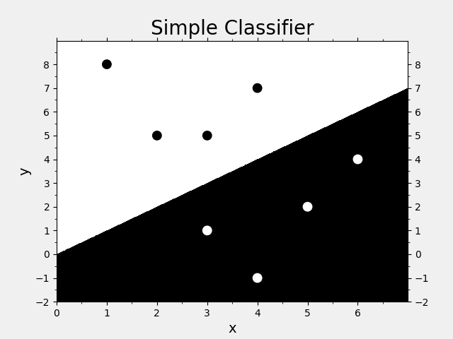
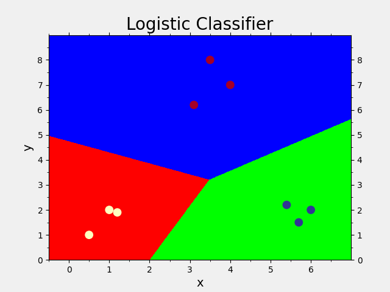

# 分类问题

- [分类问题](#分类问题)
  - [简单分类器](#简单分类器)
  - [逻辑回归分类器](#逻辑回归分类器)
  - [朴素贝叶斯分类器](#朴素贝叶斯分类器)
  - [训练集和测试集的划分](#训练集和测试集的划分)
  - [用交叉验证检验模型的准确性](#用交叉验证检验模型的准确性)
  - [混淆矩阵和性能报告](#混淆矩阵和性能报告)
  - [验证曲线](#验证曲线)
  - [学习曲线](#学习曲线)

## 简单分类器

输入数据特性与输出的联系已知，用程序描述规律，对新样本进行自动化分类。

即分类规则已知，直接通过代码对数据做分类。

```python
import os
import sys
import platform
import numpy as np
import matplotlib.pyplot as mp


def make_data():
    x = np.array([[3, 1], [2, 5], [1, 8], [6, 4],
                  [5, 2], [3, 5], [4, 7], [4, -1]])
    y = np.array([0, 1, 1, 0, 0, 1, 1, 0])
    return x, y


def pred_model(x):
    y = np.zeros(len(x), dtype=int)
    y[x[:, 0] < x[:, 1]] = 1
    return y


def init_chart():
    mp.gcf().set_facecolor(np.ones(3) * 240 / 255)
    mp.title('Simple Classifier', fontsize=20)
    mp.xlabel('x', fontsize=14)
    mp.ylabel('y', fontsize=14)
    ax = mp.gca()
    ax.xaxis.set_major_locator(mp.MultipleLocator())
    ax.xaxis.set_minor_locator(mp.MultipleLocator(0.5))
    ax.yaxis.set_major_locator(mp.MultipleLocator())
    ax.yaxis.set_minor_locator(mp.MultipleLocator(0.5))
    mp.tick_params(which='both', top=True, right=True, labelright=True, labelsize=10)
    mp.grid(axis='y', linestyle=':')


def draw_grid(grid_x, grid_y):
    mp.pcolormesh(grid_x[0], grid_x[1], grid_y, cmap='gray')
    mp.xlim(grid_x[0].min(), grid_x[0].max())
    mp.ylim(grid_x[1].min(), grid_x[1].max())


def draw_data(x, y):
    mp.scatter(x[:, 0], x[:, 1], c=1 - y, cmap='gray', s=80)


def show_chart():
    mng = mp.get_current_fig_manager()
    # if 'Windows' in platform.system():
    #     mng.window.state('zoomed')
    # else:
    #     mng.resize(*mng.window.maxsize())
    mp.show()


def main(argc, argv, envp):
    x, y = make_data()

    l, r, h = x[:, 0].min() - 1, x[:, 0].max() + 1, 0.005
    b, t, v = x[:, 1].min() - 1, x[:, 1].max() + 1, 0.005
    grid_x = np.meshgrid(np.arange(l, r, h), np.arange(b, t, v))
    grid_y = pred_model(np.c_[grid_x[0].ravel(), grid_x[1].ravel()]).reshape(grid_x[0].shape)

    init_chart()
    draw_grid(grid_x, grid_y)
    draw_data(x, y)
    show_chart()

    return 0


if __name__ == '__main__':
    sys.exit(main(len(sys.argv), sys.argv, os.environ))
```

效果如下：



## 逻辑回归分类器

通过逻辑回归分类器发现训练样本中输入输出的线性关系，并应用于测试样本。

最后能够得到直线形式的分类边界。

```python
import os
import sys
import platform
import numpy as np
import sklearn.linear_model as sl
import matplotlib.pyplot as mp


def make_data():
    x = np.array([[4, 7], [3.5, 8], [3.1, 6.2], [0.5, 1], [1, 2],
                  [1.2, 1.9], [6, 2], [5.7, 1.5], [5.4, 2.2]])
    y = np.array([0, 0, 0, 1, 1, 1, 2, 2, 2])
    return x, y


def train_model(x, y):
    model = sl.LogisticRegression(solver='liblinear', C=100)  # 逻辑回归分类器
    model.fit(x, y)
    return model


def pred_model(model, x):
    y = model.predict(x)
    return y


def init_chart():
    mp.gcf().set_facecolor(np.ones(3) * 240 / 255)
    mp.title('Logistic Classifier', fontsize=20)
    mp.xlabel('x', fontsize=14)
    mp.ylabel('y', fontsize=14)
    ax = mp.gca()
    ax.xaxis.set_major_locator(mp.MultipleLocator())
    ax.xaxis.set_minor_locator(mp.MultipleLocator(0.5))
    ax.yaxis.set_major_locator(mp.MultipleLocator())
    ax.yaxis.set_minor_locator(mp.MultipleLocator(0.5))
    mp.tick_params(which='both', top=True, right=True, labelright=True, labelsize=10)
    mp.grid(axis='y', linestyle=':')


def draw_grid(grid_x, grid_y):
    mp.pcolormesh(grid_x[0], grid_x[1], grid_y, cmap='brg')
    mp.xlim(grid_x[0].min(), grid_x[0].max())
    mp.ylim(grid_x[1].min(), grid_x[1].max())


def draw_data(x, y):
    mp.scatter(x[:, 0], x[:, 1], c=y, cmap='RdYlBu', s=80)


def show_chart():
    mng = mp.get_current_fig_manager()
    # if 'Windows' in platform.system():
    #     mng.window.state('zoomed')
    # else:
    #     mng.resize(*mng.window.maxsize())
    mp.show()


def main(argc, argv, envp):
    x, y = make_data()

    l, r, h = x[:, 0].min() - 1, x[:, 0].max() + 1, 0.005
    b, t, v = x[:, 1].min() - 1, x[:, 1].max() + 1, 0.005

    model = train_model(x, y)

    grid_x = np.meshgrid(np.arange(l, r, h), np.arange(b, t, v))
    grid_y = pred_model(model, np.c_[grid_x[0].ravel(), grid_x[1].ravel()]).reshape(grid_x[0].shape)

    init_chart()
    draw_grid(grid_x, grid_y)
    draw_data(x, y)
    show_chart()

    return 0


if __name__ == '__main__':
    sys.exit(main(len(sys.argv), sys.argv, os.environ))
```

效果如下：



## 朴素贝叶斯分类器

贝叶斯推理提供了一种概率(主要应用条件概率)学习手段。

根据以往数据的概率分布和已观察到的数据进行推理判断。

朴素贝叶斯分类器对数据量大的问题十分适用。

```python
import os
import sys
import platform
import numpy as np
import sklearn.naive_bayes as nb
import matplotlib.pyplot as mp


def read_data(filename):
    x, y = [], []
    with open(filename, 'r') as f:
        for line in f.readlines():
            data = [float(substr) for substr in line.split(',')]
            x.append(data[:-1])
            y.append(data[-1])
    return np.array(x), np.array(y)


def train_model(x, y):
    model = nb.GaussianNB()
    model.fit(x, y)
    return model


def pred_model(model, x):
    y = model.predict(x)
    return y


def eval_ac(y, pred_y):
    ac = ((y == pred_y).sum() / pred_y.size)
    print('Accuracy: {}%'.format(round(ac * 100, 2)))


def init_chart():
    mp.gcf().set_facecolor(np.ones(3) * 240 / 255)
    mp.title('Naive Bayes Classifier', fontsize=20)
    mp.xlabel('x', fontsize=14)
    mp.ylabel('y', fontsize=14)
    ax = mp.gca()
    ax.xaxis.set_major_locator(mp.MultipleLocator())
    ax.xaxis.set_minor_locator(mp.MultipleLocator(0.5))
    ax.yaxis.set_major_locator(mp.MultipleLocator())
    ax.yaxis.set_minor_locator(mp.MultipleLocator(0.5))
    mp.tick_params(which='both', top=True, right=True, labelright=True, labelsize=10)
    mp.grid(axis='y', linestyle=':')


def draw_grid(grid_x, grid_y):
    mp.pcolormesh(grid_x[0], grid_x[1], grid_y, cmap='brg')
    mp.xlim(grid_x[0].min(), grid_x[0].max())
    mp.ylim(grid_x[1].min(), grid_x[1].max())


def draw_data(x, y):
    mp.scatter(x[:, 0], x[:, 1], c=y, cmap='RdYlBu', s=80)


def show_chart():
    mng = mp.get_current_fig_manager()
    # if 'Windows' in platform.system():
    #     mng.window.state('zoomed')
    # else:
    #     mng.resize(*mng.window.maxsize())
    mp.show()


def main(argc, argv, envp):
    x, y = read_data('multiple.txt')

    l, r, h = x[:, 0].min() - 1, x[:, 0].max() + 1, 0.005
    b, t, v = x[:, 1].min() - 1, x[:, 1].max() + 1, 0.005

    model = train_model(x, y)

    grid_x = np.meshgrid(np.arange(l, r, h), np.arange(b, t, v))

    grid_y = pred_model(model, np.c_[grid_x[0].ravel(),
                        grid_x[1].ravel()]).reshape(grid_x[0].shape)

    pred_y = pred_model(model, x)

    eval_ac(y, pred_y)

    init_chart()
    draw_grid(grid_x, grid_y)
    draw_data(x, y)
    show_chart()
    
    return 0


if __name__ == '__main__':
    sys.exit(main(len(sys.argv), sys.argv, os.environ))
```

## 训练集和测试集的划分

训练集数据比例过高时容易导致过拟合，测试数据比例过高时容易导致欠拟合。

```python
import os
import sys
import platform
import numpy as np
import sklearn.model_selection as ms
import sklearn.naive_bayes as nb
import matplotlib.pyplot as mp


def read_data(filename):
    x, y = [], []
    with open(filename, 'r') as f:
        for line in f.readlines():
            data = [float(substr) for substr in line.split(',')]
            x.append(data[:-1])
            y.append(data[-1])
    return np.array(x), np.array(y)


def train_model(x, y):
    model = nb.GaussianNB()
    model.fit(x, y)
    return model


def pred_model(model, x):
    y = model.predict(x)
    return y


def eval_ac(y, pred_y):
    ac = ((y == pred_y).sum() / pred_y.size)
    print('Accuracy: {}%'.format(round(ac * 100, 2)))


def init_chart():
    mp.gcf().set_facecolor(np.ones(3) * 240 / 255)
    mp.title('Naive Bayes Classifier', fontsize=20)
    mp.xlabel('x', fontsize=14)
    mp.ylabel('y', fontsize=14)
    ax = mp.gca()
    ax.xaxis.set_major_locator(mp.MultipleLocator())
    ax.xaxis.set_minor_locator(mp.MultipleLocator(0.5))
    ax.yaxis.set_major_locator(mp.MultipleLocator())
    ax.yaxis.set_minor_locator(mp.MultipleLocator(0.5))
    mp.tick_params(which='both', top=True, right=True, labelright=True, labelsize=10)
    mp.grid(axis='y', linestyle=':')


def draw_grid(grid_x, grid_y):
    mp.pcolormesh(grid_x[0], grid_x[1], grid_y, cmap='brg')
    mp.xlim(grid_x[0].min(), grid_x[0].max())
    mp.ylim(grid_x[1].min(), grid_x[1].max())


def draw_train(train_x, train_y):
    mp.scatter(train_x[:, 0], train_x[:, 1], c=train_y, cmap='RdYlBu', s=80)


def draw_test(test_x, test_y, pred_test_y):
    mp.scatter(test_x[:, 0], test_x[:, 1], marker='D', c=test_y, cmap='RdYlBu', s=80)
    mp.scatter(test_x[:, 0], test_x[:, 1], marker='x', c=pred_test_y, cmap='RdYlBu', s=80)


def show_chart():
    mng = mp.get_current_fig_manager()
    # if 'Windows' in platform.system():
    #     mng.window.state('zoomed')
    # else:
    #     mng.resize(*mng.window.maxsize())
    mp.show()


def main(argc, argv, envp):
    x, y = read_data('multiple.txt')

    l, r, h = x[:, 0].min() - 1, x[:, 0].max() + 1, 0.005
    b, t, v = x[:, 1].min() - 1, x[:, 1].max() + 1, 0.005

    train_x, test_x, train_y, test_y = ms.train_test_split(
        x, y, test_size=0.25, random_state=5)  # train_test_split函数划分测试集和训练集

    model = train_model(train_x, train_y)

    grid_x = np.meshgrid(np.arange(l, r, h), np.arange(b, t, v))
    grid_y = pred_model(model, np.c_[grid_x[0].ravel(), grid_x[1].ravel()]).reshape(grid_x[0].shape)
    pred_test_y = pred_model(model, test_x)

    eval_ac(test_y, pred_test_y)

    init_chart()
    draw_grid(grid_x, grid_y)
    draw_train(train_x, train_y)
    draw_test(test_x, test_y, pred_test_y)
    show_chart()

    return 0


if __name__ == '__main__':
    sys.exit(main(len(sys.argv), sys.argv, os.environ))
```

## 用交叉验证检验模型的准确性

交叉验证就是不断打乱数据进行训练和验证，并提供分值数据。

主要用于评估算法、参数、模型。

交叉验证使用以下函数：

`sklearn.model_selection.cross_val_score(model, x, y, cv=验证次数, scoring=评分指标)`

返回值为若干次的评分数组。

评分指标：

- `precision_weighted`：精确率p
  - 预测结果为正的样本中有多少是真正的正样本
  - p = 预测结果为正且正确的样本个数 / 预测结果为正的样本总个数
- `recall_weighted`：召回率r
  - 预测结果正确的样本中有多少是正样本
  - r = 预测结果为正且正确的样本个数 / 预测结果正确样本个数
- `f1_weighted`：f1得分
  - 综合上述两个指标的结果`f1=p*r*2/(p+r)`

```python
import os
import sys
import platform
import numpy as np
import sklearn.model_selection as ms
import sklearn.naive_bayes as nb
import matplotlib.pyplot as mp


def read_data(filename):
    x, y = [], []
    with open(filename, 'r') as f:
        for line in f.readlines():
            data = [float(substr) for substr in line.split(',')]
            x.append(data[:-1])
            y.append(data[-1])
    return np.array(x), np.array(y)


def train_model(x, y):
    model = nb.GaussianNB()
    model.fit(x, y)
    return model


def eval_cv(model, x, y):
    pc = ms.cross_val_score(model, x, y, cv=10, scoring='precision_weighted')
    rc = ms.cross_val_score(model, x, y, cv=10, scoring='recall_weighted')
    f1 = ms.cross_val_score(model, x, y, cv=10, scoring='f1_weighted')
    ac = ms.cross_val_score(model, x, y, cv=10, scoring='accuracy')
    print('{}% {}% {}% {}%'.format(
          round(pc.mean() * 100, 2), round(rc.mean() * 100, 2),
          round(f1.mean() * 100, 2), round(ac.mean() * 100, 2)))


def pred_model(model, x):
    y = model.predict(x)
    return y


def eval_ac(y, pred_y):
    ac = ((y == pred_y).sum() / pred_y.size)
    print('Accuracy: {}%'.format(round(ac * 100, 2)))


def init_chart():
    mp.gcf().set_facecolor(np.ones(3) * 240 / 255)
    mp.title('Naive Bayes Classifier', fontsize=20)
    mp.xlabel('x', fontsize=14)
    mp.ylabel('y', fontsize=14)
    ax = mp.gca()
    ax.xaxis.set_major_locator(mp.MultipleLocator())
    ax.xaxis.set_minor_locator(mp.MultipleLocator(0.5))
    ax.yaxis.set_major_locator(mp.MultipleLocator())
    ax.yaxis.set_minor_locator(mp.MultipleLocator(0.5))
    mp.tick_params(which='both', top=True, right=True, labelright=True, labelsize=10)
    mp.grid(axis='y', linestyle=':')


def draw_grid(grid_x, grid_y):
    mp.pcolormesh(grid_x[0], grid_x[1], grid_y, cmap='brg')
    mp.xlim(grid_x[0].min(), grid_x[0].max())
    mp.ylim(grid_x[1].min(), grid_x[1].max())


def draw_train(train_x, train_y):
    mp.scatter(train_x[:, 0], train_x[:, 1], c=train_y, cmap='RdYlBu', s=80)


def draw_test(test_x, test_y, pred_test_y):
    mp.scatter(test_x[:, 0], test_x[:, 1], marker='D', c=test_y, cmap='RdYlBu', s=80)
    mp.scatter(test_x[:, 0], test_x[:, 1], marker='x', c=pred_test_y, cmap='RdYlBu', s=80)


def show_chart():
    mng = mp.get_current_fig_manager()
    # if 'Windows' in platform.system():
    #     mng.window.state('zoomed')
    # else:
    #     mng.resize(*mng.window.maxsize())
    mp.show()


def main(argc, argv, envp):
    x, y = read_data('multiple.txt')

    l, r, h = x[:, 0].min() - 1, x[:, 0].max() + 1, 0.005
    b, t, v = x[:, 1].min() - 1, x[:, 1].max() + 1, 0.005

    train_x, test_x, train_y, test_y = ms.train_test_split(
        x, y, test_size=0.25, random_state=5)

    model = train_model(train_x, train_y)
    eval_cv(model, x, y)

    grid_x = np.meshgrid(np.arange(l, r, h), np.arange(b, t, v))
    grid_y = pred_model(model, np.c_[grid_x[0].ravel(), grid_x[1].ravel()]).reshape(grid_x[0].shape)
    pred_test_y = pred_model(model, test_x)

    eval_ac(test_y, pred_test_y)

    init_chart()
    draw_grid(grid_x, grid_y)
    draw_train(train_x, train_y)
    draw_test(test_x, test_y, pred_test_y)
    show_chart()
    return 0


if __name__ == '__main__':
    sys.exit(main(len(sys.argv), sys.argv, os.environ))
```

## 混淆矩阵和性能报告

No.| 0 | 1 | 2
---|---|---|---
0 | 45 | 4 | 3
1 | 11 | 56 | 2
2 | 5 | 6 | 49

行向表示0、1、2三个类，纵向表示对每一类数据的测试结果。

如第一行(0类)，表示0类数据共有52个，其中45个识别为正确，4个识别为1类，3个识别为2类。

主要用于评估模型的分类结果。

```python
import os
import sys
import platform
import numpy as np
import sklearn.model_selection as ms
import sklearn.naive_bayes as nb
import sklearn.metrics as sm
import matplotlib.pyplot as mp
import mpl_toolkits.axes_grid1 as mg


def read_data(filename):
    x, y = [], []
    with open(filename, 'r') as f:
        for line in f.readlines():
            data = [float(substr) for substr in line.split(',')]
            x.append(data[:-1])
            y.append(data[-1])
    return np.array(x), np.array(y)


def train_model(x, y):
    model = nb.GaussianNB()
    model.fit(x, y)
    return model


def eval_cv(model, x, y):
    pc = ms.cross_val_score(model, x, y, cv=10, scoring='precision_weighted')
    rc = ms.cross_val_score(model, x, y, cv=10, scoring='recall_weighted')
    f1 = ms.cross_val_score(model, x, y, cv=10, scoring='f1_weighted')
    ac = ms.cross_val_score(model, x, y, cv=10, scoring='accuracy')
    print('{}% {}% {}% {}%'.format(
          round(pc.mean() * 100, 2), round(rc.mean() * 100, 2),
          round(f1.mean() * 100, 2), round(ac.mean() * 100, 2)))


def pred_model(model, x):
    y = model.predict(x)
    return y


def eval_ac(y, pred_y):
    ac = ((y == pred_y).sum() / pred_y.size)
    print('Accuracy: {}%'.format(round(ac * 100, 2)))


def eval_cm(y, pred_y):
    cm = sm.confusion_matrix(y, pred_y)
    print(cm)
    return cm


def eval_cr(y, pred_y):
    cr = sm.classification_report(y, pred_y)
    print(cr)


def init_class():
    mp.gcf().set_facecolor(np.ones(3) * 240 / 255)
    mp.subplot(121)
    mp.title('Naive Bayes Classifier', fontsize=20)
    mp.xlabel('x', fontsize=14)
    mp.ylabel('y', fontsize=14)
    ax = mp.gca()
    ax.xaxis.set_major_locator(mp.MultipleLocator())
    ax.xaxis.set_minor_locator(mp.MultipleLocator(0.5))
    ax.yaxis.set_major_locator(mp.MultipleLocator())
    ax.yaxis.set_minor_locator(mp.MultipleLocator(0.5))
    mp.tick_params(which='both', top=True, right=True, labelright=True, labelsize=10)
    mp.grid(axis='y', linestyle=':')


def draw_grid(grid_x, grid_y):
    mp.pcolormesh(grid_x[0], grid_x[1], grid_y, cmap='brg')
    mp.xlim(grid_x[0].min(), grid_x[0].max())
    mp.ylim(grid_x[1].min(), grid_x[1].max())


def draw_train(train_x, train_y):
    mp.scatter(train_x[:, 0], train_x[:, 1], c=train_y, cmap='RdYlBu', s=80)


def draw_test(test_x, test_y, pred_test_y):
    mp.scatter(test_x[:, 0], test_x[:, 1], marker='D', c=test_y, cmap='RdYlBu', s=80)
    mp.scatter(test_x[:, 0], test_x[:, 1], marker='x', c=pred_test_y, cmap='RdYlBu', s=80)


def init_cm():
    mp.subplot(122)
    mp.title('Confusion Matrix', fontsize=20)
    mp.xlabel('Predicted Class', fontsize=14)
    mp.ylabel('True Class', fontsize=14)
    ax = mp.gca()
    ax.xaxis.set_major_locator(mp.MultipleLocator())
    ax.yaxis.set_major_locator(mp.MultipleLocator())
    mp.tick_params(which='both', top=True, right=True, labelsize=10)


def draw_cm(cm):
    im = mp.imshow(cm, interpolation='nearest', cmap='jet')
    for row in range(cm.shape[0]):
        for col in range(cm.shape[1]):
            mp.text(col, row, str(cm[row, col]), color='orangered',
                    fontsize=14, fontstyle='italic', ha='center', va='center')
    dv = mg.make_axes_locatable(mp.gca())
    ca = dv.append_axes('right', '6%', pad='5%')
    cb = mp.colorbar(im, cax=ca)
    cb.set_label('Number Of Samples')


def show_chart():
    mng = mp.get_current_fig_manager()
    # if 'Windows' in platform.system():
    #     mng.window.state('zoomed')
    # else:
    #     mng.resize(*mng.window.maxsize())
    mp.show()


def main(argc, argv, envp):
    x, y = read_data('multiple.txt')

    l, r, h = x[:, 0].min() - 1, x[:, 0].max() + 1, 0.005
    b, t, v = x[:, 1].min() - 1, x[:, 1].max() + 1, 0.005

    train_x, test_x, train_y, test_y = ms.train_test_split(
        x, y, test_size=0.25, random_state=5)

    model = train_model(train_x, train_y)
    eval_cv(model, x, y)

    grid_x = np.meshgrid(np.arange(l, r, h), np.arange(b, t, v))
    grid_y = pred_model(model, np.c_[grid_x[0].ravel(), grid_x[1].ravel()]).reshape(grid_x[0].shape)
    pred_test_y = pred_model(model, test_x)

    eval_ac(test_y, pred_test_y)
    cm = eval_cm(test_y, pred_test_y)
    eval_cr(test_y, pred_test_y)

    init_class()
    draw_grid(grid_x, grid_y)
    draw_train(train_x, train_y)
    draw_test(test_x, test_y, pred_test_y)
    init_cm()
    draw_cm(cm)
    show_chart()

    return 0


if __name__ == '__main__':
    sys.exit(main(len(sys.argv), sys.argv, os.environ))

# 99.55% 99.5% 99.5% 99.5%
# Accuracy: 98.0%
# [[23  0  0  0]
#  [ 0 20  1  0]
#  [ 0  0 34  0]
#  [ 1  0  0 21]]
#              precision    recall  f1-score   support

#         0.0       0.96      1.00      0.98        23
#         1.0       1.00      0.95      0.98        21
#         2.0       0.97      1.00      0.99        34
#         3.0       1.00      0.95      0.98        22

# avg / total       0.98      0.98      0.98       100
```

## 验证曲线

通过图形的方式展示超参数对学习效果的影响。

函数：

`sklearn.model_selection.validation_curve(模型, 输入数据, 输出数据, 超参数名称, 超参数值表, 交叉验证数)`

返回值：

- 训练集分值数组(行为超参数，列为)
- 测试集分值数组

```python
import os
import sys
import platform
import numpy as np
import sklearn.preprocessing as sp
import sklearn.ensemble as se
import sklearn.model_selection as ms
import matplotlib.pyplot as mp


def read_data(filename):
    data = []
    with open(filename, 'r') as f:
        for line in f.readlines():
            data.append(line[:-1].split(','))
    data = np.array(data).T
    encoders, x = [], []
    for row in range(len(data)):
        encoder = sp.LabelEncoder()
        if row < len(data) - 1:
            x.append(encoder.fit_transform(data[row]))
        else:
            y = encoder.fit_transform(data[row])
        encoders.append(encoder)
    x = np.array(x).T
    return x, y


def train_model_estimator(max_depth):
    model = se.RandomForestClassifier(max_depth=max_depth, random_state=7)
    return model


def eval_vc_estimator(model, x, y, n_estimators):
    train_scores, test_scores = ms.validation_curve(
        model, x, y, 'n_estimators', n_estimators, cv=5)
    print(train_scores)
    print(test_scores)
    return train_scores, test_scores


def train_model_max_depth(n_estimators):
    model = se.RandomForestClassifier(n_estimators=n_estimators, random_state=7)
    return model


def eval_vc_max_depth(model, x, y, max_depth):
    train_scores, test_scores = ms.validation_curve(model, x, y, 'max_depth', max_depth, cv=5)
    print(train_scores)
    print(test_scores)
    return train_scores, test_scores


def init_estimator():
    mp.gcf().set_facecolor(np.ones(3) * 240 / 255)
    mp.subplot(121)
    mp.title('Training Curve On Estimator', fontsize=20)
    mp.xlabel('Number Of Estimators', fontsize=14)
    mp.ylabel('Accuracy', fontsize=14)
    ax = mp.gca()
    ax.xaxis.set_major_locator(mp.MultipleLocator(20))
    ax.yaxis.set_major_locator(mp.MultipleLocator(.1))
    mp.tick_params(which='both', top=True, right=True, labelright=True, labelsize=10)
    mp.grid(linestyle=':')


def draw_estimator(n_estimators, train_score_estimator):
    mp.plot(n_estimators, train_score_estimator.mean(axis=1) * 100,
            'o-', c='dodgerblue', label='Train Score')
    mp.legend()


def init_max_depth():
    mp.subplot(122)
    mp.title('Training Curve On Max Depth', fontsize=20)
    mp.xlabel('Max Depth', fontsize=14)
    mp.ylabel('Accuracy', fontsize=14)
    ax = mp.gca()
    ax.xaxis.set_major_locator(mp.MultipleLocator())
    ax.yaxis.set_major_locator(mp.MultipleLocator(5))
    mp.tick_params(which='both', top=True, right=True, labelright=True, labelsize=10)
    mp.grid(linestyle=':')


def draw_max_depth(max_depth, train_score_max_depth):
    mp.plot(max_depth, train_score_max_depth.mean(axis=1) * 100,
            'o-', c='orangered', label='Train Score')
    mp.legend()


def show_chart():
    mng = mp.get_current_fig_manager()
    # if 'Windows' in platform.system():
    #     mng.window.state('zoomed')
    # else:
    #     mng.resize(*mng.window.maxsize())
    mp.show()


def main(argc, argv, envp):
    x, y = read_data('car.txt')
    model_estimator = train_model_estimator(4)
    n_estimators = np.linspace(20, 200, 10).astype(int)
    train_score_estimator, test_score_estimator = \
        eval_vc_estimator(model_estimator, x, y, n_estimators)
    model_max_depth = train_model_max_depth(20)
    max_depth = np.linspace(1, 10, 10).astype(int)
    train_score_max_depth, test_score_max_depth = \
        eval_vc_max_depth(model_max_depth, x, y, max_depth)
    init_estimator()
    draw_estimator(n_estimators, train_score_estimator)
    init_max_depth()
    draw_max_depth(max_depth, train_score_max_depth)
    show_chart()
    return 0


if __name__ == '__main__':
    sys.exit(main(len(sys.argv), sys.argv, os.environ))
```

## 学习曲线

反映训练数据对学习效果的影响。

函数：

`sklearn.model_selection.learning_curve(模型, 输入数据, 输出数据, 训练集大小列表, 交叉验证数)`

返回值：(训练集大小, 训练集分值数组, 测试集分值数组)

```python
import os
import sys
import platform
import numpy as np
import sklearn.preprocessing as sp
import sklearn.ensemble as se
import sklearn.model_selection as ms
import matplotlib.pyplot as mp


def read_data(filename):
    data = []
    with open(filename, 'r') as f:
        for line in f.readlines():
            data.append(line[:-1].split(','))
    data = np.array(data).T
    encoders, x = [], []
    for row in range(len(data)):
        encoder = sp.LabelEncoder()
        if row < len(data) - 1:
            x.append(encoder.fit_transform(data[row]))
        else:
            y = encoder.fit_transform(data[row])
        encoders.append(encoder)
    x = np.array(x).T
    return x, y


def train_model():
    model = se.RandomForestClassifier(
        max_depth=8, n_estimators=200, random_state=7)
    return model


def eval_lc(model, x, y, train_sizes):
    train_sizes, train_scores, test_scores = ms.learning_curve(
        model, x, y, train_sizes=train_sizes, cv=5)
    print(train_scores)
    print(test_scores)
    return train_sizes, train_scores, test_scores


def init_chart():
    mp.gcf().set_facecolor(np.ones(3) * 240 / 255)
    mp.title('Learning Curve', fontsize=20)
    mp.xlabel('Number Of Training Samples', fontsize=14)
    mp.ylabel('Accuracy', fontsize=14)
    ax = mp.gca()
    ax.xaxis.set_major_locator(mp.MultipleLocator(100))
    ax.yaxis.set_major_locator(mp.MultipleLocator())
    mp.tick_params(which='both', top=True, right=True, labelright=True, labelsize=10)
    mp.grid(linestyle=':')


def draw_chart(train_sizes, test_score):
    mp.plot(train_sizes, test_score.mean(axis=1) * 100,
            'o-', c='dodgerblue', label='Test Score')
    mp.legend()


def show_chart():
    mng = mp.get_current_fig_manager()
    # if 'Windows' in platform.system():
    #     mng.window.state('zoomed')
    # else:
    #     mng.resize(*mng.window.maxsize())
    mp.show()


def main(argc, argv, envp):
    x, y = read_data('car.txt')
    model = train_model()
    train_sizes = np.linspace(100, 1000, 10).astype(int)
    train_sizes, train_scores, test_scores = eval_lc(
        model, x, y, train_sizes)
    init_chart()
    draw_chart(train_sizes, test_scores)
    show_chart()
    return 0


if __name__ == '__main__':
    sys.exit(main(len(sys.argv), sys.argv, os.environ))

# [[ 1.          1.          1.          1.          1.        ]
#  [ 1.          1.          1.          1.          1.        ]
#  [ 1.          1.          1.          1.          1.        ]
#  [ 0.995       1.          0.9975      0.9975      0.9975    ]
#  [ 1.          1.          0.996       0.996       0.996     ]
#  [ 0.99833333  0.99833333  1.          0.99833333  0.99833333]
#  [ 0.99857143  0.99857143  0.99857143  0.99571429  0.99571429]
#  [ 0.99625     0.9925      0.99625     0.9975      0.9975    ]
#  [ 0.98555556  0.99222222  0.99        0.99777778  0.99777778]
#  [ 0.984       0.985       0.983       0.997       0.996     ]]
# [[ 0.69942197  0.69942197  0.69942197  0.69942197  0.70348837]
#  [ 0.69942197  0.69942197  0.69942197  0.69942197  0.70348837]
#  [ 0.62427746  0.75433526  0.69942197  0.74855491  0.70348837]
#  [ 0.6416185   0.70231214  0.76589595  0.76589595  0.70348837]
#  [ 0.71387283  0.77456647  0.76589595  0.76300578  0.70348837]
#  [ 0.69653179  0.73699422  0.74566474  0.76589595  0.74418605]
#  [ 0.71387283  0.7716763   0.5982659   0.76300578  0.76744186]
#  [ 0.71387283  0.78612717  0.62138728  0.76300578  0.77034884]
#  [ 0.71387283  0.78034682  0.73699422  0.76589595  0.77034884]
#  [ 0.71098266  0.75722543  0.73121387  0.77745665  0.77034884]]
```
