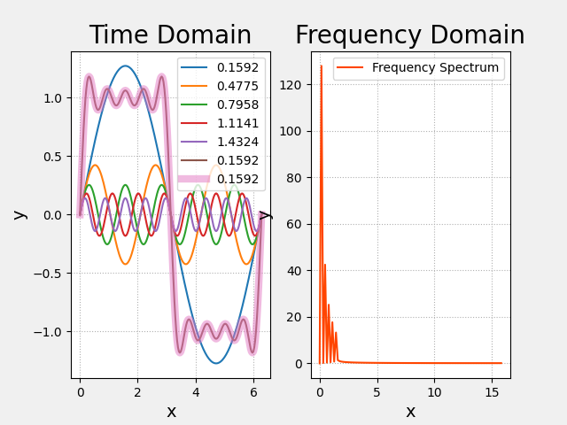
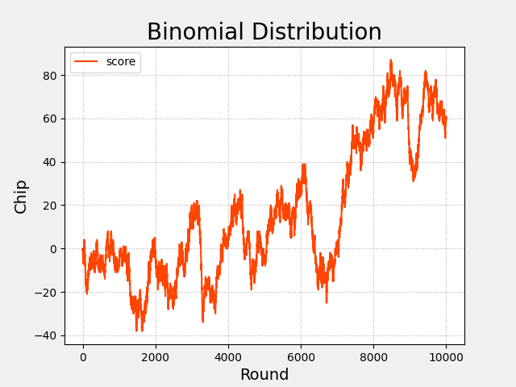
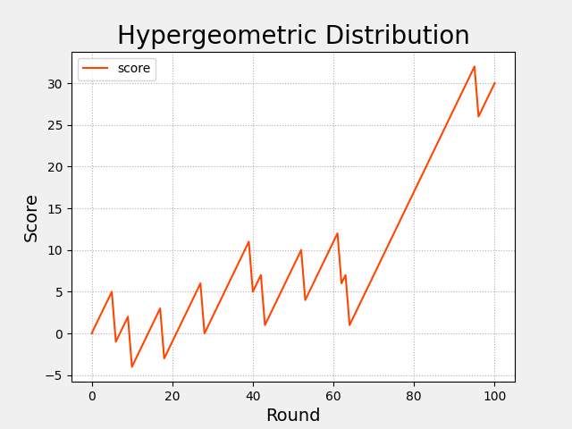
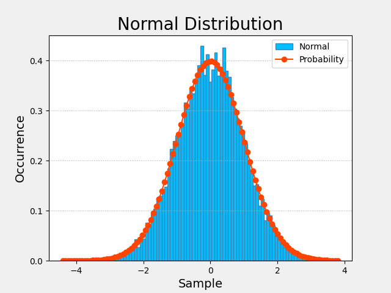

# numpy的子模块

- [numpy的子模块](#numpy的子模块)
  - [线性代数子模块(linalg)](#线性代数子模块linalg)
    - [矩阵求逆](#矩阵求逆)
    - [解线性方程组](#解线性方程组)
    - [矩阵的特征值和特征向量](#矩阵的特征值和特征向量)
    - [矩阵的奇异值分解](#矩阵的奇异值分解)
    - [矩阵广义求逆](#矩阵广义求逆)
    - [矩阵行列式的值](#矩阵行列式的值)
  - [快速傅立叶变换模块(fft)](#快速傅立叶变换模块fft)
  - [随机数模块](#随机数模块)
    - [二项分布](#二项分布)
    - [超几何分布](#超几何分布)
    - [标准正态分布](#标准正态分布)

## 线性代数子模块(linalg)

### 矩阵求逆

在线性代数中，矩阵A与其逆矩阵的乘积是一个单位矩阵I。

函数：`numpy.linalg.inv(A)`

```python
import numpy as np

A = np.array([
    [1, 2, 3],
    [8, 9, 4],
    [7, 6, 5]])

B = np.linalg.inv(A)
print(B)
B = np.mat(A).I
print(B)

C = np.matrix(A) * np.matrix(B)
print(C)

# [[-0.4375     -0.16666667  0.39583333]
#  [ 0.25        0.33333333 -0.41666667]
#  [ 0.3125     -0.16666667  0.14583333]]
# [[-0.4375     -0.16666667  0.39583333]
#  [ 0.25        0.33333333 -0.41666667]
#  [ 0.3125     -0.16666667  0.14583333]]
# [[  1.00000000e+00   2.77555756e-17  -5.55111512e-17]
#  [  0.00000000e+00   1.00000000e+00   2.22044605e-16]
#  [  0.00000000e+00   1.94289029e-16   1.00000000e+00]]
```

### 解线性方程组

函数：`x=numpy.linalg.solve(A, b)`

```python
import numpy as np

A = np.mat('1 -2 1; 0 2 -8; -4 5 9')
b = np.mat('0; 8; -9')
print(A, b, sep='\n')

x = np.linalg.solve(A, b)
print(x)
print(A * x)

# [[ 1 -2  1]
#  [ 0  2 -8]
#  [-4  5  9]]
# [[ 0]
#  [ 8]
#  [-9]]
# [[ 29.]
#  [ 16.]
#  [  3.]]
# [[ 0.]
#  [ 8.]
#  [-9.]]
```

### 矩阵的特征值和特征向量

对于n阶方阵A，如果存在数a和非零列向量x，使得Ax=ax成立，则称：

- a是矩阵A的一个特征值
- x是矩阵A属于特征值a的特征向量

函数：

- 特征值数组：`numpy.linalg.eigvals (A)`
- 特征值数组, 特征向量矩阵：`numpy.linalg.eig(A)`
  - 特征向量矩阵中的每一列是与特征值数组中每个特征值相对应的特征向量

```python
import numpy as np

A = np.mat('3 -2; 1 0')
print(A)

eigvals = np.linalg.eigvals(A)
print(eigvals)

eigvals, eigvecs = np.linalg.eig(A)
print(eigvals, eigvecs, sep='\n')

for eigval, eigvec in zip(eigvals, eigvecs.T):
    eigvec = eigvec.reshape(-1, 1)
    print(A * eigvec, eigval * eigvec, sep='\n')

# [[ 3 -2]
#  [ 1  0]]
# [ 2.  1.]
# [ 2.  1.]
# [[ 0.89442719  0.70710678]
#  [ 0.4472136   0.70710678]]
# [[ 1.78885438]
#  [ 0.89442719]]
# [[ 1.78885438]
#  [ 0.89442719]]
# [[ 0.70710678]
#  [ 0.70710678]]
# [[ 0.70710678]
#  [ 0.70710678]]
```

### 矩阵的奇异值分解

将一个矩阵M分解为三个矩阵的乘积`M=USV`：

- U和V都是正交矩阵，即`UU^T=I`且`VV^T=I`
- S就被称为M的奇异值矩阵，其主对角线上的元素就是M的奇异值，其它元素均为0

函数：`numpy.svd(M)`

```python
import numpy as np

M = np.mat('4 11 14; 8 7 -2')
print(M)

U, singular_values, V = np.linalg.svd(M, full_matrices=False)
S = np.diag(singular_values)
print(U, S, V, sep='\n')

print(U * S * V)

print(U * U.T, V * V.T, sep='\n')

# [[ 4 11 14]
#  [ 8  7 -2]]
# [[-0.9486833  -0.31622777]
#  [-0.31622777  0.9486833 ]]
# [[ 18.97366596   0.        ]
#  [  0.           9.48683298]]
# [[-0.33333333 -0.66666667 -0.66666667]
#  [ 0.66666667  0.33333333 -0.66666667]]
# [[  4.  11.  14.]
#  [  8.   7.  -2.]]
# [[  1.00000000e+00   3.21230610e-17]
#  [  3.21230610e-17   1.00000000e+00]]
# [[  1.00000000e+00  -6.16790569e-18]
#  [ -6.16790569e-18   1.00000000e+00]]
```

### 矩阵广义求逆

`numpy.linalg.inv`只能对方阵求逆。

`numpy.linalg.pinv`可对非方阵求逆，即广义求逆。

```python
import numpy as np

A = np.mat('11 12 13 14; 20 21 22 15; 19 18 17 16')
B = np.linalg.pinv(A)
print(B)
print(A * B)

# [[-0.18055556 -0.08333333  0.23611111]
#  [-0.04305556  0.04166667 -0.00138889]
#  [ 0.09444444  0.16666667 -0.23888889]
#  [ 0.1625     -0.125       0.0375    ]]
# [[  1.00000000e+00   2.22044605e-16  -3.33066907e-16]
#  [  1.77635684e-15   1.00000000e+00  -1.88737914e-15]
#  [  1.77635684e-15   8.88178420e-16   1.00000000e+00]]
```

### 矩阵行列式的值

函数：`numpy.det(A)`

```python
import numpy as np

A = np.mat('2 1; 3 4')
print(A)

a = np.linalg.det(A)
print(a)

# [[2 1]
#  [3 4]]
# 5.0
```

## 快速傅立叶变换模块(fft)

函数：

- numpy.fft.fftfreq(采样数(频率数), 采样周期)->频率数组(w)
- numpy.fft.fft(信号值)->复数数组(A,fai)
- numpy.fft.ifft(复数数组)->信号值

```python
import numpy as np
import numpy.fft as nf
import matplotlib.pyplot as mp

times = np.linspace(0, 2 * np.pi, 201)
sigs1 = 4 / (1 * np.pi) * np.sin(1 * times)
sigs2 = 4 / (3 * np.pi) * np.sin(3 * times)
sigs3 = 4 / (5 * np.pi) * np.sin(5 * times)
sigs4 = 4 / (7 * np.pi) * np.sin(7 * times)
sigs5 = 4 / (9 * np.pi) * np.sin(9 * times)
sigs6 = sigs1 + sigs2 + sigs3 + sigs4 + sigs5

freqs = nf.fftfreq(times.size, times[1] - times[0])
ffts = nf.fft(sigs6)
pows = np.abs(ffts)
sigs7 = nf.ifft(ffts).real
print(sigs7)

mp.gcf().set_facecolor(np.ones(3) * 240 / 255)
mp.subplot(121)
mp.title('Time Domain', fontsize=20)
mp.xlabel('x', fontsize=14)
mp.ylabel('y', fontsize=14)
mp.tick_params(labelsize=10)
mp.grid(linestyle=':')
mp.plot(times, sigs1, label='{:.4f}'.format(1 / (2 * np.pi)))
mp.plot(times, sigs2, label='{:.4f}'.format(3 / (2 * np.pi)))
mp.plot(times, sigs3, label='{:.4f}'.format(5 / (2 * np.pi)))
mp.plot(times, sigs4, label='{:.4f}'.format(7 / (2 * np.pi)))
mp.plot(times, sigs5, label='{:.4f}'.format(9 / (2 * np.pi)))
mp.plot(times, sigs6, label='{:.4f}'.format(1 / (2 * np.pi)))
mp.plot(times, sigs7, label='{:.4f}'.format(1 / (2 * np.pi)),
        alpha=0.5, linewidth=6)
mp.legend()
mp.subplot(122)
mp.title('Frequency Domain', fontsize=20)
mp.xlabel('x', fontsize=14)
mp.ylabel('y', fontsize=14)
mp.tick_params(labelsize=10)
mp.grid(linestyle=':')
mp.plot(freqs[freqs >= 0], pows[freqs >= 0],
        c='orangered', label='Frequency Spectrum')
mp.legend()
mp.show()
```



## 随机数模块

### 二项分布

函数：`numpy.random.binomial(n, p, size)`(生成随机数数组)

说明：产生size个随机数，每个随机数来自n次尝试中的成功次数，其中每次尝试的成功概率为p。

举例：

初始积分值为0，每轮猜9次硬币的正反面，猜对5次及5次以上为赢，积分加1，否则为输，积分减1。

问：

10000轮以后积分值为多少？

以上可以使用numpy.random.binomial(9, 0.5, 10000)来产生符合二项分布的随机数据。

```python
import numpy as np
import matplotlib.pyplot as mp

outcomes = np.random.binomial(9, 0.5, 10000)
scores = [0]

for outcome in outcomes:
    if outcome >= 5:
        scores.append(scores[-1] + 1)
    else:
        scores.append(scores[-1] - 1)
scores = np.array(scores)

mp.gcf().set_facecolor(np.ones(3) * 240 / 255)
mp.title('Binomial Distribution', fontsize=20)
mp.xlabel('Round', fontsize=14)
mp.ylabel('Chip', fontsize=14)
mp.tick_params(labelsize=10)
mp.grid(linestyle=':')
o, h, l, c = 0, scores.argmax(), scores.argmin(), scores.size - 1
if scores[o] < scores[c]:
    color = 'orangered'
elif scores[c] < scores[o]:
    color = 'limegreen'
else:
    color = 'dodgerblue'
mp.plot(scores, c=color, label='score')
mp.legend()
mp.show()
```



### 超几何分布

函数：`numpy.random.hypergeometric(ngood, nbad, nsample, size)`(随机数数组)

说明：

- 产生size个随机数，每个随机数来自随机抽取nsample个样本中的好样本数
- 总样本由ngood个好样本和nbad个坏样本组成

举例：

将25个好球和1个坏球放在一起，每轮模3个球，全是好球加1分，只要有坏球减6分，问100轮以后的得分？

以上可以使用`numpy.random.hypergeometric(25, 1, 3, 100)`来产生符合超几何分布的随机数据。

```python
import numpy as np
import matplotlib.pyplot as mp

outcomes = np.random.hypergeometric(25, 1, 3, 100)

scores = [0]
for outcome in outcomes:
    if outcome == 3:
        scores.append(scores[-1] + 1)
    else:
        scores.append(scores[-1] - 6)
scores = np.array(scores)

mp.gcf().set_facecolor(np.ones(3) * 240 / 255)
mp.title('Hypergeometric Distribution', fontsize=20)
mp.xlabel('Round', fontsize=14)
mp.ylabel('Score', fontsize=14)
mp.tick_params(labelsize=10)
mp.grid(linestyle=':')
o, h, l, c = 0, scores.argmax(), scores.argmin(), scores.size - 1
if scores[o] < scores[c]:
    color = 'orangered'
elif scores[c] < scores[o]:
    color = 'limegreen'
else:
    color = 'dodgerblue'
mp.plot(scores, c=color, label='score')
mp.legend()
mp.show()
```



### 标准正态分布

函数：`numpy.random.norml(size)`

说明：产生size个随机数，服从标准正态分布。

```python
import numpy as np
import matplotlib.pyplot as mp

samples = np.random.normal(size=10000)

mp.gcf().set_facecolor(np.ones(3) * 240 / 255)
mp.title('Normal Distribution', fontsize=20)
mp.xlabel('Sample', fontsize=14)
mp.ylabel('Occurrence', fontsize=14)
mp.tick_params(labelsize=10)
mp.grid(axis='y', linestyle=':')
bins = mp.hist(samples, 100, density=True, edgecolor='steelblue',
                facecolor='deepskyblue', label='Normal')[1]
probs = np.exp(-bins ** 2 / 2) / np.sqrt(2 * np.pi)
mp.plot(bins, probs, 'o-', c='orangered', label='Probability')
mp.legend()
mp.show()
```


