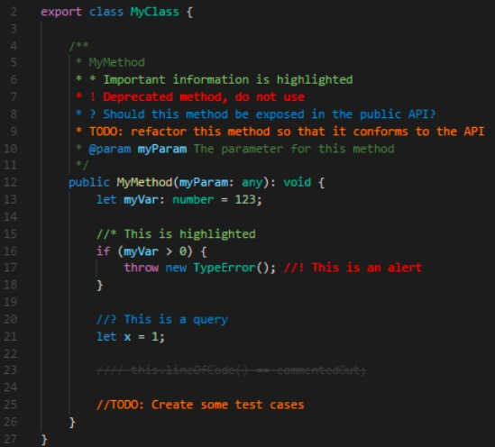

# vscode插件

- [vscode插件](#vscode插件)
  - [CMake](#cmake)
  - [C/C++](#cc)
  - [Golang](#golang)
  - [Rust](#rust)
  - [Lua](#lua)
  - [Shell](#shell)
  - [Python](#python)
  - [Markdown](#markdown)
  - [通用插件](#通用插件)

---

## CMake

- CMake：语法高亮、自动补全。
- CMake Tools：结合 VSCode IDE 使用，可以生成CMake项目、构建CMake项目。

---

## C/C++

- C/C++：智能感知、调试、代码浏览。
- Better C++ Syntax：更好的语法高亮显示。
- C++ Intellisense：代码提示与高亮。
- Clang-Format：代码格式化工具。

```shell
# ubuntu 安装 clang-format
sudo apt-get install clang-format

# 到处 google 配置
clang-format -style=google -dump-config > .clang-format
```

以上生成的 .clang-format 放在 vscode 打开工程的根目录下。

代码块使用`// clang-format off`包裹可以关闭 clang-format 对于这段代码的格式化。

---

## Golang

- Go：提供了丰富的 go 语法支持。
- Go Outliner：显示代码大纲。

---

## Rust

- Rust：添加 vscode 对于 rust 语言的支持。
- crates：帮助管理 Cargo.toml 依赖。
- Better TOML：添加 toml 语言支持。
- Rust Syntax：rust 语法高亮。

---

## Lua

- Lua：代码跳转、语法检查、代码高亮、智能提示、自动补全等。

---

## Shell

- Shell：支持在 vscode 中直接执行命令。
- shellman：对shell脚本提供代码补全和提示。
- ShellCheck：对脚本进行语法检查，而且会标注出来是参考哪一条原则给出提示。
- shell-format：对shell脚本进行格式化。

---

## Python

- Python：代码智能感知、高亮、格式化、调试插件。
- Visual Studio Intellicode：代码智能补全。
- indent-rainbow：代码缩进检查。
- Jupyter：安装后打开 ipynb 文件可以边写边执行。

---

## Markdown

- Markdown All in One
- Markdown Preview Mermaid Support
- markdownlint
- Markdown Preview Enhanced
- Markdown Preview Github Styling

<table>
    <tr>
        <td>插件</td>
        <td>说明</td>
    </tr>
    <tr>
        <td>Markdown All in One</td>
        <td>
当前安装版本是 v3.5.1。<br>
插入目录：<br>
<ol>
<li>按下 shift + cmd + p 打开 command palette</li>
<li>输入 Create Table of Contents 并执行，则会在光标位置插入目录</li>
</ol>
自动格式化：`option + shift + f`。<br>
打开预览：`shift + cmd + v`。<br>
可以向选中文本粘贴链接，自动形成一个超链接。
        </td>
    </tr>
    <tr>
        <td>Markdown Preview Mermaid Support</td>
        <td>
当前安装版本是 v1.14.0。<br>
用于支持在 markdown 中画流程图、甘特图。
        </td>
    </tr>
    <tr>
        <td>Markdown Preview Enhanced</td>
        <td>
对于 Markdown All in One 基础语法的扩展。<br>
Markdown Preview Github Styling 的依赖插件。
</td>
    </tr>
    <tr>
        <td>markdownlint</td>
        <td>
当前安装版本是 v0.47.0。<br>
markdownlint Markdown 格式检查，规定了许多规则并实时对文档进行检查，防止一些语法错误。<br>
同时维持文档风格的统一，使用此工具有助于形成一个良好的写作习惯和规范。<br>
<a href="https://github.com/DavidAnson/markdownlint/blob/v0.25.1/doc/Rules.md#md033">markdownlint 规则</a><br>
我们可以在工程的根目录下创建配置文件：`.markdownlint.json`，对每一项规则进行配置。
         </td>
    </tr>
    <tr>
        <td>Markdown Preview Github Styling</td>
        <td>将 vscode 内置的 Markdown 预览样式，修改为 Github 的样式，这样可以实时预览文档在 github 上的显示。</td>
    </tr>
</table>

---

## 通用插件

- Better Align
- koroFileHeader
- Increment Selection
- vscode-mindmap
- SVG Viewer
- vscode-pdf
- Eva Theme
- Code Runner
- Git Graph
- GitLens
- Better Comments
- Bracket Highlighter
- Remote-SSH
- Doxygen Documentation Generator
- Chinese (Simplified)
- Docker

<table>
    <tr>
        <td>插件</td>
        <td>说明</td>
    </tr>
    <tr>
        <td>Better Align</td>
        <td>
通过冒号(:)、赋值(=、+=、-=、*=、/=)、箭头(=>)对齐代码<br>
mac：shift + command + p，输入：align，执行：Align
        </td>
    </tr>
    <tr>
        <td>koroFileHeader</td>
        <td>
添加文件头部注释：<br>
windows：ctrl + alt + i<br>
mac：control + command + i<br>
添加函数头部注释：<br>
windows：ctrl + alt + t<br>
mac：control + command + t<br>
        </td>
    </tr>
    <tr>
        <td>Increment Selection</td>
        <td>
同时编辑多行，插入递增数字。<br>
`commad + d` 选中所有要修改区域；<br>
输入数字；<br>
`commad + option + I` 选中的数字自动递增。
        </td>
    </tr>
    <tr>
        <td>vscode-mindmap</td>
        <td>脑图插件，km 为扩展名的脑图文件将使用这个插件打开，支持图片导出。</td>
    </tr>
    <tr>
        <td>SVG Viewer</td>
        <td>vscode 内浏览 svg 矢量图形。</td>
    </tr>
    <tr>
        <td>vscode-pdf</td>
        <td>vscode内浏览 pdf 文档。</td>
    </tr>
    <tr>
        <td>Eva Theme</td>
        <td>主题插件。</td>
    </tr>
    <tr>
        <td>Code Runner</td>
        <td>代码一键运行，支持超过40种语言。</td>
    </tr>
    <tr>
        <td>Git Graph</td>
        <td>git 操作 GUI 化插件。</td>
    </tr>
    <tr>
        <td>GitLens</td>
        <td>
git 操作 GUI 化插件。<br>
安装成功之后，vscode 左侧边栏便会出现 gitlens 小图标。<br>
没有图标时使用快捷键"ctrl+shift+p"调出对话框后键入"GitLens:SetViews Layout"，点击"GitLens Layout"即可。
        </td>
    </tr>
    <tr>
        <td>Better Comments</td>
        <td>
插入更美观的注释。<br>
<p align="left"></p>
        </td>
    </tr>
    <tr>
        <td>Bracket Highlighter</td>
        <td>用于高亮显示成对的括号。</td>
    </tr>
    <tr>
        <td>Remote-SSH</td>
        <td>
vscode 远程连接服务器进行开发需要安装。<br>
安装后 `ctrl/command + shift + p` 调出对话框后键入 `remote-ssh:open` 打开配置文件。<br>
配置文件中输入以下内容：<br>
<pre><code>
Host 192.168.0.1
  HostName 192.168.0.1
  User shiyucun
</code></pre>
以上三行内容分别表示：服务器名称、IP地址、用户名。<br>
然后点击侧边栏的远程资源管理器，右键点击服务器名称选择 connect，输入密码。<br>
远程服务器需要安装 ssh-server，如果 ssh 配置了密钥对不输入密码也可以连接。<br>
<a href="../../linux/ubuntu常用软件安装和使用.md#SSH">SSH安装以及秘钥配置</a>
        </td>
    </tr>
    <tr>
        <td>Doxygen Documentation Generator</td>
        <td>
"ctrl/command+,"打开设置面板，在扩展中可以进行设置。<br>
默认情况下输入"/**"就可以在函数或者文件头部插入注释。
        </td>
    </tr>
    <tr>
        <td>Chinese (Simplified)</td>
        <td>适用于 vscode 的中文语言包。</td>
    </tr>
    <tr>
        <td>Docker</td>
        <td>用于创建和管理 docker，还可以进行 debug。写 Dockerfile 时更智能。</td>
    </tr>
</table>
