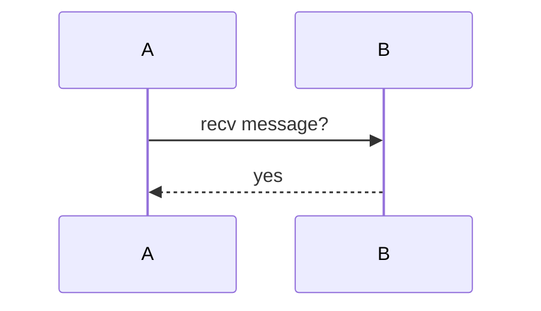
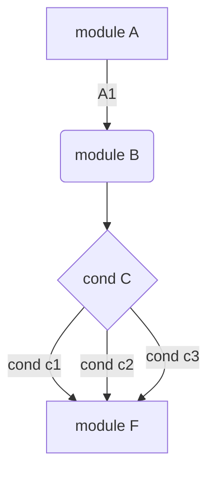

# Markdown 语法

需要先安装 [markdown插件](./vscode插件.md#markdown)。

Markdown 基于 HTML，但不是为了取代 HTML，而是辅助 HTML。

- [Markdown 语法](#markdown-语法)
  - [基础语法](#基础语法)
    - [目录](#目录)
    - [对齐方式](#对齐方式)
    - [分隔线](#分隔线)
    - [加粗](#加粗)
    - [斜体](#斜体)
    - [斜体加粗](#斜体加粗)
    - [删除线](#删除线)
    - [添加上标](#添加上标)
    - [添加下标](#添加下标)
    - [下划线](#下划线)
    - [标题](#标题)
    - [列表](#列表)
    - [待办事项](#待办事项)
    - [链接](#链接)
    - [插入数学公式](#插入数学公式)
    - [插入表格](#插入表格)
    - [行内代码和代码块](#行内代码和代码块)
    - [插入图片](#插入图片)
    - [插入时序图](#插入时序图)
    - [插入流程图](#插入流程图)
  - [MPE 扩展语法](#mpe-扩展语法)

---

## 基础语法

---

### 目录

插入目录：

1. 按下 `shift + cmd + p` 打开 `command palette`
2. 输入 `Create Table of Contents` 并执行，则会在光标位置插入目录

---

### 对齐方式

Markdown 语法本身没有居中，但 Markdown 可以使用[HTMl标签](https://www.runoob.com/tags/html-reference.html)。

```text
<center>居中</center>
<p align="left">左对齐</p>
<p align="right">右对齐</p>
```

效果如下：

<center>居中</center>

<p align="left">左对齐</p>

<p align="right">右对齐</p>

---

### 分隔线

某一行只含有`---`时，则会在这一行渲染分隔线。

---

### 加粗

**加粗**：粗体用一对`**`包裹，`**加粗**`，快捷键：`ctrl/cmd + b`。

---

### 斜体

*斜体*：用一对`*`包裹，`*斜体*`，快捷键：`ctrl/cmd + i`。

---

### 斜体加粗

***斜体加粗***：用一对`***`包裹，`***斜体加粗***`。

---

### 删除线

~~删除线~~：用一对`~~`包裹，`~~删除线~~`。

---

### 添加上标

添加<sup>上标</sup>：用`<sup>`标签包裹，`添加<sup>上标</sup>`。

---

### 添加下标

添加<sub>下标</sub>：用`<sub>`标签包裹，`添加<sub>上标</sub>`。

---

### 下划线

<u>下划线</u> : 用`<u>`标签包裹，`<u>下划线</u>`。

---

### 标题

使用`#`号添加标题，支持 1~6 级标题，如添加二级标题，则：`## 二级标题`。

---

### 列表

列表分为无序列表和有序列表，无序列表以`减号+空格`开头，有序列表以`数字+空格`开头，无序列表和有序列表可以相互嵌套。

```markdown
- 事项 A
  1. 事项 1
  2. 事项 2
  3. 事项 3
- 事项 B
- 事项 C
```

效果如下：

- 事项 A
  1. 事项 1
  2. 事项 2
  3. 事项 3
- 事项 B
- 事项 C

使用 html 标签插入列表，如下：

```html
<ol>
<li>list elem1</li>
<li>list elem2</li>
</ol>
```

效果：

<ol>
<li>list elem1</li>
<li>list elem2</li>
</ol>

---

### 待办事项

待办事项使用`- [ ]`或`- [x]`声明，前者表示未完成事项，后者表示已完成事项。

```markdown
- [x] 事项 1
- [ ] 事项 2
- [ ] 事项 3
```

效果如下：

- [x] 事项 1
- [ ] 事项 2
- [ ] 事项 3

---

### 链接

`[字符串](链接)`这是基本语法，如`[百度](https://www.baidu.com/)`会被渲染为[百度](https://www.baidu.com/)，点击时会跳转到链接。

使用 html 标签插入链接：`<a href="https://www.baidu.com/">Baidu</a>`会被渲染为<a href="https://www.baidu.com/">Baidu</a>。

---

### 插入数学公式

数学公式用一对`$`标签包裹，则插入行内公式。

如`$y = a + b$`，效果：$y = \displaystyle \lim_{x \to 0} x \div (x+1)$。

数学公式用一对`$$`标签包裹，则插入行间公式。

如`$$y = \displaystyle \lim_{x \to 0} x \div (x+1)$$`，效果如下：

$$y = \displaystyle \lim_{x \to 0} x \div (x+1)$$

[LaTex公式生成网](https://editor.codecogs.com/)。

[LaTex函数符号及特殊字符](https://blog.csdn.net/u011544225/article/details/107172237)。

[LaTex新手教程](https://zhuanlan.zhihu.com/p/456055339)。

---

### 插入表格

方法 1：

```markdown
| 1   | 2   | 3   | 4   |
| --- | --- | --- | --- |
| 5   | 6   | 7   | 8   |
| 9   | 10  | 11  | 12  |
| 13  | 14  | 15  | 16  |
```

效果：

| 1   | 2   | 3   | 4   |
| --- | --- | --- | --- |
| 5   | 6   | 7   | 8   |
| 9   | 10  | 11  | 12  |
| 13  | 14  | 15  | 16  |

方法 2：

```text
<table>
    <tr>
        <td>行一：列一</td>
        <td>行一：列二</td>
        <td>行一：列三</td>
   </tr>
   <!-- tr内为每一行的内容 -->
    <tr>
       <!-- 定义一个占两行的单元格 -->
        <td rowspan="2">占两行（行二，三）：列一</td>
        <td >行二：列二</td>
        <td >行二：列三</td>
    </tr>
    <tr>
        <!-- 由于上面第一列占了两行，所以该行不用写 -->
        <td >行三：列二</td>
        <td >行三：列三</td>
    </tr>
    <tr>
        <!-- 两行已经用完，所以在下一行开始需要写第一列 -->
        <td >行四：列一</td>
        <td >行四：列二</td>
        <td >行四：列三</td>
    </tr>
</table>
```

效果：

<table>
    <tr>
        <td>行一：列一</td>
        <td>行一：列二</td>
        <td>行一：列三</td>
   </tr>
   <!-- tr内为每一行的内容 -->
    <tr>
       <!-- 定义一个占两行的单元格 -->
        <td rowspan="2">占两行（行二，三）：列一</td>
        <td >行二：列二</td>
        <td >行二：列三</td>
    </tr>
    <tr>
        <!-- 由于上面第一列占了两行，所以该行不用写 -->
        <td >行三：列二</td>
        <td >行三：列三</td>
    </tr>
    <tr>
        <!-- 两行已经用完，所以在下一行开始需要写第一列 -->
        <td >行四：列一</td>
        <td >行四：列二</td>
        <td >行四：列三</td>
    </tr>
</table>

---

### 行内代码和代码块

行内代码用用一对'\`'包裹，如 \`行内代码\`，效果：`行内代码`。

代码块，用一对'\`\`\`'包裹，效果如下：

```c++
#include <iostream>

int main() {
  std::cout << "Hello, Markdown." << std::endl;
  return 0;
}
```

markdown 代码块可以支持多种语言语法高亮，可以在第一个\`\`\`后指明语言，如\`\`\`c++。

简要列出以下几种支持的语言：

- text、c、c++、go、rust、shell、lua、matlab、cuda、opencl、plsql
- python、python3、python-console、numpy、cython
- css、html、xhtml、html+django、html+jinja、js、java
- xml、ini、yaml、json、jsonc、json5
- gdb、objdump、neon
- dockerfile、nginx、awk、sed、svg、cmake、ninja、gitignore

[已经被高亮支持的语言](https://help.coding.net/docs/ci/lint/markdown-code-lang.html)。

使用 html 标签插入代码块：

```text
<pre><code>
Host 192.168.0.1
  HostName 192.168.0.1
  User shiyucun
</code></pre>
```

效果如下：

<pre><code>
Host 192.168.0.1
  HostName 192.168.0.1
  User shiyucun
</code></pre>

---

### 插入图片

``这是基本语法。

如``，效果如下：


使用`html`的方式显示图片，还可以指定图片大小和对齐方式。

```text
<p align="center"></p>
<p align="left"></p>
<p align="right"></p>
```

效果如下：

<p align="center"></p>

<p align="left"></p>

<p align="right"></p>

---

### 插入时序图

```text
sequenceDiagram
A->>B: recv message?
B-->>A: yes
```



---

### 插入流程图

```text
graph TD
A[module A]-->|A1| B(module B)
B --> C{cond C}
C -->|cond c1| D[module D]
C -->|cond c2| D[module E]
C -->|cond c3| D[module F]
```



---

## MPE 扩展语法

文档中插入`[TOC]`，会被 MPE 渲染为目录。

使用`==`包含文字，会高亮显示文字。

在 ``` 之后指明语言时追加 `{.line-numbers}` 可以显示代码行号。

添加上标：`x^y^`。

添加下标：`x~y~`。

引入图片：`@import "sources/rainbow.jpeg" {width="300px" height="200px" title="rainbow" alt="alt"}`。

引入文件渲染为代码块：`@import "sources/test.cc" { code_block=true class="line-numbers"}`。

更多的 MPE 的使用，参考[中文版的文档](https://www.bookstack.cn/read/mpe/zh-cn-_sidebar.md)。
