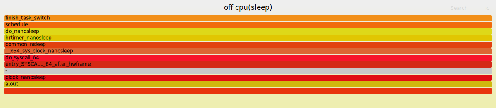

# 火焰图

- [火焰图](#火焰图)
  - [perf 的使用](#perf-的使用)
  - [生成火焰图](#生成火焰图)
  - [红蓝差分火焰图](#红蓝差分火焰图)
  - [off-cpu 火焰图](#off-cpu-火焰图)
  - [其它学习资料](#其它学习资料)

## perf 的使用

```shell
perf stat ls -l

# 显示信息如下：
# total 100
# drwxrwxr-x  5 shiyucun shiyucun  4096 5月   4 19:53 bags
# drwxr-xr-x  2 shiyucun shiyucun  4096 3月  16 11:56 Desktop
# drwxr-xr-x  3 shiyucun shiyucun  4096 5月   6 10:18 Documents
# drwxr-xr-x  2 shiyucun shiyucun 53248 5月  12 12:58 Downloads
# drwxr-xr-x  2 shiyucun shiyucun  4096 9月  27  2021 Music
# drwxr-xr-x  2 root     root      4096 9月  27  2021 nas
# drwxr-xr-x 11 shiyucun shiyucun  4096 9月  27  2021 NVIDIA_CUDA-11.4_Samples
# drwxr-xr-x  2 shiyucun shiyucun  4096 1月   8 22:34 Pictures
# drwxr-xr-x  2 shiyucun shiyucun  4096 9月  27  2021 Public
# drwx------  6 shiyucun shiyucun  4096 10月 14  2021 snap
# drwxr-xr-x  2 shiyucun shiyucun  4096 9月  27  2021 Templates
# drwxr-xr-x  2 shiyucun shiyucun  4096 9月  27  2021 Videos
# drwxrwxr-x  6 shiyucun shiyucun  4096 11月 29 15:20 workspace
# 
# Performance counter stats for 'ls -l':
# 
#               0.93 msec task-clock                #    0.805 CPUs utilized
#                 0      context-switches           #    0.000 K/sec
#                 0      cpu-migrations             #    0.000 K/sec
#               135      page-faults                #    0.145 M/sec
#         3,306,849      cycles                     #    3.555 GHz                      (41.64%)
#         3,147,825      instructions               #    0.95  insn per cycle
#           638,936      branches                   #  686.892 M/sec
#             22,979     branch-misses              #    3.60% of all branches          (58.36%)
# 
#       0.001156222 seconds time elapsed
# 
#       0.001156000 seconds user
#       0.000000000 seconds sys
```

`perf stat`默认统计8种event在程序运行过程中的计数，如上所示。

也可以使用-e选项来自定义使用的event。

`perf stat`命令只能记录event发生的次数。

`perf record`可以记录event发生时详细的数据(比如IP、堆栈等等)。

可以自定义需要记录的event，可以自定义记录数据的格式。

```shell
perf record -g -F 99 ls -l

# 显示信息如下，生成了记录文件perf.data：
# total 120
# drwxrwxr-x  5 shiyucun shiyucun  4096 5月   4 19:53 bags
# drwxr-xr-x  2 shiyucun shiyucun  4096 3月  16 11:56 Desktop
# drwxr-xr-x  3 shiyucun shiyucun  4096 5月   6 10:18 Documents
# drwxr-xr-x  2 shiyucun shiyucun 53248 5月  12 12:58 Downloads
# drwxr-xr-x  2 shiyucun shiyucun  4096 9月  27  2021 Music
# drwxr-xr-x  2 root     root      4096 9月  27  2021 nas
# drwxr-xr-x 11 shiyucun shiyucun  4096 9月  27  2021 NVIDIA_CUDA-11.4_Samples
# -rw-------  1 shiyucun shiyucun 18680 5月  12 19:31 perf.data
# drwxr-xr-x  2 shiyucun shiyucun  4096 1月   8 22:34 Pictures
# drwxr-xr-x  2 shiyucun shiyucun  4096 9月  27  2021 Public
# drwx------  6 shiyucun shiyucun  4096 10月 14  2021 snap
# drwxr-xr-x  2 shiyucun shiyucun  4096 9月  27  2021 Templates
# drwxr-xr-x  2 shiyucun shiyucun  4096 9月  27  2021 Videos
# drwxrwxr-x  6 shiyucun shiyucun  4096 11月 29 15:20 workspace
# [ perf record: Woken up 1 times to write data ]
# [ perf record: Captured and wrote 0.020 MB perf.data (5 samples) ]
```

`perf record`默认只使用了1种event cpu-clock。

cpu-clock使用的是高精度定时器来进行定时采样。

- `-F 99`选项指定了采样频率`99Hz`
- `-g`选项指定了输出数据中包含调用堆栈
- `perf record`默认数据输出文件为`perf.data`

```shell
perf script -i perf.data  # 读取perf.data并显示

# 显示信息如下：
# perf 60224 13364.200755:          1 cycles:
#         ffffffff8dc7b846 native_write_msr+0x6 ([kernel.kallsyms])
#         ffffffff8dc0e7b5 intel_pmu_enable_all+0x15 ([kernel.kallsyms])
#         ffffffff8dc08948 x86_pmu_enable+0x118 ([kernel.kallsyms])
#         ffffffff8de2561d perf_pmu_enable.part.0+0xd ([kernel.kallsyms])
#         ffffffff8de28e5e ctx_resched+0x8e ([kernel.kallsyms])
#         ffffffff8de325ef perf_event_exec+0x17f ([kernel.kallsyms])
#         ffffffff8df0bc62 begin_new_exec+0x582 ([kernel.kallsyms])
#         ffffffff8df8c095 load_elf_binary+0x145 ([kernel.kallsyms])
#         ffffffff8df09744 exec_binprm+0x134 ([kernel.kallsyms])
#         ffffffff8df0afbd __do_execve_file.isra.0+0x50d ([kernel.kallsyms])
#         ffffffff8df0b479 __x64_sys_execve+0x39 ([kernel.kallsyms])
#         ffffffff8e76a6c9 do_syscall_64+0x49 ([kernel.kallsyms])
#         ffffffff8e80008c entry_SYSCALL_64_after_hwframe+0x44 ([kernel.kallsyms])
#             7f5b4bb892fb [unknown] ([unknown])
# 
# perf 60224 13364.200763:          1 cycles:
#         ffffffff8dc7b846 native_write_msr+0x6 ([kernel.kallsyms])
#         ffffffff8dc0e7b5 intel_pmu_enable_all+0x15 ([kernel.kallsyms])
#         ffffffff8dc08948 x86_pmu_enable+0x118 ([kernel.kallsyms])
#         ffffffff8de2561d perf_pmu_enable.part.0+0xd ([kernel.kallsyms])
```

## 生成火焰图

火焰图是用图形化的方式来展现perf等工具采集的性能数据，对数据进行统计和分析。

火焰图工具：

- [github](https://github.com/brendangregg/FlameGraph)
- [gitee](https://gitee.com/Kirin_lgf/FlameGraph)

使用`git clone`获取以上火焰图工具源码。

进入目录 `example/on_cpu`，进行生成火焰图的测试。

```shell
# 测试目录：example/on_cpu

# 1. 获取火焰图工具源码
git clone git@gitee.com:Kirin_lgf/FlameGraph.git

# 2. 编译源码
g++ main.cc

# 3. 采集性能数据，将在当前目录生成 perf.data
perf record -g -F 99 ./a.out

# 4. 读取 perf.data 并保存数据
perf script -i perf.data > out.perf

# 5. 生成火焰图
./FlameGraph/stackcollapse-perf.pl out.perf > out.floded
./FlameGraph/flamegraph.pl out.floded > out.svg

# out.svg即为生成的火焰图
```

火焰图是`svg`格式的图片, 可以用浏览器打开互动。

在当前 markdown 中插入，如下图所示：


火焰图中的每一个方框是一个函数，方框长度代表执行时间，因此越宽的函数，执行越久。

火焰图的楼层每高一层，就是更深一级的函数被调用，最顶层的函数，是叶子函数。

火焰图的含义:

- 火焰图是基于 stack 信息生成的 svg 图片，用来展示 CPU 的调用栈
- y 轴：
  - 表示调用栈，每一层都是一个函数
  - 调用栈越深，火焰就越高
  - 顶部就是正在执行的函数，下方都是它的父函数
- x 轴：
  - 表示抽样数，一个函数在x轴越宽，表示它被抽到的次数越多，对应执行时间越长
  - x轴不代表时间，而是所有的调用栈合并后，按字母顺序排列的

以上，可以看到执行 a.out 程序大部分时间都消耗在执行 add 函数。

对于正在运行的程序，可以使用以下命令采集数据进行分析：

```shell
perf stat -p pid
perf record -g -e cpu-clock -p pid
```

## 红蓝差分火焰图

在某些情况下我们关心的是加上某项功能后，性能的对比情况。

这种情况下需要用到差分火焰图来进行分析。

进入目录 `example/on_cpu`，进行生成红蓝差分火焰图的测试。

```shell
# 测试目录：example/on_cpu

# 1. 获取火焰图工具源码
git clone git@gitee.com:Kirin_lgf/FlameGraph.git

# 2. 编译源码
g++ main.cc -o a.out
g++ main_rb.cc -o a_rb.out

# 3. 对修改前后的程序抓取数据，并处理数据生成火焰图
perf record -g -F 99 ./a.out
perf script -i perf.data > out1.perf
./FlameGraph/stackcollapse-perf.pl out1.perf > out1.floded
# ./FlameGraph/flamegraph.pl out1.floded > out1.svg

perf record -g -F 99 ./a_rb.out
perf script -i perf.data > out2.perf
./FlameGraph/stackcollapse-perf.pl out2.perf > out2.floded
# ./FlameGraph/flamegraph.pl out2.floded > out2.svg

# 4. 对比两次抓取采集的数据并生成红蓝差分火焰图
./FlameGraph/difffolded.pl out1.floded out2.floded > diff.floded
./FlameGraph/flamegraph.pl --title="rb_diff" --negate diff.floded > rb_diff.svg
```

当前 markdown 中插入红蓝差分火焰图：


在红蓝差分火焰图中，使用不同的颜色来表示两个文件中的差异部分。

**红色表示增长，蓝色表示衰减。**

虽然红/蓝差分火焰图很有用，但实际上还是有一个问题：

**如果一个代码执行路径完全消失了，那么在火焰图中就找不到地方来标注蓝色。**

这种情况下我们只能看到当前 CPU 的使用情况，而却不知道变成这样的原因。

解决：

**将对比顺序颠倒，画一个相反的差分火焰图。**

```shell
# 测试目录：example/on_cpu

# 1. 获取火焰图工具源码
git clone git@gitee.com:Kirin_lgf/FlameGraph.git

# 2. 编译源码
g++ main_rb.cc -o a_rb.out
g++ main_diff.cc -o a_diff.out

# 3. 对修改前后的程序抓取数据，并处理数据生成火焰图
perf record -g -F 99 ./a_rb.out
perf script -i perf.data > out1.perf
./FlameGraph/stackcollapse-perf.pl out1.perf > out1.floded
# ./FlameGraph/flamegraph.pl out1.floded > out1.svg

perf record -g -F 99 ./a_diff.out
perf script -i perf.data > out2.perf
./FlameGraph/stackcollapse-perf.pl out2.perf > out2.floded
# ./FlameGraph/flamegraph.pl out2.floded > out2.svg

# 4. 对比两次抓取采集的数据并生成红蓝差分火焰图

# 生成消失代码的火焰图
./FlameGraph/difffolded.pl out2.floded out1.floded > diff.floded
./FlameGraph/flamegraph.pl --title="diff_del" --negate diff.floded > diff_del.svg

# 生成新增代码的火焰图
./FlameGraph/difffolded.pl out1.floded out2.floded > diff.floded
./FlameGraph/flamegraph.pl --title="diff_new" --negate diff.floded > diff_new.svg
```


## off-cpu 火焰图

以上主要是 on-cpu 火焰图，是系统的 CPU 的走向分析。

但是，很多时候，单纯地看 on-cpu 的情况(什么代码在耗费 CPU)，并不能解决性能问题。

因为有时候性能差的原因不一定在 CPU 上，而是在 off-cpu 的时间，如：

- 进程进入系统调用执行 io 动作，io 动作的延迟
- 进程等待 mutex 锁的时间
- 内存被交换，swap 的时间
- 内存不够的时候，执行直接内存回收的时间
- 进程被抢占调度走、或者时间片用完被调度走的时间

[安装 eBPF](https://github.com/iovisor/bcc/blob/master/INSTALL.md) 进行 off-cpu 数据抓取：

```shell
# ubuntu 20.04
sudo apt install -y bison build-essential cmake flex git libedit-dev \
  libllvm12 llvm-12-dev libclang-12-dev python zlib1g-dev libelf-dev libfl-dev python3-distutils

git clone https://github.com/iovisor/bcc.git
mkdir bcc/build; cd bcc/build
cmake ..
make
sudo make install
cmake -DPYTHON_CMD=python3 .. # 默认 python 为 python2 时：-DPYTHON_CMD=python
pushd src/python/
make
sudo make install
popd
```

```shell
# 测试目录：example/off_cpu

# 1. 编译源码
g++ main.cc

# 2. 执行程序
time ./a.out
# 循环输出：
#     pid:9664
#     pid:9664
#     ...

# 3. 使用 eBPF 工具抓取数据
sudo /usr/share/bcc/tools/offcputime -df -p 9664 > out.stacks

# 4. 获取火焰图工具源码
git clone git@gitee.com:Kirin_lgf/FlameGraph.git

# 5. 生成火焰图
./FlameGraph/flamegraph.pl --title="off cpu(sleep)" ./out.stacks > out.svg

# 6. ctrl+c 停止步骤 2 中程序的执行，可以得到输出：
# real    0m3.004s
# user    0m0.006s
# sys     0m0.001s
# 程序运行时间 real 远远大于 user + sys 的时间
```



## 其它学习资料

[bcc](https://github.com/iovisor/bcc)

[bpf_study](https://github.com/DavadDi/bpf_study)

[offcpuanalysis](https://www.brendangregg.com/offcpuanalysis.html)

[Java 火焰图](https://github.com/alibaba/arthas)
